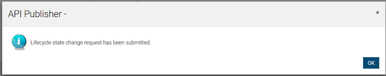

# Adding an API State Change Workflowzzzzz

This section explains how to add a custom workflow to control the API state changes in the API Manager. First see [Workflow Extensions](https://docs.wso2.com/display/AM220/Managing+Workflow+Extensions) for more information on different types of workflow executors. For more details on API states see [API Lifecycle](https://docs.wso2.com/display/AM220/Key+Concepts#KeyConcepts-APIlifecycle) .

-   [**Using WSO2 EI**](#UsingEI)
-   [**Using WSO2 BPS**](#UsingBPS)

#### Configuring the Business Process Server

1.  Download [WSO2 Enterprise Integrator](https://wso2.com/integration) .
2.  Set an offset of 2 to the default BPS port in `              <EI_HOME>/conf/carbon.xml             ` file. This prevents port conflicts that occur when you start more than one WSO2 product on the same server. Also see [Changing the Default Ports with Offset](https://docs.wso2.com/display/AM220/Changing+the+Default+Ports+with+Offset) .

    ``` xml
    <Offset>2</Offset>
    ```

    !!! tip

        **Tip** : If you change the EI port **offset to a value other than 2 or run the API Manager and EI on different machines** (therefore, want to set the `              hostname             ` to a different value than `              localhost             ` ), you do the following:

    -   Search and replace the value 9765 in all the files (.epr) inside /business-processes folder with the new port (9763 + port offset).

3.  Start the EI server and log in to its management console ( `              https://<Server Host>:9443+<port offset>/carbon             ` ).

    !!! warning
    If you are using Mac OS with High Sierra, you may encounter following warning when login into the Management console due to a compression issue exists in High Sierra SDK.

    ``` java
    WARN {org.owasp.csrfguard.log.JavaLogger} -  potential cross-site request forgery (CSRF) attack thwarted (user:<anonymous>, ip:xxx.xxx.xx.xx, method:POST, uri:/carbon/admin/login_action.jsp, error:required token is missing from the request)
    ```

    To avoid this issue open `              <EI_HOME>/             ` conf/tomcat/catalina-server.xml and change the compression="on" to compression="off" in Connector configuration and restart the EI.

4.  Select **Processes &gt; Add &gt; BPMN** and upload the `             <APIM_HOME>/business-processes/api-state-change/APIStateChangeApprovalProcess.bar            ` file to EI. {width="700"}

#### Configuring the Business Process Server

1.  Download [WSO2 Business Process Server](http://wso2.com/products/business-process-server/) .
2.  Set an offset of 2 to the default BPS port in `              <BPS_HOME>/repository/conf/carbon.xml             ` file. This prevents port conflicts that occur when you start more than one WSO2 product on the same server. Also see [Changing the Default Ports with Offset](https://docs.wso2.com/display/AM220/Changing+the+Default+Ports+with+Offset) .

    ``` xml
    <Offset>2</Offset>
    ```

    !!! tip

    **Tip** : If you change the BPS port **offset to a value other than 2 or run the API Manager and BPS on different machines** (therefore, want to set the `              hostname             ` to a different value than `              localhost             ` ), you do the following:

    -   Search and replace the value 9765 in all the files (.epr) inside /business-processes folder with the new port (9763 + port offset).

3.  Start the BPS server and log in to its management console ( `              https://<Server Host>:9443+<port offset>/carbon             ` ).

    !!! warning

    If you are using Mac OS with High Sierra, you may encounter following warning when login into the Management console due to a compression issue exists in High Sierra SDK.

    ``` java
    WARN {org.owasp.csrfguard.log.JavaLogger} -  potential cross-site request forgery (CSRF) attack thwarted (user:<anonymous>, ip:xxx.xxx.xx.xx, method:POST, uri:/carbon/admin/login_action.jsp, error:required token is missing from the request)
    ```

    To avoid this issue open `              <BPS_HOME>/             ` repository/conf/tomcat/catalina-server.xml and change the compression="on" to compression="off" in Connector configuration and restart the BPS.

4.  Select **Processes &gt; Add &gt; BPMN** and upload the `             <APIM_HOME>/business-processes/api-state-change/APIStateChangeApprovalProcess.bar            ` file to BPS. {width="700"}

#### Configuring the API Manager

1.  Open `          <APIM_HOME>/repository/conf/api-manager.xm         ` l and set in `          <Enabled>         ` to `          true         ` in the `          <WorkflowConfigurations>         ` section.
2.  Change the `          <ServerUrl>         ` if you have configured the BPS/EI to run on a different port offset.

#### Engaging the WS Workflow Executor in the API Manager

First, enable the API state change workflow.

1.  Log in to the APIM management console ( `          https://<Server Host>:9443/carbon         ` ) and select Browse under Resources.
    
2.  Go to the `           /_system/governance/apimgt/applicationdata/workflow-extensions.xml          ` resource, disable the Simple Workflow Executor and enable WS Workflow Executor.

    ``` html/xml
    <WorkFlowExtensions>
        ....
        <!-- Publisher related workflows -->
        <!--<APIStateChange executor="org.wso2.carbon.apimgt.impl.workflow.APIStateChangeSimpleWorkflowExecutor" />-->
        <APIStateChange executor="org.wso2.carbon.apimgt.impl.workflow.APIStateChangeWSWorkflowExecutor">
            <Property name="processDefinitionKey">APIStateChangeApprovalProcess</Property>
            <Property name="stateList">Created:Publish,Published:Block</Property>      
        </APIStateChange>
        ....
    </WorkFlowExtensions>
    ```

    You have now engaged the API WS Workflow. The default configuration is set for **Created to Publish** and **Published to Block** state changes. See [Advanced Configurations](#AddinganAPIStateChangeWorkflow-AdvancedConfigurations) for information on configuring more state changes.

    When enabling the workflow features, make sure you import the certificate of the API Manager into the `           client-truststore          ` located inside the `           <BPS_HOME>/repository/resources/security          ` directory.

3.  Log in to the API Publisher ( `           https://<Server Host>:9443/publisher          ` ) and publish an API. See [Create and Publish an API](https://docs.wso2.com/display/AM220/Create+and+Publish+an+API) . A message related to the publish workflow will be displayed because the workflow is enabled for **Created to Publish** state change. {width="700"}

    Note that the **Save & Publish** button will be disabled until the workflow task is completed or deleted. {width="700"}

4.  You can revoke the state change by clicking **Delete Task** in the **Lifecycle** tab.
    {width="700"}

5.  Log in to the Admin Portal ( `          https://<Server Host>:9443/admin         ` ) and click API State Change to see the list of tasks awaiting approval. {width="700"}
    Click **Assign to Me** to approve the task **.** Select Approve and click **Complete** to resume and complete the API state change. **{width="700"}**

-   [**Using WSO2 EI**](#05571107f2a94d54a6a17419af602eca)
-   [**Using WSO2 BPS**](#29313f28d0de47909fb094a27eb77f24)

#### Configuring the BPS for tenants

1.  Log in to the EI with the credentials of the tenant. Select **Processes &gt; Add &gt; BPMN** and upload the `             <APIM_HOME>/business-processes/api-state-change/APIStateChangeApprovalProcess.bar            ` file to EI.
2.  Copy the `             <EI_HOME>/wso2/business-process/repository/deployment/server/webapps/bpmn.war            ` web app to `             <EI_HOME>/wso2/business-process/repository/tenants/<tenant_id>/webapps            ` .
3.  To engage the WS Workflow Executor, log in to the admin console using the credentials of the tenant and repeat step 2 from [Engaging the WS Workflow Executor in the API Manager](#AddinganAPIStateChangeWorkflow-EngagingtheWSWorkflowExecutorintheAPIManager) .

#### Configuring the BPS for tenants

1.  Log in to the BPS with the credentials of the tenant. Select **Processes &gt; Add &gt; BPMN** and upload the `             <APIM_HOME>/business-processes/api-state-change/APIStateChangeApprovalProcess.bar            ` file to BPS.
2.  Copy the `             <BPS_HOME>/repository/deployment/server/webapps/bpmn.war            ` web app to `             <BPS_HOME>/repository/tenants/<tenant_id>/webapps            ` .
3.  To engage the WS Workflow Executor, log in to the admin console using the credentials of the tenant and repeat step 2 from [Engaging the WS Workflow Executor in the API Manager](#AddinganAPIStateChangeWorkflow-EngagingtheWSWorkflowExecutorintheAPIManager) .

### Advanced Configurations

Given below are the configurations that can be changed by editing `         <APIM_HOME>/repository/conf/api-manager.xml        `

``` html/xml
<WorkflowConfigurations>
    <Enabled>true</Enabled>
     <ServerUrl>https://localhost:9445/bpmn</ServerUrl>         
     <ServerUser>${admin.username}</ServerUser>
     <ServerPassword>${admin.password}</ServerPassword>   
<WorkflowCallbackAPI>https://localhost:${mgt.transport.https.port}/api/am/publisher/v0.10/workflows/update-workflow-status</WorkflowCallbackAPI>
    <TokenEndPoint>https://localhost:${https.nio.port}/token</TokenEndPoint>    
<DCREndPoint>https://localhost:${mgt.transport.https.port}/client-registration/v0.10/register</DCREndPoint>
    <DCREndPointUser>${admin.username}</DCREndPointUser>
    <DCREndPointPassword>${admin.password}</DCREndPointPassword>
</WorkflowConfigurations>
```

The elements of the above configuration are explained below.

| Element name                                       | Description                                                                                                                                               |
|----------------------------------------------------|-----------------------------------------------------------------------------------------------------------------------------------------------------------|
| `               Enabled              `             | Enables the Admin Portal to approve state change tasks.                                                                                                   |
| `               ServerUrl              `           | The URL of the BPMN server.                                                                                                                               |
| `               ServerUser              `          | User accessing the BPMN REST API.                                                                                                                         |
| `               ServerPassword              `      | Password of the user accessing the BPMN REST API.                                                                                                         |
| `               WorkflowCallbackAPI              ` | The REST API invoked by the BPMN to complete the workflow.                                                                                                |
| `               TokenEndPoint              `       | The API call to generate the access token is passed to the BPMN process. Once the access token is received, it is used to call the workflow callback API. |
| `               DCREndPoint              `         | Endpoint to generate OAuth application. This application is used by the BPMN process to generate the token.                                               |
| `               DCREndPointUser              `     | Endpoint user.                                                                                                                                            |
| `               DCREndPointPassword              ` | Endpoint password.                                                                                                                                        |

Setting a DCREndPointUser

Create a user with exclusive **apim:apiworkflow** scope permissions when setting a `           DCREndPointUser.          ` Please avoid using super admin credentials. If super admin credentioals are used, the created OAuth application will have all the permissions related to scopes in the other REST APIs. Follow the steps below to create a user with **apim:apiworkflow** scope permissions:

1.  Log in to  APIM management console ( `            https://<Server Host>:9443/carbon           ` ) and create a role named `            workflowCallbackRole           ` . Set create and publisher or subscriber permissions to this role.
2.  Go to **Resources** and click **Browse** . Go to `             /_system/config/apimgt/applicationdata/tenant-conf.json            ` and update the role related to ‘apim:api\_workflow’ scope with the newly created role.

    ``` java
    ...
          {
            "Name": "apim:api_workflow",
            "Roles": "workflowCallbackRole"
          }
    ...
    ```

3.  Assign this role to a user.
4.  Update &lt;DCREndPointUser&gt; and &lt;DCREndPointPassword&gt; with this user's credentials.

For more details on how to create users and roles see [managing users and roles](https://docs.wso2.com/display/AM220/Managing+Users+and+Roles) .

The configurations that can be changed by editing the `          /_system/governance/apimgt/applicationdata/workflow-extensions.xml         ` are given below.

**Simple WorkFlow**

``` java
<APIStateChange executor="org.wso2.carbon.apimgt.impl.workflow.APIStateChangeSimpleWorkflowExecutor" />
```

**WS WorkFlow**

``` java
<APIStateChange executor="org.wso2.carbon.apimgt.impl.workflow.APIStateChangeWSWorkflowExecutor">
    <Property name="processDefinitionKey">APIStateChangeApprovalProcess</Property>
    <Property name="stateList">Created:Publish,Published:Block</Property>     
</APIStateChange>
```

The elements of the above configuration are explained below.

| Element Name                                        | Mandatory/Optional | Description                                                                                                                                                                                                                                       |
|-----------------------------------------------------|--------------------|---------------------------------------------------------------------------------------------------------------------------------------------------------------------------------------------------------------------------------------------------|
| `               processDefinitionKey              ` | Mandatory          | BPMN process definition id.  BPMN process provided with AM as default has ‘APIStateChangeApprovalProcess’ as the id                                                                                                                               |
| `               stateList              `            | Mandatory          | This is a comma separated list of the current state and intended action. For example, Created:Publish,Published:Block                                                                                                                             |
| `               serviceEndpoint              `      | Optional           | The URL of the BPMN process engine. This overrides the global `               <ServerUrl>              ` value from the `               api-manager.xml              ` file. This can be used to connect a separate workflow engine for a tenant. |
| `               username              `             | Optional           | Username for the external BPMN process engine. This overrides `               <ServerUser>              ` defined in the `               api-manager.xml              ` file for the tenant.                                                      |
| `               password              `             | Optional           | password for the external BPMN process engine. This overrides `               <ServerPassword>              ` defined in the `               api-manager.xml              ` file for the tenant.                                                  |

## Attachments:

{width="8" height="8"} [Upload-BPMN.png](attachments/97563610/97563617.png) (image/png)
{width="8" height="8"} [Resources-Browse.png](attachments/97563610/97563616.png) (image/png)
{width="8" height="8"} [API-State-Change-Request-Sent-Message.png](attachments/97563610/97563615.png) (image/png)
{width="8" height="8"} [Disabled-SaveAndPublish.png](attachments/97563610/97563614.png) (image/png)
{width="8" height="8"} [Delete-State-Change-Task.png](attachments/97563610/97563613.png) (image/png)
{width="8" height="8"} [Approval-Task-AssignToMe.png](attachments/97563610/97563612.png) (image/png)
{width="8" height="8"} [Approval-Tasks-Admin.png](attachments/97563610/97563611.png) (image/png)

