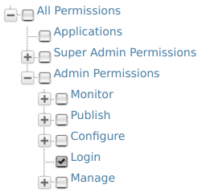

# Role-based Permissions

The **User Management** module in WSO2 products enable role-based access. With this functionality, the permissions enabled for a particular role determines what that user can do using the management console of a WSO2 product. Permissions can be granted to a role at two levels:

-   **Super tenant level:** A role with super tenant permissions is used for managing all the tenants in the system and also for managing the key features in the system, which are applicable to all the tenants.
-   **Tenant level:** A role with tenant level permissions is only applicable to individual tenant spaces.

The permissions navigator that you use to enable permissions for a role is divided into these two categories (**Super Admin** permissions and **Admin** permissions) as shown below.


You can access the permissions navigator for a particular role by clicking **Permissions** as shown below.


By default, every WSO2 product comes with the following Users, Roles and Permissions configured:

**Users:**

- **Admin** - Has all the permissions in the system enabled by default. Therefore, this is a super tenant, with all permissions enabled. By default, the admin user is assigned to both the **admin** and the **everyone** roles.

!!! info

    -   The **admin** user and **admin** role is defined and linked to each other in the `user-mgt.xml` file, stored in the `<PRODUCT_HOME>/repository/conf/` directory as shown below.

        ``` java
        <AddAdmin>true</AddAdmin>
        <AdminRole>admin</AdminRole>
        <AdminUser>
            <UserName>admin</UserName>
            <Password>admin</Password>
        </AdminUser>
        ```
        These properties can be customized by configuring the `<PRODUCT_HOME>/repository/conf/deployment.toml` file. For more information, see [Configuring the System Administrator]({{base_path}}/Administer/ProductAdministration/ManagingUsersAndRoles/ManagingUserStores/configuring-the-system-administrator) 

    -   The **admin** role has all the permissions in the system enabled by default. Therefore, this is a super tenant, with all permissions enabled.

**Roles:**

By default, all WSO2 products have the following roles configured: 

-   **admin** - Provides full access to all features and controls. By default, the admin user is assigned to both the admin and the `Internal/everyone` roles.
-   **Internal/everyone** - This is a pre defined role that is used to group all the users (across the user stores) together. When you create a new user, automatically the user belongs to the `Internal/everyone` role. It does not include any permissions. This role can be used to identify all logged in users.
-   **Internal/system** - This is another pre defined role which does not include any permissions. Unlike the `Internal/everyone` role, this role is **not assigned** to a user by default.
-   **Internal/analytics** - This role can be assigned to users who do not have the publisher or subscriber roles assigned but need permission to view the analytics dashboards.

In addition to the above, the following roles exist by default.

1.  Internal/creator
2.  Internal/publisher
3.  Internal/subscriber

For more information about managing roles, see [Managing User Roles]({{base_path}}/Administer/ProductAdministration/ManagingUsersAndRoles/managing-user-roles)

You will be able to log in to the management console of the product with the **admin** user defined in the `user-mgt.xml` file. You can then create new users and roles and configure permissions for the roles using the management console. However, note that you cannot modify the permissions of the **admin** role. The possibility of managing users, roles and permissions is granted by the **User Management** permission. For more information, see [Configuring the User Realm](https://is.docs.wso2.com/en/5.9.0/setup/configuring-the-realm/) .

## Description of role-based permissions

!!! note
    Note that the descriptions given in this document only explains how permissions control access to operations available on the [Management Console](``https://localhost:9443/carbon``) (`https://<hostname>:9443/carbon`). Also, not all the permissions available in the permission tree are listed here. You can get the information related to them throughout the documentation wherever applicable.

### Log-in Permissions

The **Login** permission defined under **Admin** permissions allows users to log in to the management console of the product. Therefore, this is the primary permission required for using the management console.



### Super Tenant Permissions

The following table describes the permissions at **Super Tenant** level. These are also referred to as **Super Admin** permissions.

<table>
<colgroup>
<col width="50%" />
<col width="50%" />
</colgroup>
<thead>
<tr class="header">
<th>Permission</th>
<th>Description of UI menus enabled</th>
</tr>
</thead>
<tbody>
<tr class="odd">
<td><strong>Management</strong> permissions: </br>
</td>
<td><p>The <strong>Super Admin/Manage</strong> permissions are used for adding new tenants and monitoring them.</p>
<p><strong>- Modify/Tenants</strong> permission enables the <strong>Add New Tenant</strong> option in the <strong>Configure/Multitenancy</strong> menu of the management console, which allows users to add new tenants.<br />
<strong>- Monitor/Tenants</strong> permission enables the <strong>View Tenants</strong> option in the <strong>Configure/Multitenancy</strong> menu of the management console.</p></td>
</tr>
<tr class="even">
<td><strong>Server Admin</strong> permissions:<br />
</td>
<td>Selecting the <strong>Server Admin</strong> permission enables the <strong>Manage/Shutdown/Restart</strong> option in the <strong>Main</strong> menu of the management console.</td>
</tr>
</tbody>
</table>

<!-- -->

### Tenant-level permissions

The following table describes the permissions at **Tenant** level. These are also referred to as **Admin** permissions.

!!! info
        Note that when you select a node in the **Permissions** navigator, all the subordinate permissions that are listed under the selected node are also automatically enabled.

<table>
<colgroup>
<col width="50%" />
<col width="50%" />
</colgroup>
<thead>
<tr class="header">
<th>Permission level</th>
<th>Description of UI menus enabled</th>
</tr>
</thead>
<tbody>
<tr class="odd">
<td>Admin</td>
<td><p>When the <strong>Admin</strong> permission node is selected, features including the following menus are enabled in the management console:</p>
<p><strong>- Identity/User Stores:</strong> This permission allows users to add new user stores and manage them with the management console. Note that only secondary user stores can be added using this option. See the topic on <a href="../../../../Administer/ProductAdministration/ManagingUsersAndRoles/ManagingUserStores/configuring-secondary-user-stores/">Configuring Secondary User Stores</a> for more details.<br />
<strong>- Identity/Identity Providers:</strong> See the topic on <a href="https://is.docs.wso2.com/en/5.9.0/learn/adding-and-configuring-an-identity-provider">working with identity providers</a> for details on how to use this option.</p>
<p>- Additionally, all permissions listed under <strong>Admin</strong> in the permissions navigator are selected automatically.</p></td>
</tr>
<tr class="even">
<td>Admin/Manage/Identity/User Store Management</td>
<td>This permission enables the <strong>Identity/User Stores</strong> option in the <strong>Main</strong> menu. This option allows users to add new user stores. For more details on User Store Management, see <a href="../../../../Administer/ProductAdministration/ManagingUsersAndRoles/ManagingUserStores/configuring-secondary-user-stores/">Configuring Secondary User Stores</a></td>
</tr>
<tr class="odd">
<td>Admin/Manage/Identity/Claim</td>
<td>This permission enables the <strong>Identity/Claims</strong> option in the <strong>Main</strong> menu. This option allows users to perform Claim Management. For more details, see <a href="https://is.docs.wso2.com/en/5.9.0/learn/claim-management/">Claim Management.</a></td>
</tr>
<tr class="even">
<td>Admin/Manage/Identity/Key Store Management</td>
<td>This permission enables the <strong>Manage/KeyStores</strong> option in the <strong>Main</strong> menu. This option allows users to add and modify new key stores. For more details on Key Store Management, see <a href="https://is.docs.wso2.com/en/5.9.0/administer/creating-new-keystores/">Ceating New Key Stores</a></td>
</tr>
<tr class="odd">
<td>Admin/Manage/Resources/Browse</td>
<td>This permission enables the <strong>Browse</strong> option under the <strong>Registry</strong> menu in the main navigator. This option allows users to browse the resources stored in the registry by using the <strong>Registry</strong> tree navigator.</td>
</tr>
<tr class="even">
<td>Admin/Manage/Search</td>
<td>This permission enables the <strong>Search</strong> option under the <strong>Registry</strong> sub menu in the <strong>Main</strong> menu. This option allows users to search for specific resources stored in the registry by filling in the search criteria.</td>
</tr>
<tr class="odd">
<td>Admin/Monitor</td>
<td>When the <strong>Admin/Monitor</strong> permission node is selected, system monitoring related features including the following menus are enabled in the management console:<br />
<br />
<strong>- Monitor</strong> menu <strong>/System Statistics:</strong> See the topic on <a href="../../../../Administer/ProductAdministration/Monitoring/monitoring-performance-statistics">system statistics</a> for information on how to use this option.<br />
<br />
- Additionally, all permissions listed under <strong>Admin/Monitor</strong> in the permissions navigator will be enabled automatically.</td>
</tr>
</tbody>
</table>


