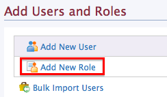
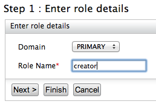
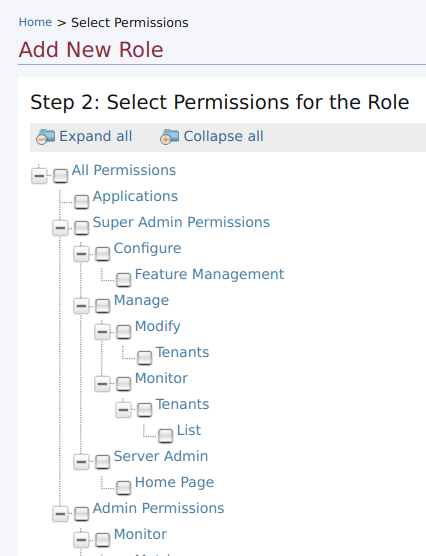
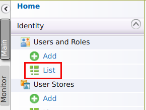
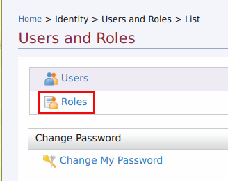
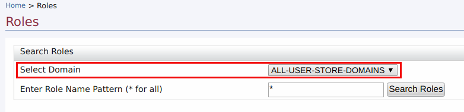

# Managing User Roles

Roles contain permissions for users to manage the server. They can be reused and they eliminate the overhead of granting permissions to users individually.

Throughout this documentation, we use the following roles that are typically used in many enterprises. You can also define different user roles depending on your requirements.

-   **admin:** The API management provider who hosts and manages the [API Gateway](../../../../GettingStarted/overview/#api-gateway) and is responsible for creating users in the system, assigning them roles, managing databases, security, etc. The Admin role is also used to access the WSO2 Admin Portal ( `https://<APIM_Host>:<APIM_Port>/admin` ), where you can define workflow tasks, throttling policies, analytics configurations, etc. The Admin role is available by default with the credentials admin/admin. By default, this role contains all the permissions (including super admin permissions) in the permission tree.
-   **creator:** A creator is typically a person in a technical role who understands the technical aspects of the API (interfaces, documentation, versions etc.) and uses the [API publisher](../../../../GettingStarted/overview/#api-publisher) to provision APIs into the Developer Portal. The creator uses the Developer Portal to consult ratings and feedback provided by API users. Creator can add APIs to the Developer Portal but cannot manage their lifecycle. Governance permission gives a creator permission to govern, manage and configure the API artifacts.
-   **publisher:** A person in a managerial role and overlooks a set of APIs across the enterprise and controls the API lifecycle, subscriptions and monetization aspects. The publisher is also interested in usage patterns for APIs and has access to all API statistics.
-   **subscriber:** A user or an application developer who searches the [Developer Portal](../../../../GettingStarted/overview/#developer-portal) to discover APIs and use them. S/he reads the documentation and forums, ratings/comments on the APIs, subscribes to APIs, obtains access tokens and invokes the APIs.

Follow the instructions below to create the `creator` , `publisher` and `subscriber` roles in the API Manager for example.

!!! info
        Creator, Publisher and Subscriber roles are available by default in API Manager.

### Create user roles

1.  Log in to the management console ( `https://<APIM_Host>:<APIM_Port>/carbon` ) as admin (default credentials are admin/admin).
2.  In the **Main** menu, click **Add** under **Users and Roles**.

    

3.  Click **Add New Role**.

    

4.  Enter the name of the user role (e.g., `creator` ).

    
    
    In the Domain list, specify the user store where you want to create this role. This list includes the primary user store and any other secondary user stores that are configured for your product. For information on how user stores (which are repositories storing information about users and roles) are set up and configured, see [Configuring User Stores](../../../../Administer/ProductAdministration/ManagingUsersAndRoles/ManagingUserStores/introduction-to-userstores). Enter a unique name for this role (`creator`) and click **Next**.

    !!! tip
            The **Domain** drop-down list contains all user stores configured in the system. By default, you only have the PRIMARY user store. To configure secondary user stores, see [Configuring Secondary User Stores](../../../../Administer/ProductAdministration/ManagingUsersAndRoles/ManagingUserStores/configuring-secondary-user-stores/).

5.  The permissions page opens. 

    

    Select the permissions according to the role that you create. The table below lists the permissions of the `creator` , `publisher` and `subscriber` roles which are available by default:

    <table>
    <thead>
    <tr class="header">
    <th>Roles</th>
    <th>Permissions</th>
    <th>UI</th>
    </tr>
    </thead>
    <tbody>
    <tr class="odd">
    <td>creator</td>
    <td><ul>
    <li>Configure &gt; Governance and all underlying permissions.</li>
    <li>Login</li>
    <li>Manage &gt; API &gt; Create</li>
    <li>Manage &gt; Resources &gt; Govern and all underlying permissions</li>
    </ul></td>
    <td><div class="content-wrapper">
    
    </div></td>
    </tr>
    <tr class="even">
    <td>publisher</td>
    <td><ul>
    <li>Login</li>
    <li>Manage &gt; API &gt; Publish</li>
    </ul></td>
    <td><div class="content-wrapper">
    
    </div></td>
    </tr>
    <tr class="odd">
    <td><p>subscriber<br />
    </p></td>
    <td><ul>
    <li>Login</li>
    <li>Manage &gt; API &gt; Subscribe</li>
    </ul>
    <br />
    </td>
    <td><div class="content-wrapper">
    
    </div></td>
    </tr>
    </tbody>
    </table>

6.  Click **Finish** once you are done adding permissions.

!!! info
        When a user creates an application and generates application keys, a role is created automatically in the following format.

``` java
"Application/<username>_<applicationName>_PRODUCTION"
```

These roles do not have any permissions assigned to it, but it is used to manage the visibility of the corresponding service provider that is created in the format of `'<username>_<applicationName>_PRODUCTION'` within the Key Manager. The created service provider is only visible to users with the latter mentioned role that has been generated automatically. Only if a user with admin privileges assigns the latter mentioned role to a user, will that user be able to view the details of the service provider that is created per application.

#### Editing or deleting a role

1. Log in to the management console ( `https://<APIM_Host>:<APIM_Port>/carbon` ) if you have not done already.

2. In the **Main** menu, click **List** under **Users and Roles**.

    

3. Click **Roles**.

    

4. If you need to do modifications to a role, select the domain (user store) under **Search Roles** > **Select Domain** where the role resides.

    

    Then use the relevant links in the **Actions** column in the role listing to perform the following:

    

    -   Rename the role
    -   Change the default permissions associated with this role
    -   Assign this role to users
    -   View the users who are assigned this role
    -   Delete the role if you no longer need it

!!! info
        If the role is in an external user store to which you are connected in read-only mode, you will be able to view the existing roles but not edit or delete them. However, you can still create new editable roles.


##### Update before the first startup (recommended)

The default role name of the Administrator, (`admin`) can be changed before starting WSO2 API Manager by editing `<API-M_HOME>/repository/conf/deployment.toml` file. For more information on configuring the system administrator, see [Configuring the System Administrator](../../../../Administer/ProductAdministration/ManagingUsersAndRoles/ManagingUserStores/configuring-the-system-administrator).

Configure the property `admin_role` with your custom role (`administrator`) in the `deployment.toml` file as follows and start the server.

```
[super_admin]
admin_role = "administrator"
username = "admin"
password = "admin"
create_admin_account = true
```

##### Update after the product is used for some time (advanced configuration)

If you have already updated the role names before the first startup of the product, these steps are not necessary. The following steps guide you through updating the role names after you have used the product for some time.

1.  Make the configuration changes indicated in [the above section](#update-before-the-first-startup-recommended).

2.  Do the following user store level changes for existing users:

    If you are connected to the `JDBCUserStoreManager`, update the `UM_ROLE` table with the new role name that you defined in place of the `admin` role.

    !!! info
            The schema can be located by referring to the data source `[database.shared_db]` defined in the `deployment.toml` file. The data source definition can also be found in the same file.

    -   If you are connected to the `ReadWriteLdapUserStoreManager`, populate the members of the previous `admin` role to the new role under **Groups**. For more information, see [Configuring User Stores](../../../../Administer/ProductAdministration/ManagingUsersAndRoles/ManagingUserStores/introduction-to-userstores) .

3.  After the changes, **restart** the server.


