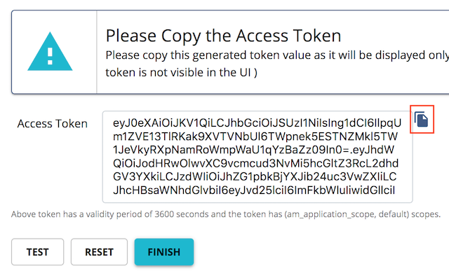

# Quick Start Guide

##### Before you begin....

!!! tip
        1.  Install [Oracle Java SE Development Kit (JDK)](http://java.sun.com/javase/downloads/index.jsp) version 11.\* or 1.8.\* and set the `JAVA_HOME` environment variable. Refer [Setup and Install](../../SetupAndInstall/InstallationGuide/InstallingTheProduct/installing-on-linux-or-os-x/) documentation to set `JAVA_HOME` environment variable for different operating systems
        2.  [Download the latest version of WSO2 API Manager](https://wso2.com/api-management/install/) .
        3.  Start WSO2 API Manager by going to the `<API-M_HOME>/bin` directory using the command-line and then executing `wso2server.bat` (for Windows) or `wso2server.sh` (for Linux.)

##### Let's get started....

In the following section we will be doing 3 things.

1. Creating an API from the API publisher portal and deploying it.
2. Subscribing to the API through the developer portal and getting keys.
3. Accessing the APIs with keys.

Once these steps are done we will take a look at how we can create an API using the API controller, which is a command line tool to develop and deploy APIs.

### Creating and deploying an API from the publisher portal.

1.  Once the API Manager has started open a web browser and navigate to the API publisher portal on `https://localhost:9443/publisher` and login with **`admin/admin`** credentials.

2. Once logged in you should see a page that looks like below.                                                      

    

3.  If you want to deploy a pre-configured sample API that works you can chose the 'Deploy Sample API' option. Note that this option is only available as long as there are no APIs created in the system.

4. We are about to create an API for a Hello World REST service. Let's quickly create a mock REST service for Hello World using `https://www.mocky.io/`. Visit this website on a new tab on your browser. You should see a URL being displayed on the top of the web page which looks like below

    `https://www.mocky.io/v2/5185415ba171ea3a00704eed`

    Copy this URL and use a new browser tab to navigate to it. You should see a JSON message saying `{"hello": "world"}` We are going to create an OAuth2.0 protected REST API for this service on API Manager.

5. To create a new API from scratch let's click on the `Create API` button and chose the `Design a new REST API` option.
  
    
    

6.  Fill in the following details in the form that appears. Use the URL from mocky.io as the endpoint. Note to use the http protocol for now since using https for mocky.io requires importing its certificate into API Manager.

      

7.  Click on the `Create & Publish` button once done. This will deploy your first API on the developer portal and API gateway. You now have an OAuth2.0 secured REST API that is ready to be consumed.

### Consuming the API from the developer portal.

1.  Open up a new browser terminal and navigate to `https://localhost:9443/devportal`. You should see the `HelloWorld` API appearing on the portal. Click on the `Sign-In` button on the top right corner to login to the developer portal and sign-in by entering the default **`admin/admin`** credentials.

2. Once logged in click on the API thumbnail to view details of the API. You should see a page that gives you an overview of the API. Click on the button that says `Key Generation Wizard`. This will walk you through a few steps that registers an OAuth2.0 application which consumes this API.  

    

3.  In the form that appears, enter `Greetings` as the name of the application. Let the other fields be left with default values and proceed by clicking on the `Next` button.  

      

4.  The next step is about subscribing the `Greetings` application to the API on a selected Business Plan. You can leave the defaults on this page and proceed by clicking on the `Next` button.  

      

5. The 3rd step in the key generation wizard is about generating credentials for your OAuth2.0 application. The `Grant Types` are the various protocols which will be allowed by the system for your application to request tokens from. You can leave the defaults on this page as well and proceed by clicking on the `Next` button.  

      

6. In the next step we generate a test access token for our application to access the API. This allows us to specify the required validity period for the token and its permissions (scopes). Leave the defaults as is on this form and press `Next`.  

      

7. On the final step of the wizard we can view the token that is generated and copy it to the clipboard using the button right next to the text box displaying the token. Once copied click on the `Finish` button.  

      

8. The next step is to test the API with the OAuth2.0 token we just generated. To do that click on the `Test` button on the left hand side menu. You will see a console which lists the resources of the API. Paste the copied token in the text box right next to the word `Bearer` as shown below.  

      

9. If this is the first time you are using the API test console from your browser, open a new tab and navigate to the URL `https://localhost:8243/`. This will prompt  your browser to accept the certificate used by the API gateway. This is because by default the API gateway uses a self-signed certificate that is not trusted by web browsers. This certificate is replaced when deploying the system in production.

10. Once the token has been pasted on the text box you can try out the API. Click on the `GET` resource of the API and once expanded click on the `Try it out` button on the right. Then press on the `Execute` button.  

      

11. You should see the `{"hello" : "world"}` response from the API.  

      

12. Congratulations!. You have successfully created your first API, subscribed to it through an OAuth2.0 application, obtained an access token for testing and tested your API with the access token.