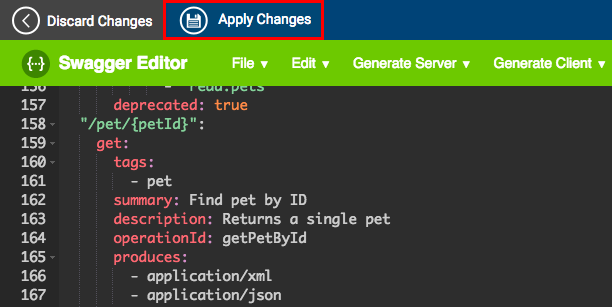

# Create and Publish an API from a Swagger Definition

A Swagger definition is a format that describes REST APIs. In this tutorial, you create and publish an API in WSO2 API Manager using a Swagger definition for an existing API.

1.  Sign in to the WSO2 API Publisher.
    `          https://<hostname>:9443/publisher         `
2.  In the **APIS** menu, click **Add New API** .
    
3.  Select **I Have an Existing API** . Click **Swagger URL** and give `                     http://petstore.swagger.io/v2/swagger.json                   ` as the URL. Click **Start Creating** .
    
4.  Edit the information as given below. 

    | Field   | Sample value |
    |---------|--------------|
    | Name    | Petstore     |
    | Context | /petstore    |
    | Version | 1.0.0        |

    

5.  Notice that all the **API resources** are created automatically when the Swagger URL is specified.
    
6.  Click **Edit Source** to edit the Swagger file and remove security headers. This is required to invoke the API in the Store using the Swagger UI.
    
7.  Remove the security tag from the `           /pet          ` POST resource given below. This is required to enable API invocation using the API (store) console.

    **Swagger - Post resource**

```java
        //remove the following code snippet
        security:
            - petstore_auth:
                - 'write:pets'
                - 'read:pets'
```

8.  Remove the security `           pet/{petId}          ` GET resource given below:

    **Swagger - Get resource**

``` java
        //remove the following code snippet
        security:
                - api_key: []
```

9.  After removing the security tags, click **Apply Changes** to save the changes.
    
    Then, click **Next: Implement.**
10. Click the **Managed API** option. Enter the information shown below and click **Next: Manage** .

    | Field               | Sample value                                          |
    |---------------------|-------------------------------------------------------|
    | Endpoint type       | HTTP/REST endpoint                                    |
    | Production endpoint | http://petstore.swagger.io/v2/                        |
    | Sandbox endpoint    | Providing only the production endpoint is sufficient. |

    

11. Select the options described in the table below.

    | Field              | Sample value   | Description                                                                                                                                                                                                           |
    |--------------------|----------------|-----------------------------------------------------------------------------------------------------------------------------------------------------------------------------------------------------------------------|
    | Transports         | HTTP and HTTPS | The transport protocol on which the API is exposed.  Both HTTP and HTTPS transports are selected by default. If you want to limit API availability to only one transport (e.g., HTTPS), un-check the other transport. |
    | Subscription Tiers | Gold, Silver   | The API can be available at different levels of service. They allow you to limit the number of successful hits to an API during a given period of time.                                                               |

    

    !!! note
    
        For more information on API authentication (e.g., non authentic API invocation), see [HTTP methods](https://docs.wso2.com/display/AM260/Key+Concepts#KeyConcepts-HTTPmethods) .
    

12. Click **Save & Publish** . 

Now you have successfully published an API using a Swagger defintion.

Let's invoke the API from the API Store.

### **Invoking the API**

1.  Sign in to the WSO2 API Store.
    `           https://<hostname>:9443/store          `

2.  Select the **PetStore** API to open it.
3.  [Subscribe](https://docs.wso2.com/display/AM260/Subscribe+to+an+API) to the API using the DefaultApplication and the Gold tier.
    
4.  Click **View Subscriptions** to view all the APIs to which the Default Application has subscribed.
    
5.  Click the **Production Keys** tab and generate a token.
    

6.  Navigate to the **API Console** for the PetStore API.
    
7.  Expand the `           POST          ` resource, click **Try it out** , and give the following example as the request body. Click **Execute** and view the response.

    -   [**Request Body**](#e4a387bcbb0a42e7b56493ed7fc8ba9f)
    -   [**Response**](#ec7edf9b862a45c797026d96cbce4db5)

``` java
    {
      "id": 0,
      "category": {
        "id": 0,
        "name": "Dogs"
      },
      "name": "Rover",
      "photoUrls": [
        "string"
      ],
      "tags": [
        {
          "id": 0,
          "name": "lion_shepard"
        }
      ],
      "status": "available"
    }
```

``` java
        {
          "id": 9123612807670061000,
          "category": {
            "id": 0,
            "name": "Dogs"
          },
          "name": "Rover",
          "photoUrls": [
            "string"
          ],
          "tags": [
            {
              "id": 0,
              "name": "lion_shepard"
            }
          ],
          "status": "available"
        }
```

    You have successfully invoked the Petstore API.

### Related Tutorials

-   [Create and Publish an API](_Create_and_Publish_an_API_)

-   [Create a WebSocket API](https://docs.wso2.com/display/AM260/Create+a+WebSocket+API)

-   [Create a Prototyped API with an Inline Script](https://docs.wso2.com/display/AM260/Create+a+Prototyped+API+with+an+Inline+Script)


