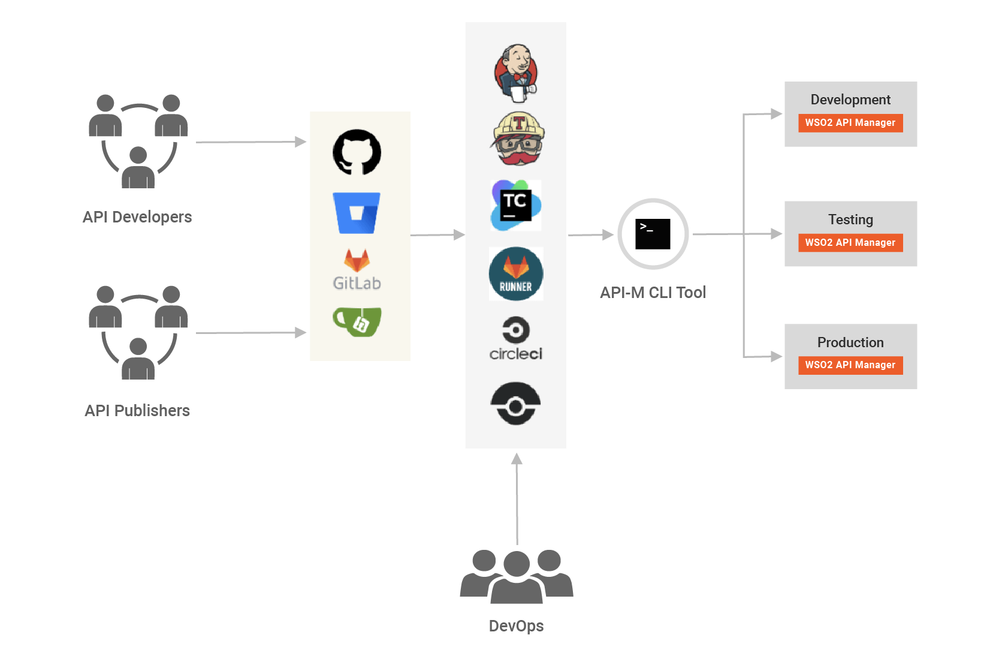
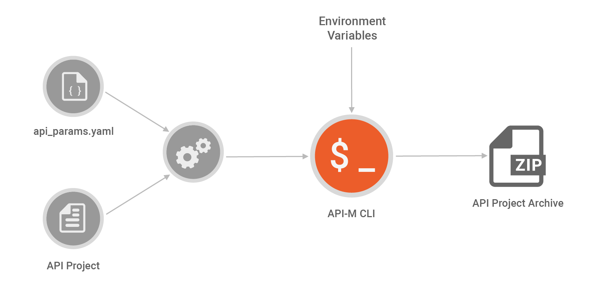
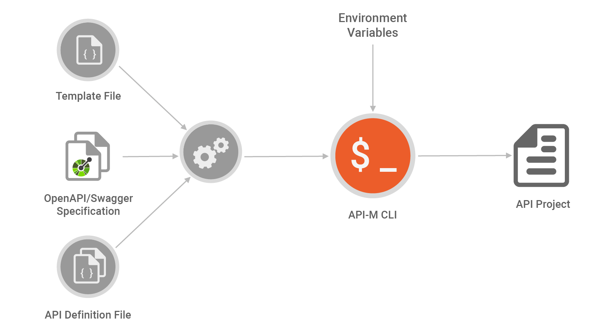

# Building a CI/CD Pipeline

APIs have become a defacto for connecting apps, services, and data. As organizations manage different environments for different purposes, APIs need to be available on each environment after developers specify conditions. Manually promoting APIs between environments is a tedious, error-prone, and time-consuming task. This drastically reduces an organization’s productivity.

WSO2 API Manager addresses the issue of API automation by providing a platform-agnostic, developer-centric solution. The apictl tool plays a key role in the automation pipeline. It can seamlessly integrate environment-related configurations and also create API Projects from Swagger/OpenAPI specifications, opening a gate to fully automated API deployment with only a few steps. With the power of flexible tooling, WSO2 API Manager is ready to address modern requirements for automating API deployments.

## The Problem

An organization can have multiple environments, such as development, testing, QA, staging, and production, each with own instance of API managers. These environments often have different configurations for APIs, and, when an API changes, these changes should be reflected in other environments with configurations. These migrations are often done manually and are error-prone. Owing to this, organizations invest more to reduce the impact caused by the manual process, which, in turn, increases maintenance costs for products.

In a software-driven world, it is natural to automate repetitive tasks, and CI/CD practices address this.

Continuous integration (CI) attempts to keep the code at a deployable state, merging code from different developers into a central branch or a trunk. Within this phase, automated tests run to ensure that the code works. Continuous delivery or continuous deployment are commonly referred to as CD. Continuous delivery refers to automating an entire release process, and it may include one or more manual stages. Continuous deployment takes this further and eliminates the manual steps in the release process; each code change is automatically deployed to production.

The CI/CD process makes a developer’s life easier by providing an automated mechanism to run tests and build upon a central code base, eliminating most issues in a development cycle. Since the deployment is automated, the manual steps for packaging and distributing can be easily performed. This makes software developers more productive and allows them to focus on solving problems rather than repeating tasks.


## CI/CD With WSO2 API Management

[](../../assets/img/Learn/ci-cd-pipeline-for-apis-with-wso2-apim.png)

WSO2 API Manager provides a clean and elegant solution to address automating API deployment. It automates from environment migration to lifecycle management and solves many issues regarding the manual process. The solution was designed to be platform-agnostic and version control-centric.

Continuous integration and continuous deployment for APIs is an open-ended scenario; different organizations have different ways of addressing the problem. In this article, we focus on discussing a generic solution that involves a minimum number of parties in an organization for API automation.

As shown in the above diagram, the pipeline could be integrated with any existing version control system and to support any available CI/CD automation server. The pipeline was designed to be flexible and provides maximum productivity for developers.

Although the diagram shows three parties, there could be more or less, depending on the organization’s structure.

-   API Developers: Develop APIs and related services
-   API Publishers: Publish APIs to users
-   DevOps: Control the deployment process

API Developers and Publishers work with a version control system, which acts as a single source of truth for the pipeline. API Developers can use WSO2 API Manager Publisher to create APIs. To continue with developed CI/CD APIs, they need to be accessible from a version control system. WSO2 API Manager’s CLI tool, apictl, can export an API as an archive, which contains all the information to recreate the API on another environment.

```bash
apictl export-api -e dev -n PizzaShackAPI -v 1.0.0 --provider admin
```

Once the API project archive is committed to the central repository, API Publishers can start working on preparing the API for other environments. To allow easily configuring environment-specific details, apictl supports an additional parameter file named api_params.yaml. We recommend storing the parameter file with the API Project; however, it can be stored anywhere as required.

```bash
environments:
  - name: dev
    endpoints:
      production:
        url: 'https://dev.wso2.com'
    certs:
     - hostName: 'https://dev.wso2.com'
       alias: Dev
       path: ~/.certs/dev.pem 
  - name: test
    endpoints:
      production:
        url: 'https://test.wso2.com'
        config:
          retryTimeOut: $RETRY
      sandbox:
        url: 'https://test.sandbox.wso2.com'
```

Production/Sandbox backends for each environment can be specified in the parameter file with additional configurations, such as timeouts. Also, certificates for each URL can be configured. For certificates, a valid path to the certificate file is required. They can be stored in the Automation Server.

The apictl tool supports detecting environment variables defined in usual notation. If an environment variable is not set, the tool will fail and request for a set of required environment variables on the system. This is to ensure that information is not missing during the migration process.

Once the file is placed in the project directory, the tool will auto-detect the parameters file upon import and create an environment-based artifact for API Manager. If the api_params.yaml is not found in the project directory, the tool will lookup in the project’s base path and the current working directory. It can also provide a custom path for the parameter file using the --params flag. We recommend keeping API and environment-specific parameters in separate repositories.

[](../../assets/img/Learn/creating-env-based-artifacts.png)

The Automation Server can be configured to run a specific pipeline for promoting artifacts to other environments. The DevOps team can develop this pipeline further to include automated tests, workflow approvals, and other tasks. The apictl tool should be installed in automation servers to begin the process. Since the tool supports a variety of platforms, including Linux/Windows and macOS, this can be done easily.

The apictl tool supports importing API Projects via the import-api command. This command is mainly used in the pipeline to migrate to different environments.

For example, to import PizzaShackAPI to a test environment, the following command could be invoked.

```bash
apictl import-api -f ./PizzaShackAPI -e test --preserve-provider=false --update=true
```
When the update flag is presented, API Manager will attempt to seamlessly update if an existing API is found with the same name and version. The import command prepares an API Project for API Manager by processing the parameter file. It determines which configuration should be processed to create an API Project by detecting the environment used to import.

When exporting an API, the apictl tool will also export the API’s lifecycle status. When importing to another environment, this lifecycle status will be preserved. This ensures that the API has the same state across environments. For example, if an API is in the Published state in the development environment, it will also be in the same state in the testing environment.This default behavior can be changed via the apictl tool, which assigns APIs the Created state after importing. The tool reduces the pipeline’s complexity and provides a simple and powerful mechanism to handle environment-specific configurations.

### Swagger/OpenAPI-based API CI/CD

WSO2 API Manager supports OpenAPI/Swagger specifications to create APIs. The apictl tool can generate projects with Swagger/OpenAPI specifications without using API-M Publisher. This powerful feature can be used to design pipelines that depend on Swagger/OpenAPI specifications.

For example:

```bash
apictl init PetstoreAPI --oas path/to/petstore.yaml
```
This generates an API project in the PetstoreAPI directory using provided specification. This project can be directly imported into the API Manager.

The apictl tool allows further customization to project initialization using a template file. Organization-specific common details can be put into this template file and shared across developers to increase productivity.

To further finetune API creation, an additional API Definition file can be used. This definition file supports detecting environment variables during the creation process. It can be combined with scripting to develop powerful tools for automating API Project creation.

With this, the Swagger/OpenAPI specification becomes a single source of truth for API deployment. By combining templating and definition, file automation servers can be configured to initialize API Projects from Swagger/OpenAPI specifications and also have custom parameter files. This reduces human intervention and boosts productivity.

For example, when an organization depends on microservices architecture, this method can be utilized to create an automated pipeline to take Swagger/OpenAPI specification to upper environments.

[](../../assets/img/Learn/api-automation-with-openapi-swagger.png)

Based on API Project generation, a powerful pipeline for API automation can be developed with OpenAPI/Swagger. It allows rapid API development and increases developer productivity.


