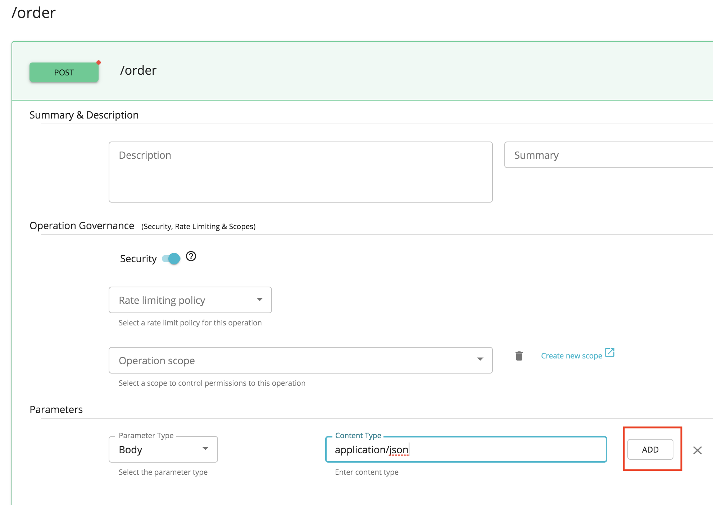
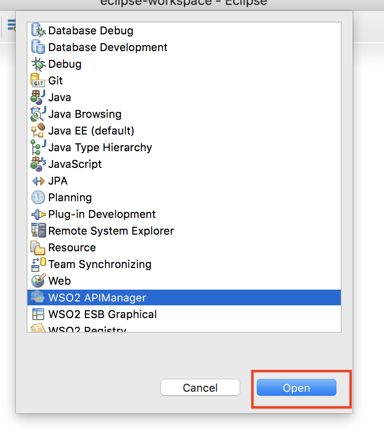
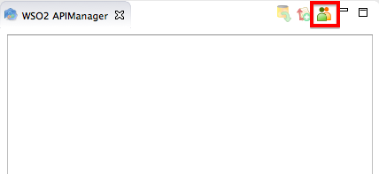
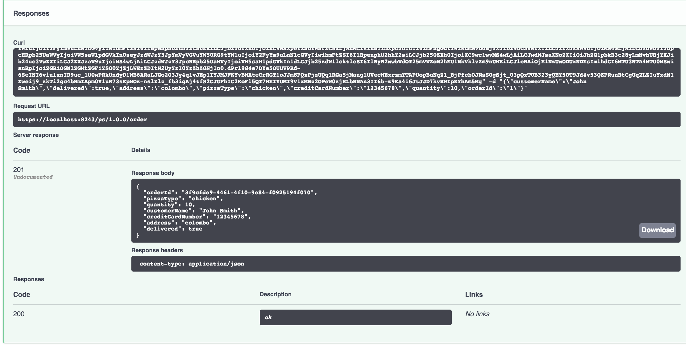

# Change the Default Mediation Flow of API Requests

!!! note
    This tutorial uses the WSO2 API Manager Tooling Plug-in.


The API Gateway has a [default mediation flow](../../../Learn/Extensions/adding-mediation-extensions.md) for the API invocation requests that it receives. You can extend this default mediation flow to do additional custom mediation for the messages in the API Gateway. An extension is provided as a [synapse mediation sequence](https://docs.wso2.com/display/EI650/Mediation+Sequences). You design all sequences using a tool such as the WSO2 API Manager Tooling Plug-in and then store the sequence in the Gateway's registry.

Let's see how to create a custom sequence using the WSO2 API Manager Tooling Plug-in and then deploy and use it in your APIs.

1.  Sign in to the API Publisher.

2.  Click **CREATE API** and then **Design a new REST API** to create an API with the following information.

    <table>
    <thead>
    <tr class="header">
    <th>Field</th>
    <th><br />
    </th>
    <th>Sample value</th>
    </tr>
    </thead>
    <tbody>
    <tr class="odd">
    <td>Name</td>
    <td><br />
    </td>
    <td>PizzaShack</td>
    </tr>
    <tr class="even">
    <td>Context</td>
    <td><br />
    </td>
    <td>/ps</td>
    </tr>
    <tr class="odd">
    <td>Version</td>
    <td><br />
    </td>
    <td>1.0.0</td>
    </tr>
    <tr class="even">
    <td>Resources</td>
    <td>URL pattern</td>
    <td>/order</td>
    </tr>
    <tr class="odd">
    <td><br />
    </td>
    <td>Request types</td>
    <td><p>POST method to place a new order</p></td>
    </tr>
    <tr class="even">
    <td>Business Plan</td>
    <td></td>
    <td>Gold</td>
    </tr>
    </tbody>
    </table>

    

3. Go to RESOURCES tab and add below parameter to the the /order POST resource.
    <table>
    <thead>
    <tr class="header">
    <th>Parameters</th>
    <th><br />
    </th>
    <th>Sample value</th>
    </tr>
    </thead>
    <tbody>
    <tr class="odd">
    <td>Parameter Type</td>
    <td><br />
    </td>
    <td>BODY</td>
    </tr>
    <tr class="even">
    <td>Content-Type</td>
    <td><br />
    </td>
    <td>application/json</td>
    </tr>
    </tbody>
    </table>
   

4. Download and install the WSO2 API Manager Tooling Plug-in by following one of the three possible methods described in Installing the API Manager Tooling Plug-In if you have not done so already. Start Eclipse by double clicking on the Eclipse application, which is  inside the downloaded folder.

5.  Navigate to the **Window** menu, click **Perspective** , **Open Perspective,** and **Other** to open the Eclipse perspective selection window.
    
6.  On the dialog box that appears, click **WSO2 API Manager** and click **OK** .
    
7.  On the APIM perspective, click the **Login** icon as shown below.
    
8.  On the dialog box that appears, enter the URL, username, and password of the Publisher server.

    

9. On the tree view that appears, expand the folder structure of the existing API.
10. Right-click on the `in` sequence folder and click **Create** to create a new `in` sequence.
     This is because you want the custom sequence to be invoked in the `In` direction or the request path. If you want it to be involved in the `Out` or `Fault` paths, select the respective folder under `customsequences`.

    !!! tip
        **Tip** : If you prefer not to use the registry to upload the sequence or want to engage a sequence to all APIs in WSO2 API-M at once, you can do so by saving the mediation sequence XML file in the file system. See [Adding Mediation Extensions](../../../Learn/Extensions/adding-mediation-extensions.md) for details.


11. Name the sequence `pizzaOrderInSeq` .
12. Your sequence now appears on the Developer Studio console. From under the **Mediators** section, drag and drop a [**Log** mediator](https://docs.wso2.com/display/EI650/Log+Mediator) to your sequence and give the following values.

    !!! note
        The **Log Mediator** has no direct impact on the message. You can retrieve the properties set on a message later through the [Synapse XPath Variables](https://docs.wso2.com/display/EI650/Accessing+Properties+with+XPath#AccessingPropertieswithXPath-SynapseXPathVariables) or the `get-property()` extension function. In this sequence, we are using a log mediator and a `get-property()` function to retrieve and log a property set to the message context during the execution.


    <table>
    <thead>
    <tr class="header">
    <th>Field</th>
    <th><br />
    </th>
    <th>Sample value</th>
    </tr>
    </thead>
    <tbody>
    <tr class="odd">
    <td>Log Category</td>
    <td>INFO</td>
    </tr>
    <tr class="even">
    <td>Log Level</td>
    <td>CUSTOM</td>
    </tr>
    <tr class="odd">
    <td>Property Name</td>
    <td>requestPath</td>
    </tr>
    <tr class="even">
    <td>Property Type</td>
    <td>Expression</td>
    </tr>
    <tr class="odd">
    <td>Value/Expression</td>
    <td><div class="content-wrapper">
    <p>get-property('REST_FULL_REQUEST_PATH')</p>
    </div></td>
    </tr>
    <tr class="even">
    <td>Property Name</td>
    <td>requestTime</td>
    </tr>
    <tr class="odd">
    <td>Property Type</td>
    <td>Expression</td>
    </tr>
    <tr class="even">
    <td>Value/Expression</td>
    <td><div class="content-wrapper">
    <p>get-property('api.ut.requestTime')</p>
    </div></td>
    </tr>
    </tbody>
    </table>

    

13. Navigate to the **File** menu, and click **Save** to save the sequence.

    !!! PizzaOrderInSeq
        ``` java
        <?xml version="1.0" encoding="UTF-8"?>
        <sequence name="PizzaOrderInSeq" trace="disable" xmlns="http://ws.apache.org/ns/synapse">
        <log description="" level="custom" separator=",">
           <property name="request'path" value="get-property('REST_FULL_REQUEST_PATH')"/>
           <property name="requestTime" value="get-property('api.ut.requestTime')"/>
        </log>
        </sequence>
        ```

14. Right-click on the sequence and click **Commit File** to push the changes to the Publisher server.

!!! note
    Alternatively, you can create a CAR file including the sequences and can deploy it in API Manager. For more information, see [Deploying Composite Applications in the Server](https://docs.wso2.com/display/ADMIN44x/Deploying+Composite+Applications+in+the+Server) , which is in the WSO2 Administration Guide.


15. Sign in to the API Publisher again, select the API that you created earlier.

    

16. Go to the API's **Runtime Configurations** tab, enable the **Message Mediation** switch and enable **Common Policies**. Now you can select the sequence that you created for the In flow. Next, click **Save** to engage the sequence to the API.

    

!!! note
    When selecting a mediator, make sure that it is a non-blocking mediator as blocking mediators are not supported in API Gateway custom mediations. For more details, see [Adding Mediation Extensions](/Users/isharacooray/Documents/apim/public/docs-apim/en/docs/Learn/Extensions/adding-mediation-extensions.md).


17. Sign in to the API Developer Portal, subscribe to the API that you just published, by selecting the **Credentials** tab.

    

18. Select PROD KEYS,  generate the access tokens in order to invoke the API.

    

19. Copy the generated access token.

    !!! Tip
        You may save it in a file for future use.

    
20. Click the **Try Out** tab of the API.
    It opens the integrated API Console using which you can invoke the API. Paste the access token in the Access Token input box.
    Click on the POST '/order' resource and click on **Try it out**

    

21. Give the following as the payload and invoke the API. You can also give any other value of your choice.
 ``` java
    {
      "customerName": "John Smith",
      "delivered": true,
      "address": "colombo",
      "pizzaType": "chicken",
      "creditCardNumber": "12345678",
      "quantity": 10,
      "orderId": "1"
    }
 ```
    

    Note the response that you get as an order is created.

    

    You can see the below log getting printed on the <APIM_SERVER>/repository/logs/wso2carbon.log

    

In this tutorial, you created a sequence to change the default mediation flow of API requests, deployed it in the API Gateway and invoked an API using the custom mediation flow.

!!! note
    Please note that following mediators are not usable within custom sequences since they are not supported by API Gateway custom medications.

    -   Call mediator in non-blocking mode
    -   Send mediator


