# Convert a JSON Message to SOAP and SOAP to JSON

!!! note
This tutorial uses the [WSO2 API Manager Tooling Plug-in](https://docs.wso2.com/display/AM260/Installing+the+API+Manager+Tooling+Plug-In) and the **PhoneVerification** API created in [Create and Publish an API](../../../Learn/Tutorials/create-and-publish-an-api).


The API Gateway has a default mediation flow for the API invocation requests that it receives. You can extend this default mediation flow to do additional custom mediation for the messages in the API Gateway. An extension is provided as a synapse mediation sequence. You can design sequences using a tool such as the [WSO2 API Manager Tooling Plug-in](https://docs.wso2.com/display/AM250/Installing+the+API+Manager+Tooling+Plug-In) and then store the sequence in the Gateway's registry.

Let's see how to convert message types using custom sequences. In this tutorial, we convert a JSON payload to SOAP before sending it to a SOAP backend. Then we receive the response in SOAP and convert it back to JSON.

1.  Log in to the API Publisher and click the **PhoneVerification** API.

2.  Create the following resource and add it to the API.

        !!! tip
    **Tip** : The resource you create here invokes the [SOAP 1.2 Web service of the backend](http://ws.cdyne.com/phoneverify/phoneverify.asmx?op=CheckPhoneNumber). Therefore, the recommended method is HTTP POST. As you do not include the payload in a query string, avoid giving any specific name in the URL pattern, which will be amended to the actual backend URL.


    <table>
    <thead>
    <tr class="header">
    <th>Field</th>
    <th><br />
    </th>
    <th>Sample value</th>
    </tr>
    </thead>
    <tbody>
    <tr class="odd">
    <td>Resources</td>
    <td>URL pattern</td>
    <td>/*</td>
    </tr>
    <tr class="even">
    <td><br />
    </td>
    <td>Request types</td>
    <td><p>POST</p></td>
    </tr>
    </tbody>
    </table>


4.  After the resource is added, expand it and edit the parameter as follows. This parameter is used to pass the payload to the backend.

    | Summary & Description                  | Parameter Type | Content-Type        |
    |----------------------------------------|----------------|---------------------|
    | Pass the phone number and license key  | body           | application/json    |

    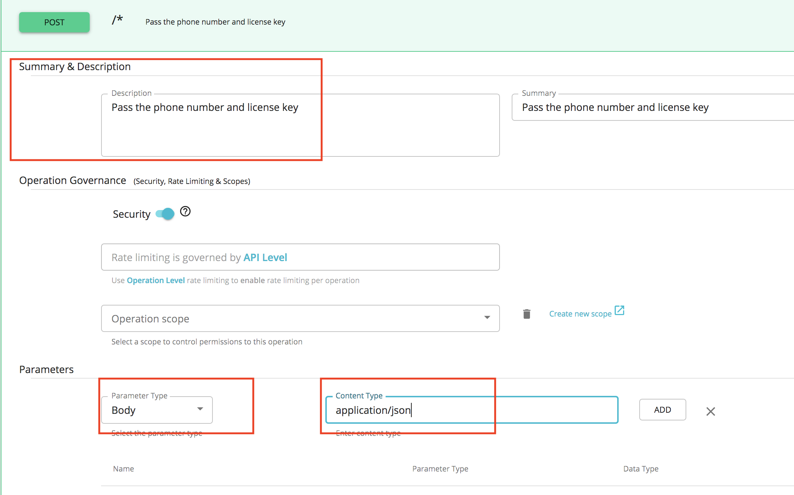

    Next, let's write a sequence to convert the JSON payload to a SOAP request. We do this because the backend accepts SOAP requests.

5.  Navigate to the **Endpoints** section and change the endpoint of the API to <http://ws.cdyne.com/phoneverify/phoneverify.asmx?WSDL>.
    [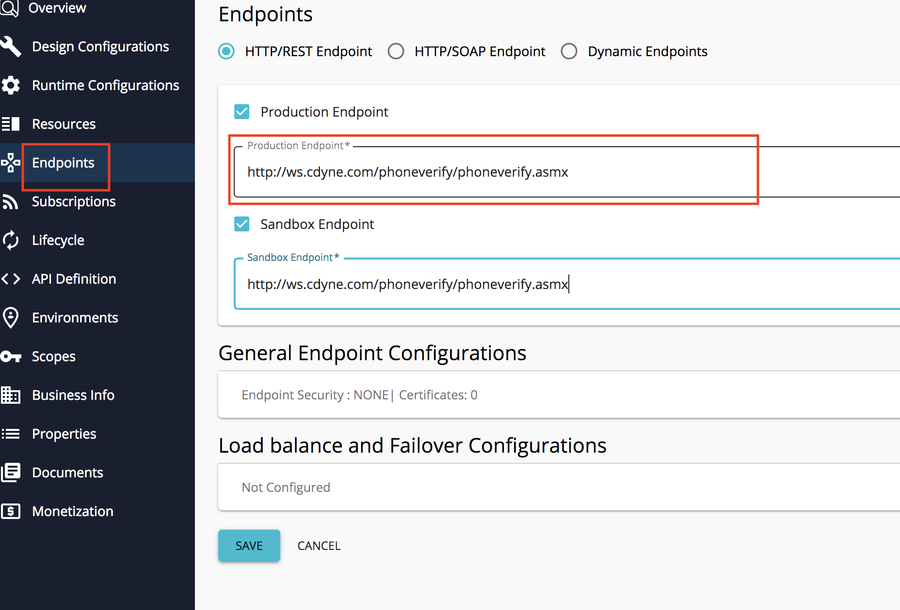](../../../assets/img/Learn/edit-endpoint.png)

6. Click **Save** to save the Endpoint details of the API.

7.  Download and install the [WSO2 API Manager Tooling Plug-in](https://docs.wso2.com/display/AM250/Installing+the+API+Manager+Tooling+Plug-In) if you have not done so already. Open Eclipse by double clicking the `Eclipse.app` file inside the downloaded folder.

8.  Click **Window &gt; Open Perspective &gt; Other** to open the Eclipse perspective selection window. Alternatively, click the **Open Perspective** icon shown below at the top right corner.
    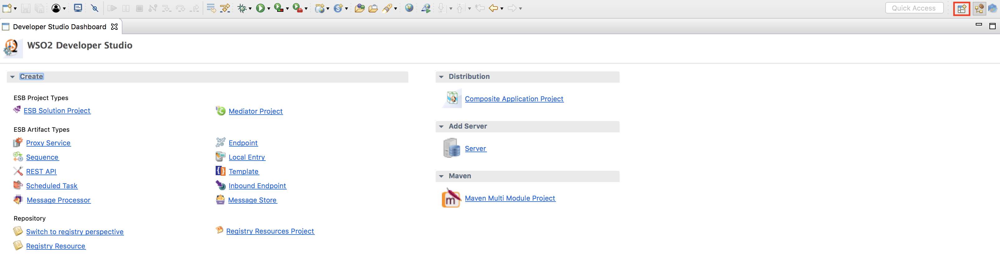
9.  On the dialog box that appears, select **WSO2 API Manager** and click **OK**.
    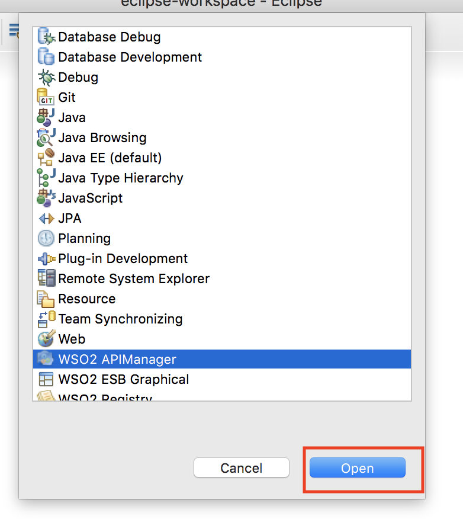
10.  On the API-M perspective, click the **Login** icon as shown below.

    [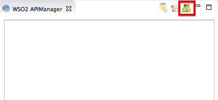](../../../assets/img/Learn/eclipse-login.png)

11. On the dialog box that appears, enter the URL, username, and password of the Publisher server.

    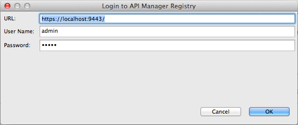

12. On the tree view that appears, expand the folder structure of the existing API.

13. Right-click on the **In** sequence folder and click **Create** to create a new [**In** sequence](https://docs.wso2.com/display/AM250/Key+Concepts#KeyConcepts-Sequences) .
    [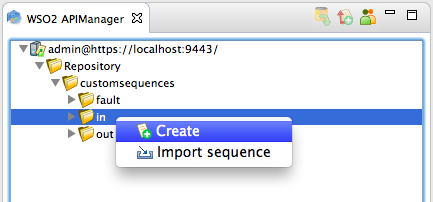](../../../assets/img/Learn/eclipse-create-in-seq.png)
14. Name the sequence `JSONtoSOAP`.
    [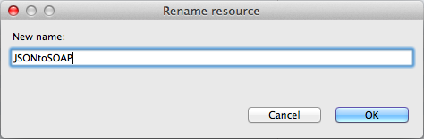](../../../assets/img/Learn/eclipse-name-resource.png)
15. Your sequence now appears on the APIM perspective. From under the **Mediators** section, drag and drop a **PayloadFactory** mediator to your sequence and give the following values to the mediator.

        !!! tip
    **Tip** : The **PayloadFactory** mediator transforms the content of your message. The `<args>` elements define arguments that retrieve values at runtime by evaluating the provided expression against the SOAP body. You can configure the format of the request/response and map it to the arguments.

    For example, in the following configuration, the values for the format parameters **PhoneNumber** and **LicenseKey** will be assigned with values that are taken from the `<args>` elements (arguments,) in that particular order.

    For details on how you got this configuration, see [PayloadFactory Mediator](https://docs.wso2.com/display/EI650/PayloadFactory+Mediator) in the WSO2 EI documentation.

 [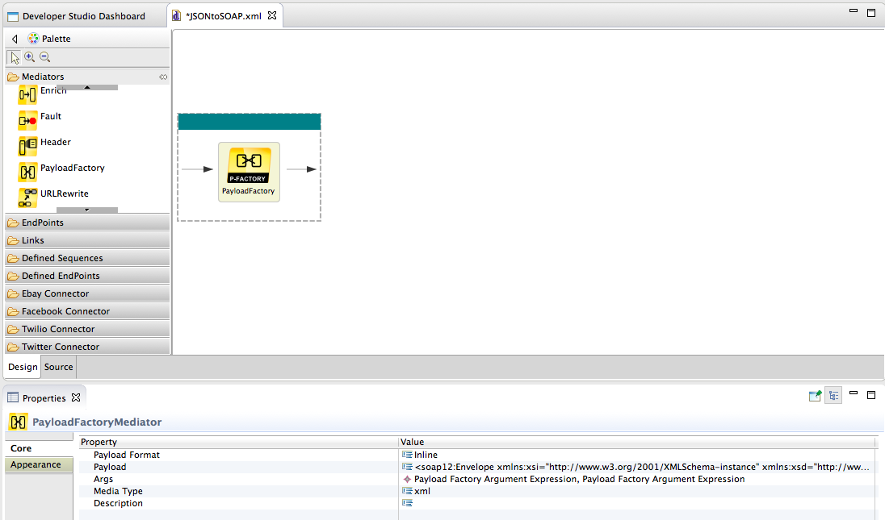](../../../assets/img/Learn/eclipse-payload-factory.png)

    |         |                                                                                                                                                                             |
    |---------|-----------------------------------------------------------------------------------------------------------------------------------------------------------------------------|
    | Payload | ``` xml                                                                                                                                                                     
          <soap12:Envelope xmlns:xsi="http://www.w3.org/2001/XMLSchema-instance" xmlns:xsd="http://www.w3.org/2001/XMLSchema" xmlns:soap12="http://www.w3.org/2003/05/soap-envelope">  
              <soap12:Body>                                                                                                                                                            
                  <CheckPhoneNumber xmlns="http://ws.cdyne.com/PhoneVerify/query">                                                                                                     
                       <PhoneNumber>$1</PhoneNumber>                                                                                                                                   
                       <LicenseKey>$2</LicenseKey>                                                                                                                                     
                  </CheckPhoneNumber>                                                                                                                                                  
               </soap12:Body>                                                                                                                                                          
          </soap12:Envelope>                                                                                                                                                           
      ```|
    | Args    | Give the arguments as a json expression as follows:                                                                                                                         
      <table>                                                                                                                                                                      
      <colgroup>                                                                                                                                                                   
      <col width="33%" />                                                                                                                                                          
      <col width="33%" />                                                                                                                                                          
      <col width="33%" />                                                                                                                                                          
      </colgroup>                                                                                                                                                                  
      <thead>                                                                                                                                                                      
      <tr class="header">                                                                                                                                                          
      <th>Type</th>                                                                                                                                                                
      <th>Value</th>                                                                                                                                                               
      <th>Evaluator</th>                                                                                                                                                           
      </tr>                                                                                                                                                                        
      </thead>                                                                                                                                                                     
      <tbody>                                                                                                                                                                      
      <tr class="odd">                                                                                                                                                             
      <td>expression</td>                                                                                                                                                          
      <td><div class="line number14 index13 alt1">                                                                                                                                 
      <code class="java string">                     //request/PhoneNumber                    </code>                                                                              
      </div></td>                                                                                                                                                                  
      <td>xml</td>                                                                                                                                                                 
      </tr>                                                                                                                                                                        
      <tr class="even">                                                                                                                                                            
      <td>expression</td>                                                                                                                                                          
      <td><code class="java string">                    //request/LicenseKey                   </code></td>                                                                        
      <td>xml</td>                                                                                                                                                                 
      </tr>                                                                                                                                                                        
      </tbody>                                                                                                                                                                     
      </table>                                                                                                                                                                     |

16. Similarly, add a **Property** mediator to the same sequence and give the following values to the property mediator. This mediator changes the payload type of the outgoing message to soap+xml. More information about the Property mediator can be found [here](https://docs.wso2.com/display/ESB500/Property+Mediator).
    [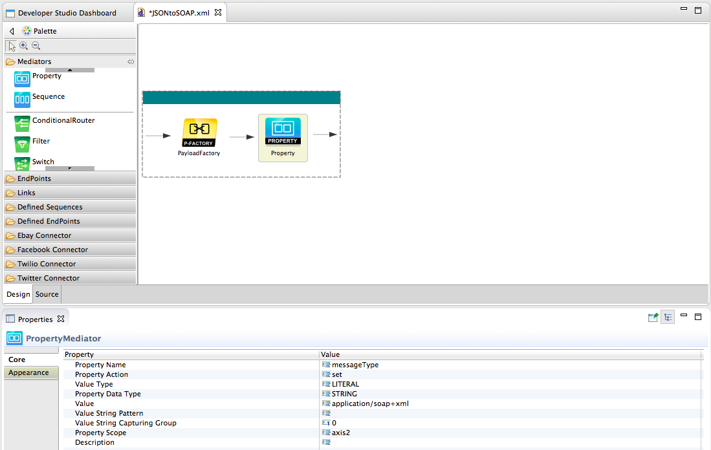](../../../assets/img/Learn/eclipse-property-mediator.png)

    |                |                      |
    |----------------|----------------------|
    | Property Name  | messageType          |
    | Value Type     | Literal              |
    | Value          | application/soap+xml |
    | Property Scope | axis2                |

17. Save the sequence, which is in XML format (e.g., `JSONtoSOAP.xml` ). This will be the **In** sequence for your API. Next, create an **Out** sequence.

18. Right-click on the **Out** sequence folder and click **Create** to create a new [**Out** sequence](https://docs.wso2.com/display/AM250/Key+Concepts#KeyConcepts-Sequences) .
    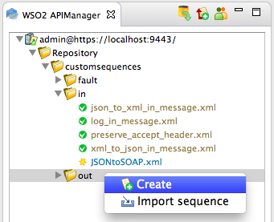

19. Name the sequence `SOAPtoJSON` .
    [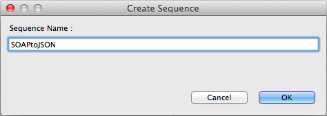](../../../assets/img/Learn/eclipse-create-seq.png)
20. Add a **Log** mediator to the sequence and give the following values. Note that the property value provided is a string literal.

        !!! info
    The **Log mediator** is used to log mediated messages. Having a custom log level allows logging only the properties added to the Log mediator configuration. More information can be found [here](https://docs.wso2.com/display/ESB500/Log+Mediator) .


    <table>
    <tbody>
    <tr class="odd">
    <td>Log Category</td>
    <td>INFO</td>
    </tr>
    <tr class="even">
    <td>Log Level</td>
    <td>CUSTOM</td>
    </tr>
    <tr class="odd">
    <td>Log Separator</td>
    <td>,</td>
    </tr>
    <tr class="even">
    <td>Properties</td>
    <td>Name: TRACE<br />
    Type: LITERAL<br />
    Value/Expression: Global Mediation Extension</td>
    </tr>
    </tbody>
    </table>

    [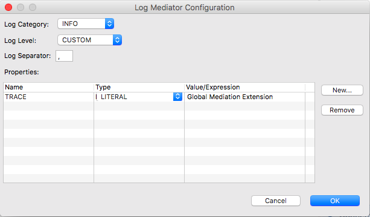](../../../assets/img/Learn/eclipse-log-mediator-config.png)

21. Similarly, add a **PayLoadFactory** mediator with the following values. This mediator in the out sequence is used to transform the SOAP message content returned from the backend into JSON.

    <table>
    <tbody>
    <tr class="odd">
    <td>Payload Format</td>
    <td>Inline</td>
    </tr>
    <tr class="even">
    <td>Payload</td>
    <td><code>               &lt;CheckPhoneNumber xmlns=&quot;                                                http://ws.cdyne.com/PhoneVerify/query                                              &quot;&gt;&lt;PhoneNumber&gt;$1&lt;/PhoneNumber&gt;&lt;LicenseKey&gt;$2&lt;/LicenseKey&gt;&lt;/CheckPhoneNumber&gt;              </code></td>
    </tr>
    <tr class="odd">
    <td>Args</td>
    <td>Type: Expression<br />
    Value: //request/PhoneNumber<br />
    Evaluator: xml<br />
    <br />
    Type: Expression<br />
    Value: //request/LicenseKey<br />
    Evaluator: xml</td>
    </tr>
    <tr class="even">
    <td>Media Type</td>
    <td>xml</td>
    </tr>
    </tbody>
    </table>

22. Finally, add a **Property** mediator with the following values. This mediator changes the payload type of the incoming message to JSON.

    | Property Name                | messageType      |
    |------------------------------|------------------|
    | Property Action              | set              |
    | Value Type                   | Literal          |
    | Property Data Type           | String           |
    | Value                        | application/json |
    | Value String Capturing Group | 0                |
    | Property Scope               | axis2            |

    [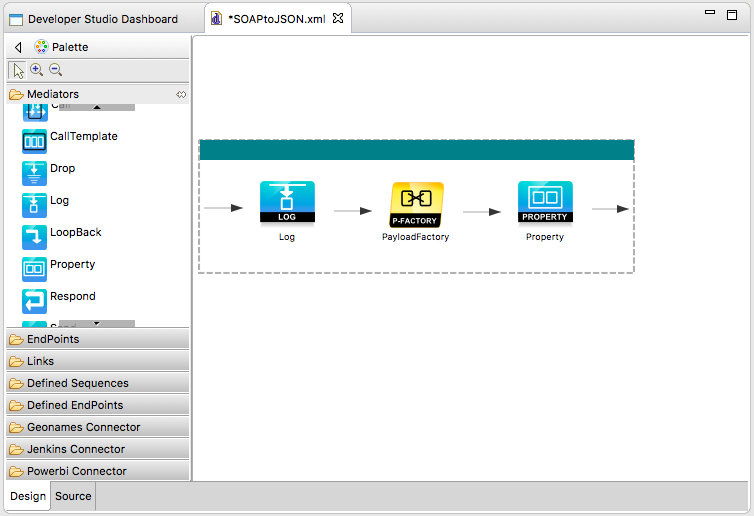](../../../assets/img/Learn/eclipse-soap-to-json.png)

23. Save the sequence, which is in XML format (e.g., `SOAPtoJSON.xml` ). This will be the **Out** sequence for your API.

24. Click the **Push all changes to the server** icon shown below to commit your changes to the Publisher server.
    [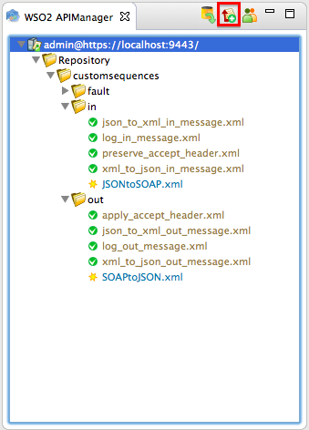](../../../assets/img/Learn/eclipse-push-all-changes.png)

25. Log back into the API Publisher, select PhoneVerification API and click the **Runtime Configurations** menu link associated with the API and navigate to the **Mediation Policies** section. Click the **Edit** icon and engage the **In** and **Out** mediation policies that you created earlier from the respective sections.
    [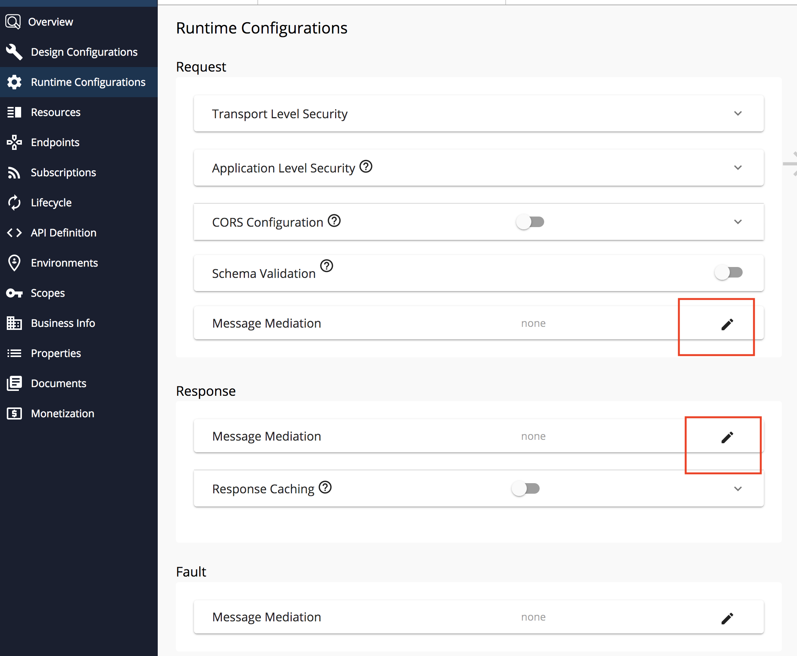](../../../assets/img/Learn/engage-created-mediation-policies.png)

        !!! info
    JSONtoSOAP **in sequence** will serve the purpose of transforming the JSON payload to SOAP before sending it to the SOAP backend. SOAPtoJSON **out sequence** will transform the SOAP message returned from the backend to JSON.


26. **Save** the API.
    You have created an API, a resource to access the SOAP backend and engaged sequences to the request and response paths to convert the message format from JSON to SOAP and back to JSON. Let's subscribe to the API and invoke it.
27. Log in to the API Devportal and [Subscribe to the API](../../../Learn/Tutorials/subscribe-to-an-api/) and create an access token if you have not done so already.
    [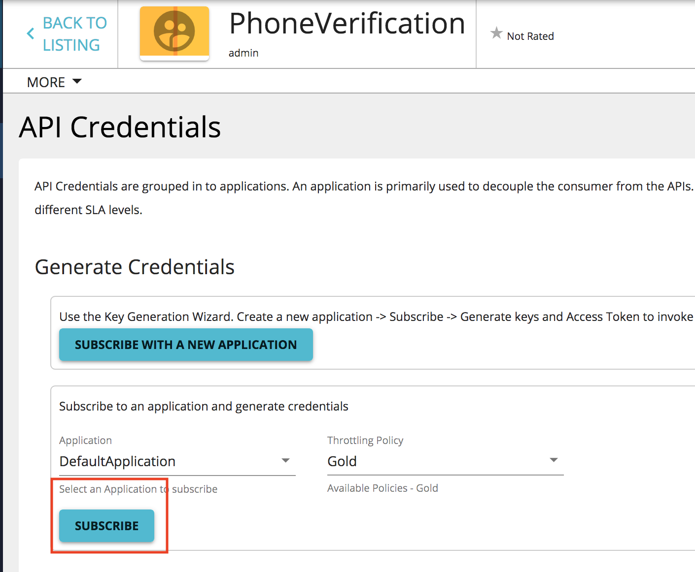](../../../assets/img/Learn/subscribe.png)

28. Select the PhoneVerification API, Go to the **Try Out** menu and expand the POST method.

29. Click on the **Try It Out** and give the payload in the `body` parameter in JSON format and click **Execute**. Here's a sample JSON payload: {"request":{"PhoneNumber":"18006785432","LicenseKey":"0"}}
    [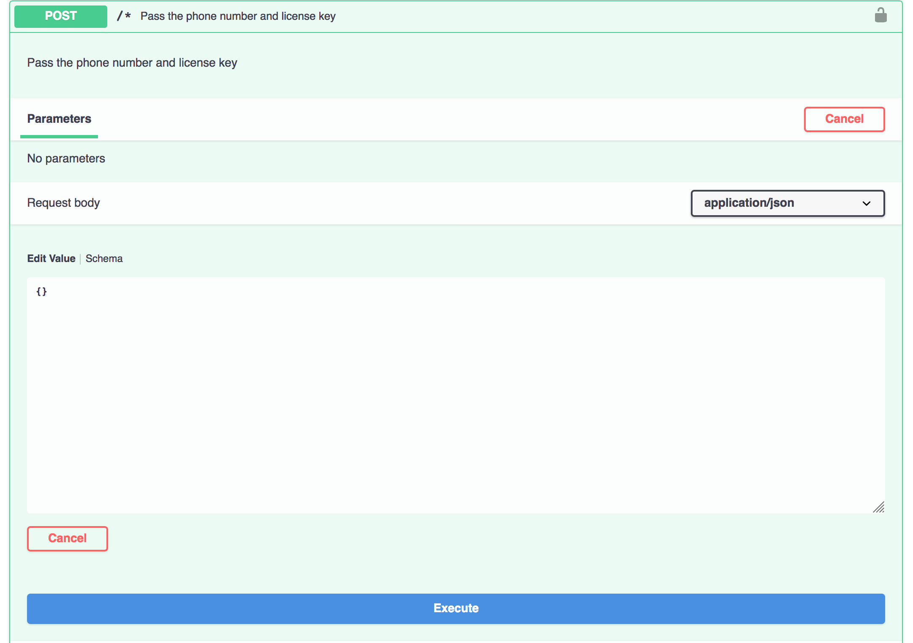](../../../assets/img/Learn/try-it.png)

30. Note that you get a JSON response to the JSON request whereas the backend accepts SOAP messages. The request and response are converted by the sequences that you engaged in.
    [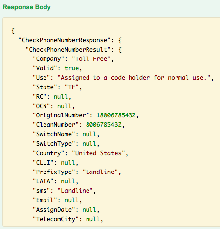](../../../assets/img/Learn/json-response.png)

In this tutorial, you converted a message from JSON to SOAP and back to JSON using **In** and **Out** sequences.
