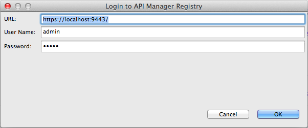

# Map the Parameters of your Backend URLs with the API Publisher URLs

!!! note
This tutorial uses the WSO2 API Manager Tooling Plug-in .


This tutorial explains how to map your backend URLs to the pattern that you want in the API Publisher. Note the following:

1.  The URL pattern of the APIs in the Publisher is `http://<hostname>:8280/<context>/<version>/<API resource>` .
2.  You can define variables as part of the URI template of your API's resources. For example, in the URI template /business/{businessId}/address/ , `businessId` is a variable.
3.  The variables in the resources are read during mediation runtime using property values with the " `uri.var.` " prefix. For example, this HTTP endpoint gets the businessId that you specify in the resource `http://localhost:8280/businesses/{uri.var.businessId}/details` .
4.  The URI template of the API's resource is automatically appended to the end of the HTTP endpoint at runtime. You can use the following mediator setting to remove the URL postfix from the backend endpoint: `<property name="REST_URL_POSTFIX" scope="axis2" action="remove"/>` .

We do the following mapping in this tutorial:


**Before you begin** , note that a mock backend implementation is set up in this tutorial for the purpose of demonstrating the API invocation. If you have a local API Manager setup, save [this file](https://docs.wso2.com/download/attachments/45966776/Response_API.xml?version=1&modificationDate=1433789423000&api=v2) in the `<APIM_HOME>/repository/deployment/server/synapse-configs/default/api` folder to set up the mock backend.

1.  Log in to the API Publisher, design a new API with the following information, click **Create**.

    <table>
    <thead>
    <tr class="header">
    <th>Field</th>
    <th><br />
    </th>
    <th>Sample value</th>
    </tr>
    </thead>
    <tbody>
    <tr class="odd">
    <td>Name</td>
    <td><br />
    </td>
    <td>TestAPI</td>
    </tr>
    <tr class="even">
    <td>Context</td>
    <td><br />
    </td>
    <td>/test</td>
    </tr>
    <tr class="odd">
    <td>Version</td>
    <td><br />
    </td>
    <td>1.0.0</td>
    </tr>
    <tr class="even">
    <td>Business Plan</td>
    <td><br />
    </td>
    <td>Gold</td>
    </tr>
    <tr class="odd">
    <td>Resources</td>
    <td>URL pattern</td>
    <td>/business/{businessId}/address/</td>
    </tr>
    <tr class="even">
    <td><br />
    </td>
    <td>Request types</td>
    <td><p>GET</p></td>
    </tr>
    </tbody>
    </table>

    
    

2.  Go to **Endpoints** tab. Give the information in the table below and click **Save**.

    | Field               | Sample value                                                                                                                    |
    |---------------------|---------------------------------------------------------------------------------------------------------------------------------|
    | Endpoint type       | HTTP/REST endpoint                                                                                                              |
    | Production endpoint | `http://localhost:8280/businesses/{uri.var.businessId}/details` |
    | Sandbox endpoint    | `http://localhost:8280/businesses/{uri.var.businessId}/details`|

    

3.  Go to **Lifecycle** tab and Click `Publish` to publish the API.

    

    As the API's resource is appended to its endpoint by Synapse at runtime, let's write a custom sequence to remove this appended resource.

4.  Copy the the following to a text editor and save the file in XML format (e.g., `TestSequence.xml` ).

    ``` java
        <sequence xmlns="http://ws.apache.org/ns/synapse" name="TestSequence">
            <property name="REST_URL_POSTFIX" scope="axis2" action="remove"/>
        </sequence>
    ```

5.  Download and install the WSO2 API Manager Tooling Plug-in if you have not done so already. Open Eclipse by double clicking the `Eclipse.app` file inside the downloaded folder.

6.  Click **Window &gt; Open Perspective &gt; Other** to open the Eclipse perspective selection window. Alternatively, click the **Open Perspective** icon shown below at the top right corner.
    
7.  On the dialog box that appears, click **WSO2 APIManager** and click **OK** .
    

8.  On the APIM perspective, click the **Login** icon as shown below.
    
9.  On the dialog box that appears, enter the URL, username and password of the Publisher server.

    

10. On the tree view that appears, expand the folder structure of the existing API.

11. Right-click on the `in` sequence folder and click **Import Sequence** to import the sequence you create above.
    

12. Browse to the `TestSequence.xml` file you created in step 4.

13. Your sequence now appears on the APIM perspective. Right-click on the imported sequence and click **Commit File** to push the changes to the Publisher server.
    

14. Log back into the API Publisher, click on the APi to go to the **Runtime Configurations** tab.
Enable the **Message Mediation**  switch and engage the `In` sequence that you created earlier.
    

        !!! info
    TestSequence.xml removes the URL postfix from the backend endpoint, since the URI template of the API's resource is automatically appended to the end of the URL at runtime. Therefore the **request** URL is modified by adding this sequence to the **In flow** .


15. Save the API.

*You have created an API. Let's subscribe to the API and invoke it.

16. Log in to the API Devportal and subscribe to the API.
    

17. Click the **PROD KEYS** button and click **Generate** to create an application access token. 
    

    

18. Click the **Try Out** tab of your API and click on **Try it out** on the /business/{businessId}/address resource.
    

19. Note below the `businessId` is added in the UI as a parameter. Give a `businessId` and click **Execute** to invoke the API.
    

20. Note the response that you get. According to the mock backend used in this tutorial, you get the response `Received Request` .
    

In this tutorial, you mapped the URL pattern of the APIs in the Publisher with the endpoint URL pattern of a sample backend.
