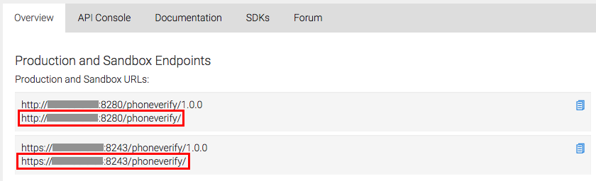

# Create and Publish an API

**API creation** is the process of linking an existing backend API implementation to the [API Publisher](https://docs.wso2.com/display/AM260/Key+Concepts#KeyConcepts-APIPublisher) so that you can manage and monitor the [API's lifecycle](https://docs.wso2.com/display/AM260/Key+Concepts#KeyConcepts-APILifecycle) , documentation, security, community, and subscriptions. Alternatively, you can provide the API implementation in-line in the [API Publisher](https://docs.wso2.com/display/AM260/Key+Concepts#KeyConcepts-APIPublisher) itself.

!!! note
    
    Click the following topics for a description of the concepts that you need to know when creating an API:
    
    -   [API visibility](https://docs.wso2.com/display/AM260/Key+Concepts#KeyConcepts-APIvisibility)
    -   [Resources](https://docs.wso2.com/display/AM260/Key+Concepts#KeyConcepts-APIresources)
    -   [Endpoints](https://docs.wso2.com/display/AM260/Key+Concepts#KeyConcepts-Endpoints)
    -   [Throttling tiers](https://docs.wso2.com/display/AM260/Key+Concepts#KeyConcepts-Throttlingtiers)
    -   [Sequences](https://docs.wso2.com/display/AM260/Key+Concepts#KeyConcepts-Sequences)
    -   [Response caching](https://docs.wso2.com/display/AM260/Configuring+Caching#ConfiguringCaching-Responsecache)
    

1.  Sign in to the WSO2 API Publisher.
    `          https://<hostname>:9443/publisher         ` (e.g., `                     https://localhost:9443/publisher                   ` ). Use **admin** as the username and password.
    `                                        `
2.  Close the interactive tutorial that starts automatically if you are a first-time user, and click **ADD NEW API** .

    !!! tip
    
        You can go back to the interactive tutorial at a later stage by clicking **API Walkthrough** on the top right corner.
    

    

3.  Click **Design a New REST API** and click **Start Creating** .
    
4.  Give the information in the table below and click **Add** to add the resource.

    Field
    Sample value
    Name
    PhoneVerification
    Context
    `                 /phoneverify                `

    The API context is used by the Gateway to identify the API. Therefore, the API context must be unique. This context is the API's root context when invoking the API through the Gateway.

    !!! tip
        You can define the API's version as a parameter of its context by adding the `                  {version}                 ` into the context. For example, `                  {version}/phoneverify                 ` . The API Manager assigns the actual version of the API to the `                  {version}                 ` parameter internally. For example, `                  https://localhost:8243/1.0.0/phoneverify                 ` . Note that the version appears before the context, allowing you to group your APIs based on the versions.
    

    Version
    1.0.0
    Access Control
    All
    Visibility on Store
    Public
    Tags
    phone, checkNumbers

    !!! tip
        Tags can be used to filter out APIs matching certain search criteria. It is recommended that you add tags that explain the functionality and purpose of the API as subscribers can search for APIs based on the tags.
    

    Resources
    URL pattern
    `               CheckPhoneNumber              `
    Request types
    GET, POST

    The selection of the HTTP method should match the actual backend resource. For example, if the actual backend contains the GET method to retrieve details of a phone number, that resource should match a GET resource type with a proper context.

    

    For more information on URL patterns, see [API Resources](https://docs.wso2.com/display/AM260/Key+Concepts#KeyConcepts-APIresources) .

5.  After you add the resource, click it's `           GET          ` method to expand it. Update the value for **Produces** as `           application/xml          ` and the value for **Consumes** as `           application/json          ` .

    !!! note
    
        In the resource definition, you define the MIME types. **Consumes** refers to the MIME type of request accepted by the backend service and **Produces** refers to the MIME type of response produced by the backend service that you define as the endpoint of the API.
    

6.  Next, add the following parameters. You use these parameters to invoke the API using the integrated API Console, which is explained in later tutorials.

    | Parameter Name                             | Description                                   | Parameter Type | Data Type | Required |
    |--------------------------------------------|-----------------------------------------------|----------------|-----------|----------|
    | `               PhoneNumber              ` | Give the phone number to be validated         | query          | string    | True     |
    | `               LicenseKey              `  | Give the license key as 0 for testing purpose | query          | string    | True     |

    

    HTTP Post

    By design, the HTTP POST method specifies that the web server accepts data enclosed within the body of the request. Therefore, when adding a POST method, API Manager adds the payload parameter to the POST method by default.

    !!! note
    
        Import or Edit API definition
    
        
    
        To import an existing swagger definition from a file or a URL, click **Import** . Click **Edit Source** to manually edit the API swagger definition.
    

7.  Once done, click **Next: Implement &gt;** .
    Alternatively, click **Save** to save all the changes made to the API. You can come back later to edit it further by selecting the API and clicking **Edit** . For details about the states of the API, see [Manage the API Lifecycle](https://docs.wso2.com/display/AM260/Manage+the+API+Lifecycle) .

    The following parameter types can be defined according to the resource parameters you add.

    | Parameter Type                            | Description                                                                                                                                                                                     |
    |-------------------------------------------|-------------------------------------------------------------------------------------------------------------------------------------------------------------------------------------------------|
    | `                query               `    | Contains the fields added as part of the invocation URL that holds the data to be used to call the backend service.                                                                             |
    | `                header               `   | Contains the case-sensitive names followed by a colon (:) and then by its value that carries additional information with the request which defines the operating parameters of the transaction. |
    | `                formData               ` | Contains a property list of attribute names and values that are included in the body of the message.                                                                                            |
    | `                body               `     | An arbitrary amount of data of any type sent with a POST message                                                                                                                                |

    You can use the following data type categories, supported by [swagger](http://docs.swagger.io/spec.html#433-data-type-fields) .

    -   [`              primitive             `](http://docs.swagger.io/spec.html#431-primitives) (input/output)
    -   `             containers            ` (as arrays/sets) (input/output)
    -   `                           complex                         ` (as models) (input/output)
    -   [`              void             `](http://docs.swagger.io/spec.html#432-void) (output)
    -   [`              file             `](http://docs.swagger.io/spec.html#434-file) (input)

8.  Click the **Managed API** option.

    

9.  The **Implement** tab opens. Enter the information in the table below.

    <table>
    <thead>
    <tr class="header">
    <th>Field</th>
    <th>Sample value</th>
    </tr>
    </thead>
    <tbody>
    <tr class="odd">
    <td>Endpoint type</td>
    <td>

    
HTTP/REST endpoint

    

    
Load balanced and fail over endpoints

    
The load balanced and failover endpoint types are not selected in this example. For details about these endpoint types, see <a href="https://docs.wso2.com/display/AM260/Working+with+Endpoints">Working with Endpoints</a> and <a href="https://docs.wso2.com/display/EI611/ESB+Endpoints">ESB Endpoints</a> .

    

    
</td>
    </tr>
    <tr class="even">
    <td>Production endpoint</td>
    <td>
This sample service has two operations; <code>                CheckPhoneNumber               </code> and <code>                CheckPhoneNumbers               </code> . Let's use <code>                CheckPhoneNumber               </code> here. 
    <a href="http://ws.cdyne.com/phoneverify/phoneverify.asmx" class="uri">http://ws.cdyne.com/phoneverify/phoneverify.asmx</a>

    
To verify the URL, click the <strong>Test</strong> button next to it (this is the actual endpoint where the API implementation can be found).
</td>
    </tr>
    <tr class="odd">
    <td>Sandbox endpoint</td>
    <td>
This sample service has two operations; <code>                CheckPhoneNumber               </code> and <code>                CheckPhoneNumbers               </code> . Let's use <code>                CheckPhoneNumber               </code> here. 
    <a href="http://ws.cdyne.com/phoneverify/phoneverify.asmx" class="uri">http://ws.cdyne.com/phoneverify/phoneverify.asmx</a>

    
To verify the URL, click the <strong>Test</strong> button next to it.
</td>
    </tr>
    </tbody>
    </table>

    For more information on Endpoints, see [Working with Endpoints](https://docs.wso2.com/display/AM2xx/Working+with+Endpoints) .

    
    For additional information, see [Enabling CORS for APIs](https://docs.wso2.com/display/AM260/Enabling+CORS+for+APIs) and [Adding Mediation Extensions](https://docs.wso2.com/display/AM260/Adding+Mediation+Extensions) . For details on adding and managing certificates, see [Dynamic SSL Certificate Installation](https://docs.wso2.com/display/AM260/Dynamic+SSL+Certificate+Installation) .

    You can deploy your API as a **Prototyped API** in the **Implement** tab. A prototyped API is usually a mock implementation made public in order to get feedback about its usability. You can implement it **inline** or by specifying an **endpoint** .

    

    You can invoke the API without a subscription after publishing the API to the Store. For more information, see [Deploy and Test as a Prototype](https://docs.wso2.com/display/AM260/Deploy+and+Test+as+a+Prototype) .

10. Click **Next: Manage &gt;** and enter the information in the table below.

    | Field              | Sample value   | Description                                                                                                                                                                                                                        |
    |--------------------|----------------|------------------------------------------------------------------------------------------------------------------------------------------------------------------------------------------------------------------------------------|
    | Transports         | HTTP and HTTPS | The transport protocol on which the API is exposed.  Both HTTP and HTTPS transports are selected by default. If you want to limit API availability to only one transport (e.g., HTTPS), clear the checkbox of the other transport. 
                                                                                                                                                                                                                                           
       !!! warning                                                                                                                                                                                                                         
              You can only [try out HTTPS based APIs via the API Console](https://docs.wso2.com/display/AM260/Invoke+an+API+using+the+Integrated+API+Console) because the API Store runs on HTTPS.                                                
                                                                                                                                                                                                                                                  
    | Subscription Tiers | Select all     | The API can be available at different levels of service. They allow you to limit the number of successful hits to an API during a given period.                                                                                    |

    

    Make Default Version

    **Make this the Default Version** checkbox ensures that the API is available in the Gateway without a version specified in the production and sandbox URLs. This option allows you to create a new version of an API and set it as the default version. Then, you can invoke the same resources in the client applications without changing the API gateway URL. This allows you to create new versions of an API with changes, while at the same time allowing existing client applications to be invoked without the client having to change the URLs.

    

    !!! note
    
        -   For more information on **maximum backend throughput** and **advanced throttling policies** , see [Working with Throttling](https://docs.wso2.com/display/AM260/Working+with+Throttling) .
    
        -   For more information on API authentication (e.g., non authentic API invocation), see [HTTP methods](https://docs.wso2.com/display/AM260/Key+Concepts#KeyConcepts-HTTPmethods) .
    

11. Click **Save & Publish** . This publishes the API that you just created to the API Store so that subscribers can use it.

    !!! tip
    
        You can save partially complete or completed APIs without publishing it. Select the API and click on the **Lifecycle** tab to [manage the API Lifecycle](https://docs.wso2.com/display/AM260/Manage+the+API+Lifecycle) .
    

You have created an API.

**Related Tutorials**

-   [Create and Publish an API from a Swagger Definition](_Create_and_Publish_an_API_from_a_Swagger_Definition_)
-   [Create a Prototyped API with an Inline Script](https://docs.wso2.com/display/AM260/Create+a+Prototyped+API+with+an+Inline+Script)
-   [Create a WebSocket API](https://docs.wso2.com/display/AM260/Create+a+WebSocket+API)
-   [Create and Publish a SOAP API](https://docs.wso2.com/display/AM260/Create+and+Publish+a+SOAP+API)

