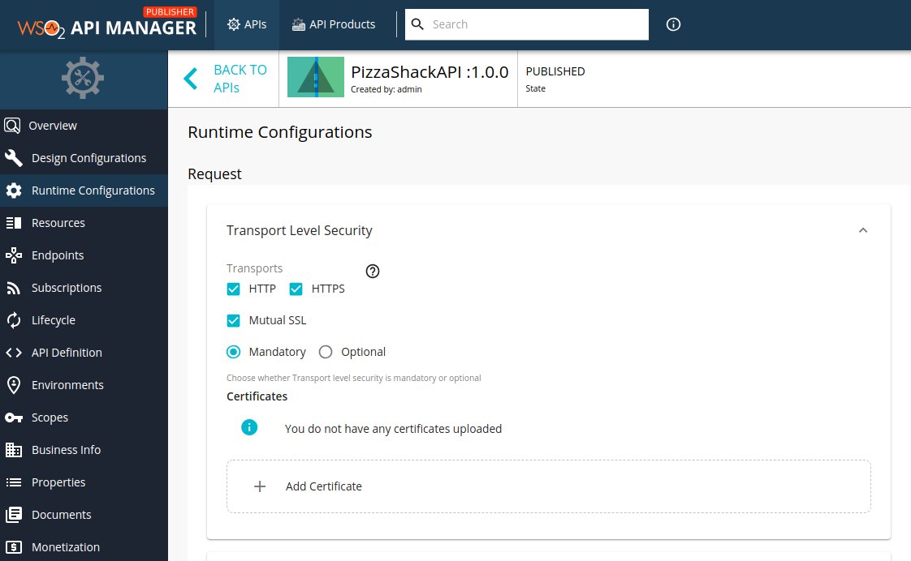

# Securing APIs with Mutual SSL

In contrast to the usual one-way SSL authentication where a client verifies the identity of the server, in mutual SSL the server validates the identity of the client so that both parties trust each other. This builds a system that has a very tight security and avoids any requests made to the client to provide the username/password, as long as the server is aware of the certificates that belong to the client.

This section explains how to APIs in WSO2 API Manager can be secured using mutual SSL in addition to OAuth2.

-   [Create an API Secured with Mutual SSL](#SecuringAPIswithMutualSSL-CreateanAPISecuredwithMutualSSL)
-   [Invoke an API Secured with Mutual SSL from the Developer Portal](#SecuringAPIswithMutualSSL-InvokeanAPIsecuredwithMutualSSLfromtheDeveloperPortal)

### Create an API Secured with Mutual SSL

1.  [Create an API](/Learn/DesignAPI/CreateAPI/create-a-rest-api) .
2.  Navigate to the **Runtime Configurations** tab.
3.  Select **Mutual SSL**.
    

4.  Click **Upload Certificate** to upload a new client certificate.
    
    !!! note
        This feature currently supports only the `.crt` format for certificates.

        If you need to use a certificate in any other format, you can convert it using a standard tool before uploading.

    !!! info
        After configuring, the certificate will be added to the Gateway nodes which are defined under the Environments in `api-manager.xml` . 
        
        In a clustered setup, as gateway configurations are identical, sync the 
        
        `<API-M_HOME>/repository/resources/security/listenerprofiles.xml` and 
        
        `<API-M_HOME>/repository/resources/security/client-truststore.jks` among the gateway nodes. After the configured interval, the synapse transport will be reloaded in all the gateway nodes.

5.  Provide an alias and public certificate. Select the tier that should be used to throttle out the calls using this particular client certificate and click **Upload** .
    
    
6.  **Save** the API
    
### Invoke an API secured with Mutual SSL from the Developer Portal

!!! note
    Before you begin...

    Add the relevant certificate to your browser according to your private certificate.

1.  [Invoke an API using the Integrated API Console](/Learn/ConsumeAPI/InvokeApis/InvokeApisUsingTools/invoke-an-api-using-the-integrated-api-console/) .
2.  When you click **Execute** the browser will send a prompt similar to the one shown below. Select the corresponding certificate for the API.
    

#### Limitations

Listed below are the known limitations for this feature.

-   Application subscription is not permitted for APIs that are only protected with mutual SSL. Hence, subscription/application level throttling is not applicable for these type of APIs.

-   Resource level throttling is not applicable for the APIs that are only protected with mutual SSL.

-   Resource level security will not be applicable for the APIs that are only protected with mutual SSL.

-   Scope level security will not be applicable for the APIs that are only protected with mutual SSL.
