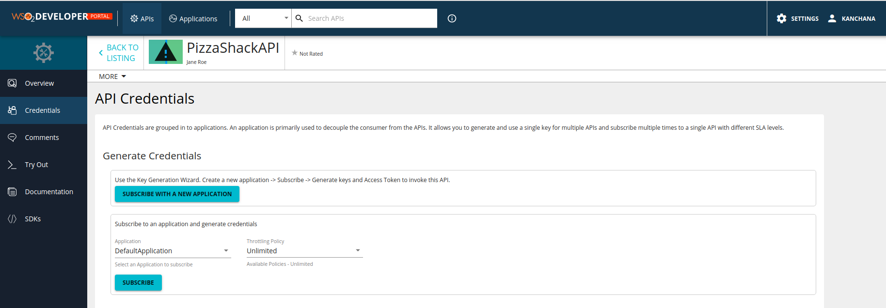
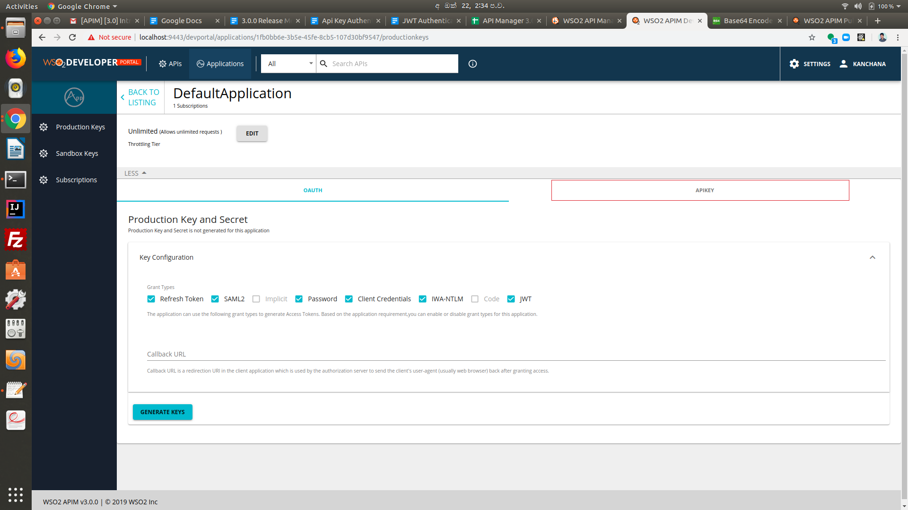
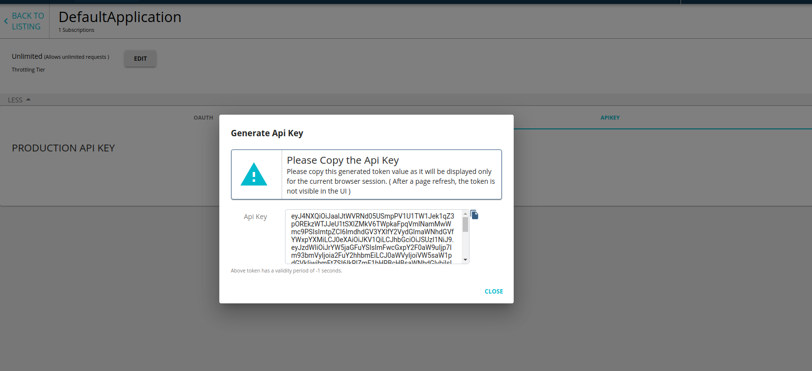

# Securing APIs with Api Key

Api Key is the simplest form of app-based security that you will be able to configure for an API. The Api Key can be obtained for a client application from the Developer portal using UI or Rest API's. The client application can use this key to invoke the APIs secured with Api Key security scheme.

The WSO2 API Manager 3.0.0 uses a self contained JWT token as the Api Key and this token is generated from the APIM Store without communicating with a Key Manager.

There will be two basic validations performing in the APIM Gateway when an API is invoked specifying the Api Key as the authentication method.

1.  Signature validation

2.  Subscription validation

The Api Key should be a valid JWT signed using the primary keystore private key of the API Store. By default, Api Key is a non expiry token. However, optionally you can define a validity period for the token.

The kid value in the Api Key header specifies the alias name of the Store certificate which needs to be available in the API Manager gateway client-truststore.jks. By default, the alias name is "gateway_certificate_alias". You can configure the alias name in the JWT to a different one by configuring the <ApiKeyAlias> value under <APIStore> in api-manager.xml.

Make sure to import the Store certificate to the APIM gateway client-truststore under the same alias.

The subscription validation is mandatory for the Api Keys and the keys generated before subscribing to an API will not contain the subscription information under the token details. These keys will not be allowed to access the specific API. Api Keys should therefore needs to be generated after the application has subscribed to the required API.

## Try Out

The following sections explain how to work with Api Key Authentication on the WSO2 API Manager.

### Step 1

Create and publish an API secured with Api Key security scheme as the application level security.


### Step 2

Login to the Developer portal and subscribe to the API.



### Step 3

Generate the Api Key from the developer portal.





### Step 4

Invoke the API using the Api Key. You can either specify the Api Key in the "apikey" header or you can specify as a query parameter in the API request.

```
curl -k -X GET "https://localhost:8243/pizzashack/1.0.0/menu" -H "accept: application/json" -H "apikey: <api_key_value>"
```

```
curl -k -X GET "https://localhost:8243/pizzashack/1.0.0/menu" -H "accept: application/json" -H "apikey: eyJ4NXQiOiJaalJtWVRNd05USmpPV1U1TW1Jek1qZ3pOREkzWTJJeU1tSXlZMkV6TWpkaFpqVmlNamMwWmc9PSIsImtpZCI6ImdhdGV3YXlfY2VydGlmaWNhdGVfYWxpYXMiLCJ0eXAiOiJKV1QiLCJhbGciOiJSUzI1NiJ9.eyJzdWIiOiJrYW5jaGFuYSIsImFwcGxpY2F0aW9uIjp7Im93bmVyIjoia2FuY2hhbmEiLCJ0aWVyIjoiVW5saW1pdGVkIiwibmFtZSI6IkRlZmF1bHRBcHBsaWNhdGlvbiIsImlkIjozNSwidXVpZCI6IjFmYjBiYjZlLTNiNWUtNDVmZS04Y2I1LTEwN2QzMGJmOTU0NyJ9LCJ0aWVySW5mbyI6eyJVbmxpbWl0ZWQiOnsic3RvcE9uUXVvdGFSZWFjaCI6dHJ1ZSwic3Bpa2VBcnJlc3RMaW1pdCI6MCwic3Bpa2VBcnJlc3RVbml0IjpudWxsfX0sImtleXR5cGUiOiJQUk9EVUNUSU9OIiwic3Vic2NyaWJlZEFQSXMiOlt7InN1YnNjcmliZXJUZW5hbnREb21haW4iOiJjYXJib24uc3VwZXIiLCJuYW1lIjoiUGl6emFTaGFja0FQSSIsImNvbnRleHQiOiJcL3Bpenphc2hhY2tcLzEuMC4wIiwicHVibGlzaGVyIjoiYWRtaW4iLCJ2ZXJzaW9uIjoiMS4wLjAiLCJzdWJzY3JpcHRpb25UaWVyIjoiVW5saW1pdGVkIn0seyJzdWJzY3JpYmVyVGVuYW50RG9tYWluIjoiY2FyYm9uLnN1cGVyIiwibmFtZSI6IlBpenphU2hhY2tBUEkiLCJjb250ZXh0IjoiXC9waXp6YXNoYWNrXC8xLjAuMCIsInB1Ymxpc2hlciI6ImFkbWluIiwidmVyc2lvbiI6IjEuMC4wIiwic3Vic2NyaXB0aW9uVGllciI6IlVubGltaXRlZCJ9XSwiaWF0IjoxNTcxNzY1Njk2LCJqdGkiOiJhOWVmMDFmYi1kNDA1LTQ0YTYtOWVkMi02ZTdhZjUyZGQ3ODMifQ==.KbxcrZv7buRSqtyI44eCGA_4mrGTRc0-ik4hmsYsmoFs5wbTXrcC1vZ7-fe9KMEWnyW6VeWJq-PnqDZzc4wOno02YMlUH9kGZ6bWj3z4RH9vVLd_xeBV50EXEDm7MbyeI-t7ADMYoOWOBBafNfiigm_86gj7LfeoSkGjsreFIJyhWIxepm3lO54cfYcDJAk3pB-T2bKC0aHJzFn_N_HuBN9lOy2yCPdJyoThQEbedBwtvh8WlTNKh7kL9Nj2E1ZwhKli0M9tuIsp08aztwUP3a-QPF4oIx4Lid0rYIr5jyQCHHor55wtzxJKH2VayZnEFIdySEjQBBj7SAfjcLXvXw=="
```

Or

```
curl -k -X GET "https://localhost:8243/pizzashack/1.0.0/menu?apikey=<url_encoded_api_key_value>"
```

```
curl -k -X GET "https://localhost:8243/pizzashack/1.0.0/menu?apikey=eyJ4NXQiOiJaalJtWVRNd05USmpPV1U1TW1Jek1qZ3pOREkzWTJJeU1tSXlZMkV6TWpkaFpqVmlNamMwWmc9PSIsImtpZCI6ImdhdGV3YXlfY2VydGlmaWNhdGVfYWxpYXMiLCJ0eXAiOiJKV1QiLCJhbGciOiJSUzI1NiJ9.eyJzdWIiOiJrYW5jaGFuYSIsImFwcGxpY2F0aW9uIjp7Im93bmVyIjoia2FuY2hhbmEiLCJ0aWVyIjoiVW5saW1pdGVkIiwibmFtZSI6IkRlZmF1bHRBcHBsaWNhdGlvbiIsImlkIjozNSwidXVpZCI6IjFmYjBiYjZlLTNiNWUtNDVmZS04Y2I1LTEwN2QzMGJmOTU0NyJ9LCJ0aWVySW5mbyI6eyJVbmxpbWl0ZWQiOnsic3RvcE9uUXVvdGFSZWFjaCI6dHJ1ZSwic3Bpa2VBcnJlc3RMaW1pdCI6MCwic3Bpa2VBcnJlc3RVbml0IjpudWxsfX0sImtleXR5cGUiOiJQUk9EVUNUSU9OIiwic3Vic2NyaWJlZEFQSXMiOlt7InN1YnNjcmliZXJUZW5hbnREb21haW4iOiJjYXJib24uc3VwZXIiLCJuYW1lIjoiUGl6emFTaGFja0FQSSIsImNvbnRleHQiOiJcL3Bpenphc2hhY2tcLzEuMC4wIiwicHVibGlzaGVyIjoiYWRtaW4iLCJ2ZXJzaW9uIjoiMS4wLjAiLCJzdWJzY3JpcHRpb25UaWVyIjoiVW5saW1pdGVkIn0seyJzdWJzY3JpYmVyVGVuYW50RG9tYWluIjoiY2FyYm9uLnN1cGVyIiwibmFtZSI6IlBpenphU2hhY2tBUEkiLCJjb250ZXh0IjoiXC9waXp6YXNoYWNrXC8xLjAuMCIsInB1Ymxpc2hlciI6ImFkbWluIiwidmVyc2lvbiI6IjEuMC4wIiwic3Vic2NyaXB0aW9uVGllciI6IlVubGltaXRlZCJ9XSwiaWF0IjoxNTcxNzY1Njk2LCJqdGkiOiJhOWVmMDFmYi1kNDA1LTQ0YTYtOWVkMi02ZTdhZjUyZGQ3ODMifQ%3D%3D.KbxcrZv7buRSqtyI44eCGA_4mrGTRc0-ik4hmsYsmoFs5wbTXrcC1vZ7-fe9KMEWnyW6VeWJq-PnqDZzc4wOno02YMlUH9kGZ6bWj3z4RH9vVLd_xeBV50EXEDm7MbyeI-t7ADMYoOWOBBafNfiigm_86gj7LfeoSkGjsreFIJyhWIxepm3lO54cfYcDJAk3pB-T2bKC0aHJzFn_N_HuBN9lOy2yCPdJyoThQEbedBwtvh8WlTNKh7kL9Nj2E1ZwhKli0M9tuIsp08aztwUP3a-QPF4oIx4Lid0rYIr5jyQCHHor55wtzxJKH2VayZnEFIdySEjQBBj7SAfjcLXvXw%3D%3D"
```