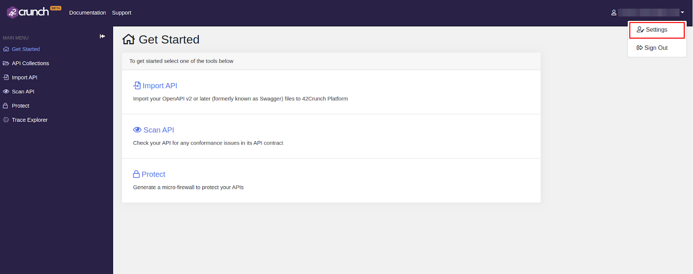
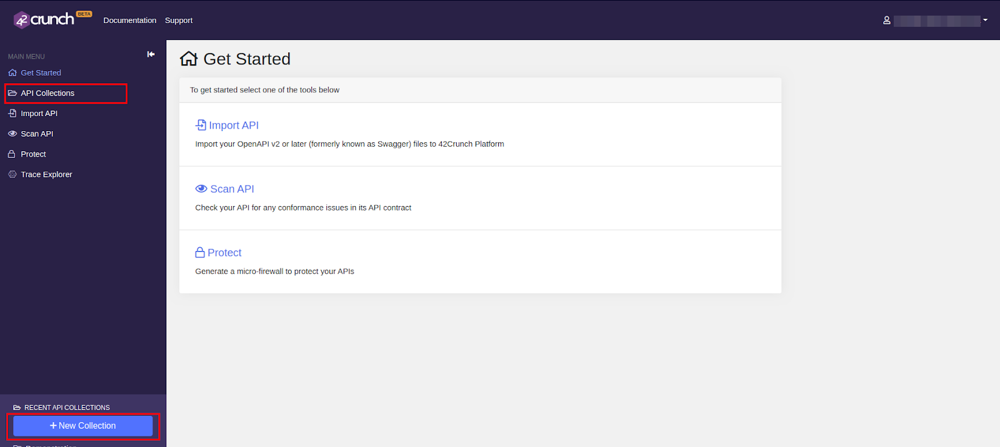

## Securing APIs by auditing API Definitions

Include brief introduction here

## How to enable the audit feature

### Retrieve API Token and Collection ID

1.  Navigate to the [42crunch platform](https://platform.42crunch.com) and register or sign in.

2.  Create a new API Token from the **Settings** Menu as shown below.

    

3.  Click on the **API Tokens** tab and select **Create New Token**

    

4.  A dialog box will be shown where you need to enter the name of the Token and select appropriate access rights. For the audit feature to work, only the **API Contract Security Audit** permission is required.

    

5.  Clicking on the **Generate Token** will lead to another dialog box showing the generated API Token.

    !!! note 
        The generated API Token will only be shown once, so make sure to copy it and save it in a safe place for reference.

    

6.  Now create a new Collection by clicking any one of the highlighted areas below.

    !!! note
        A Collection in this context is a folder hosted on 42Crunch for all the APIs that are audited

    

7.  Copy the Collection ID from the URL of the browser as highlighted below and save it in a safe place for reference, just like the API Token.

    

### Configure WSO2 API-M with the retrieved properties

The retrieved API Token and the Collection ID properties have to be placed inside the configuration files inside WSO2 API-M. There are two ways to do so.

#### Enabling the feature server-wide 

If these properties are to be accessible to all tenants, navigate to the `<API-M_HOME>/repository/conf/deployment.toml` file and make the following changes:

``` bash tab="Format"
    [security_audit]
    api_token="{api-token}"
    collection_id="{collection-id}"
    global=true
```

``` bash tab="Example"
    [security_audit]
    api_token="xxxxxxxx-xxxx-xxxx-xxxx-xxxxxxxxxxxx"
    collection_id="xxxxxxxx-xxxx-xxxx-xxxx-xxxxxxxxxxxx"
    global=true
```

!!! tip
    If you want to prevent the properties being used by any other tenants other than the super tenant, then set the **global** property to **false**.

#### Enabling the feature tenant-wise

If the properties are to be available to a specific tenant only, then do the following:

1.  Sign in to the WSO2 API Management Console with your tenant credentials at `https://<server-host>:9443/carbon`.

    !!! tip
        For more information on creating a tenant, see [Managing Tenants](https://docs.wso2.com/display/ADMIN44x/Working+with+Multiple+Tenants).

2.  Click the **Main** tab, and then **Browse**, which is under **Resources** as shown below.

    

3.  Enter `/_system/config/apimgt/applicationdata/tenant-conf.json` as the location and click **Go** to access the `tenant-conf.json` file that is in the WSO2 Registry.

4.  Click **Edit as text** to be able to edit the JSON file.

5.  Add the following configuration with the customized Security Audit properties to the JSON file and save it.

    ``` bash tab="Format"
        SecurityAuditConfig: {
            "apiToken": "{api-token}",
            "collectionId": "{collection-id}",
            "overrideGlobal": true
        }
    ```

    ``` bash tab="Example"
        SecurityAuditConfig: {
            "apiToken": "xxxxxxxx-xxxx-xxxx-xxxx-xxxxxxxxxxxx",
            "collectionId": "xxxxxxxx-xxxx-xxxx-xxxx-xxxxxxxxxxxx",
            "overrideGlobal": true
        }
    ```

    

    !!! note
        If you want the security audit properties set for a particular tenant to override the security audit properties available globally in the `<API-M_HOME>/repository/conf/deployment.toml` file, then the **overrideGlobal** property should be set to **true**.

    !!! info
        Setting both the **overrideGlobal** and **global** properties to false will disable the API Security Audit feature even if you have supplied the API Token and Collection ID.

### Auditing an API

Once the feature is enabled, you will be able to see the **Audit API** button in the **API Publisher** under the **API Definitions** tab.


The following is a sample Audit Report


There are 4 sections to the Audit Report:

1.  [Audit Score and Summary](#audit-score-and-summary)
2.  [OpenAPI Format Requirements](#openapi-format-requirements)
3.  [Security](#security)
4.  [Data Validation](#data-validation)

#### Audit Score and Summary

This section provides: 

1.  The overall score, out of 100, given to the API Definition.
2.  The total number of errors.
3.  The overall severity of vulnerabilities present in the API Definition.
4.  Scores given to the Security and Data Validation sections.

!!! info
    OpenAPI Format requirements section is not taken into account when calculating the score for the Audit Report.

#### OpenAPI Format Requirements

This category presents any issues that exist due to the API Definition not adhering to the OpenAPI Specification requirements and is divided into 3 categories.

1.  **Structural Errors**

    Occurs when specific sections that the OpenAPI format requires in the API Definition are not present.

2.  **Semantic Errors**

    Even when API Definitions that are structurally correct, there can be issues with the semantics of the fields. For example, the API Definition could include invalid email and URL formats or inconsistent property formats across the Definition.

3.  **Best Practices Issues**

    The OpenAPI Specification includes requirements that, while not mandatory, are highly recommended. Issues in this section will be shown in the report if those recommended requirements do not exist in the API Definition.

!!! note
    The API will not be audited if there are Structural Errors. Therefore Structural Errors have to be fixed using the built-in Swagger Editor before attempting to audit the API again.

#### Security

The Security category showcases:

1.  Number of Issues

2.  Overall Score

3.  Overall severity of security issues

4.  A table of the issues along with their specific severity levels, descriptions and the impact it has on the overall score for the Security category.

#### Data Validation

The Data Validation category showcases:

1.  Number of Issues

2.  Overall Score

3.  Overall severity of data validation issues

4.  A table of the issues along with their specific severity levels, descriptions and the impact it has on the overall score for the Data Validation category.