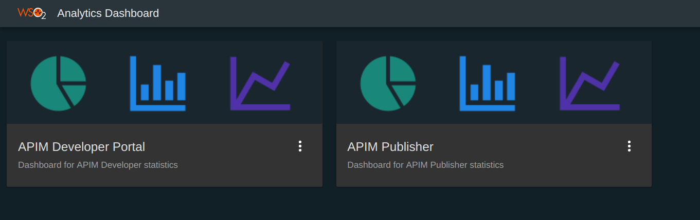
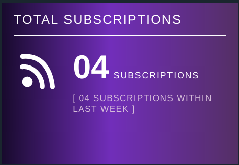

# Viewing API Statistics

API statistics are provided for both the API Publisher and the Developer Portal. 

From API-M Analytics 3.0.0 release onwards, Publisher and Developer Portal statistics are moved out from the Publisher and Developer portal apps.
And those can be viewed using the **dashboard** runtime of the API-M Analytics server.

For instructions on how to set up Analytics, see [Configuring APIM Analytics](../configuring-apim-analytics.md) . 
Once Analytics is set up, follow the instructions below to view statistics relevant to API Publisher and Developer Portal.

First, [invoke a few APIs](../../../ConsumeAPI/InvokeApis/InvokeApisUsingTools/invoke-an-api-using-the-integrated-api-console/) to generate traffic and see the statistics.

!!! note
      The following widgets on the API Manager statistical dashboards, display real runtime statistics even when Analytics is not set up (as described in [Configuring APIM Analytics](_Configuring_APIM_Analytics_) ).
      
      **Publisher Dashboard**
      
      + Overview Page
        + Total Api Count
        + Total App Count
        + Total Subscriptions
        + Total Signups
        + Top Api Creators
        + Top App Creators
        + Top Subscriptions per API Provider
      + API and Application Statistics Page
        + Apis Created Over Time
        + Apps Created Over Time
      + Developer Statistics Page
        + Subscriptions Over Time
        + Developer Signups Over Time
      + Faults Page
        + Top Faulty Apis
        + Top Throttled Apis
      
      **Developer Portal Dashboard**
      
      + Registered Application Users

!!! warning
      Please note that our data summarization logic summarizes the data on a **per day** basis.

The sections below explain how to access the statistical dashboards:

+ Log in to the Analytics Dashboard by accessing `<Protocol>://<Host>:<Port>/analytics-dashboard` (ex: [https://localhost:9643/analytics-dashboard](https://localhost:9643/analytics-dashboard)). 
+ After login in, you will see the **APIM Publisher** and the **APIM Developer Portal** dashboards listed.
  
       

+ Click on the card of any desired dashboard to view that particular dashboard.
+ Admin Portal Statistics can be viewed from the admin app.
    
Please refer below sub sections for more details about each dashboard.
    
-   [**API Publisher statistics**](#api-publisher-statistics)
-   [**API Store statistics**](#api-store-statistics)
-   [**Admin Portal Statistics**](#admin-portal-statistics)

### API Publisher statistics

!!! info
      Unlike the previous releases of API-M Analytics dashboards, Publisher statistics dashboard can be viewed by any user having Analytics role, Creator role or Publisher role.
      And these permissions can be changed as per your preferences by going to **Settings** options of the dashboard. More information can be found at [Managing Analytics Dashboard Permissions]() page.
      
 API Publisher dashboard has 8 main pages namely **Overview**, **API and Application Statistics**, **Developer Statistics**, **Usage Summary**, **Devices**, **API Proxy Performance**, **Faults**, and **Geo Map**.
 
#### Overview 
##### Total API Count
This widget displays the total number of apis created and the number of apis created within the last week by the publishers of logged in user's tenant.

  

##### Total App Count
This widget displays the total number of applications created and the number of applications created within the last week by the subscribers of the logged in user's tenant.

 

##### Total Subscriptions
This widget displays the total api subscriptions by the subscribers of the logged in user's tenant and its last weeks statistics of the same factor.

 
 
##### Total Signups
This widget displays count of the unique subscribers logged in to the developer portal app and its last week statistics of the same factor.

 

##### Overal API Stats

This widget has two sections.

+ Api Availability - Displays a percentage of api availability 
+ Top Rated Apis - Displays the total number of stars received (ratings) by each api 
 
 for that particular tenant.

!!! Note
      In order to view statistics of **Api Availability** widget, it is required to enable alerts as described in [Configuring Alerts](../../ManagingAlertsWithRealTimeAnalytics/configuring-alerts).
      
  The availability of APIs statistics is directly related to the [Availability of APIs (health monitoring)](../../ManagingAlertsWithRealTimeAnalytics/alert-types/#availability-of-apis-api-health-monitoring) alert type. 
  
  
  
Along with the total number of stars received for each api, Top Rated Apis section of the widget displays the api creator of each api as well. 
By clicking on the filter arrow
<html>
<body>

</body>
</html>
,you can search by **Api name** and **Ratings**.

  

##### Top API Creators

As the name depicts this widget displays the top api creators and the percerntage of apis that each of them have created.
You can choose the limit of api creators that you want to see by giving the number under the limit field.
   
   
   
You also get a list view of api creators along with the number of apis created by each api creator. 
This list can be searched either via Api name or Api count.

   

##### Top App Creators

As same as Top Api Creators widget, Top App Creators widget displays a percentage of apps created by each app creator and also a list of app creators along with the number of apps they created with the filtering capabilities.

   
  
   
  
##### Top Subcriptions per API Provider

This widget displays the percentage of subscription count against each api provider. It also has a list view with the subscription count with the filtering capability based on the provider name and count.

   
      
   
   
#### API and Application Statistics

Under this page you can choose to view APIs/Apps based on different filter criteria.
You can also select the time period and granularities such as minute, hour,day for which you wish to view the statistics. 

<html>
<body>

</body>
</html>

##### APIs Created Over Time

This widget displays the number of apis published over a given time period.
You can filter based on the api created by you or apis created by all.
It also has a list view along with the filtering capability based on Api Name.

<html>
<body>

</body>
</html>

##### Apps Created Over Time

This widget displays number of applications created over a given period of time. Statistics can be filtered based on api creator, app creator and subscribed api.
This also has a list view with app name and created time which can be filtered based on the app name.

<html>
<body>

</body>
</html>

#### Developer Statistics

##### Subscriptions Over Time

This widget displays the number of subscriptions created for an API over a given period.

<html>
<body>

</body>
</html>

##### Developer Signups Over Time

This widget displays the number of developers who signed up to the developer portal over time. 

<html>
<body>

</body>
</html>

#### Usage Summary

##### Overall API Usage

<html>
<body>

</body>
</html>

##### Top API Users

<html>
<body>

</body>
</html>

##### API Version Usage Summary

<html>
<body>

</body>
</html>

##### API Resource Usage Summary

<html>
<body>

</body>
</html>

##### API Backend Usage Summary

<html>
<body>

</body>
</html>

##### API Last Access Summary

<html>
<body>

</body>
</html>

#### Devices

##### Top User Agents

<html>
<body>

</body>
</html>

##### Top Platforms

<html>
<body>

</body>
</html>

#### API Proxy Performance

##### API Latency Time

<html>
<body>

</body>
</html>

#### Faults

##### Top Faulty APIs

<html>
<body>

</body>
</html>

##### Top Throttled Out APIs

<html>
<body>

</body>
</html>

#### Geo Map

##### Geo Location Based Invocations

<html>
<body>

</body>
</html>
