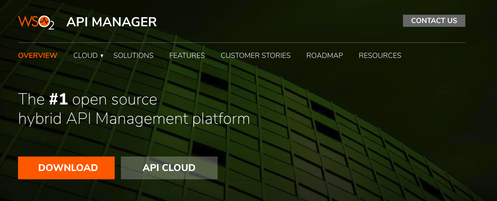
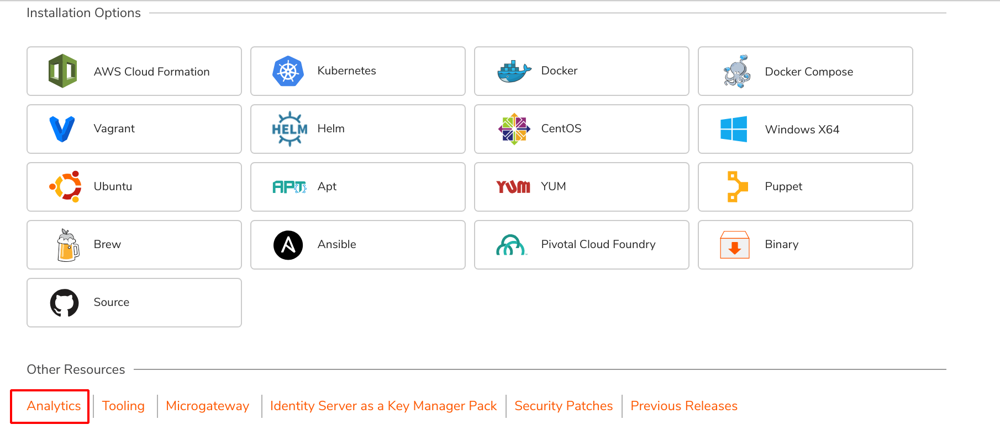

# Configuring APIM Analytics

This section explains how to configure analytics for WSO2 API Manager (WSO2 API-M). The API Manager integrates with the [WSO2 Streaming Integrator](https://wso2.com/integration/streaming-integrator) to provide reports, statistics and graphs on the APIs deployed in WSO2 API Manager. You can then configure alerts to monitor these APIs and detect unusual activity, manage locations via geo location statistics and carry out detailed analysis of the logs. WSO2 API Manager has an enhanced distribution of Analytics to cater to API Manager specific scenarios which is used here to configure APIM Analytics.

Please refer the  [**Quick Setup**](#quick-setup) section to set up analytics for quick demos and try-out scenarios, or refer the [**Standard Setup**](#standard-setup) section to set up analytics for a production environment.

!!! note
      -   WSO2 recommends using the API-M Analytics (powered by [WSO2 Streaming Integrator](https://wso2.com/integration/streaming-integrator) ) distribution to set up the minimum high availability deployment with API Manager. For configuration details, see [Minimum High Availability Deployment for Streaming Integrator](https://ei.docs.wso2.com/en/next/streaming-integrator/setup/deploying-si-as-minimum-ha-cluster/) .
      -   It is not recommended to configure the Gateway node as an analytics server.


-   [**Quick Setup**](#quick-setup)
-   [**Standard Setup**](#standard-setup)

###Quick Setup

Follow the instructions below if you wish to set up API-M Analytics for quick demos and to try-out scenarios.

1.  Download and install WSO2 API-M.
    WSO2 API-M via the [WSO2 API Manager page](https://wso2.com/api-management/install/) . For more information on installing WSO2 API-M, see the [Installation Guide](../../SetupAndInstall/InstallationGuide/installation-prerequisites.md) .
    
    
    
2.  Download and install WSO2 API-M Analytics.
    To download WSO2 API-M Analytics go to the [WSO2 API Manager page](https://wso2.com/api-management/install/), click **Download** to expand the installation options.Navigate to the **Other Resources** section, and click **Analytics**. 
    As the process of installing API-M Analytics is identical to installing WSO2 Streaming Integrator 1.0.0 (WSO2 SI), for more information you can refer to the [WSO2 SI documentation](#https://ei.docs.wso2.com/en/next/streaming-integrator/setup/installing-si-in-vm/).

    
    
3.  To enable Analytics, open the `<API-M_HOME>/repository/conf/deployment.toml` file and uncomment the analytics enabling section as shown below. Save this change.

    ``` toml
        [apim.analytics]
        enable = true
    ```

    !!! note
          If you are working on a distributed (clustered) setup of WSO2 API Manager, do the configurations instructed to be done in API Manager in the Publisher, Store, and Gateway nodes as well.


4.  Start the Worker profile of the Analytics Server.
    <br/>Navigate to the `<API-M_ANALYTICS_HOME>/bin` directory in your console and execute one of the following scripts based on your OS.
    -   On Windows: `worker.bat --run              `
    -   On Linux/Mac OS: `sh worker.sh               `

5.  Start the API Manager server.
    <br/>Navigate to the `<API-M_HOME>/bin` directory in your console and execute one of the following scripts based on your OS.
    -   On Windows: `wso2server.bat --run`
    -   On Linux/Mac OS: `sh wso2server.sh 
    
        !!! info
                  If API-M Analytics is properly configured in WSO2 API Manager, when you start up the API Manager server, which is after the WSO2 API-M Analytics server, you will see the following log message in the terminal that is running the API-M Analytics server.
            
                    INFO {org.wso2.carbon.databridge.core.DataBridge} - user admin connected   
                    
6.  Start the Dashboard profile of the Analytics Server.
    <br/>Navigate to the `<API-M_ANALYTICS_HOME>/bin` directory in your console and execute one of the following scripts based on your OS.
    -   On Windows: `dashboard.bat --run  
    -   On Linux/Mac OS: `sh dashboard.sh    
    
    

7.  Optionally, if you wish to access the business rules via the Dashboard node, you can use the dashboard profile that we started in the previous step.            

You can now start using the WSO2 API Manager for its usual operations and the required Analytics functionality.

###Standard Setup

Follow the instructions below if you wish to set up API-M Analytics for a production environment.

-   [Step 1 - Download and install WSO2 API-M](#step-1-download-and-install-wso2-api-m)
-   [Step 2 - Download and install WSO2 API-M Analytics](#step-2-download-and-install-wso2-api-m-analytics)
-   [Step 3 - Configure WSO2 API Manager to publish statistics](#step-3-configure-wso2-api-manager-to-publish-statistics)
-   [Step 5 - Configure databases](#step-4-configure-databases)
-   [Step 6 - Configure keystores](#step-5-configure-keystores)

#### Step 1 - Download and install WSO2 API-M

 Download and install WSO2 API-M via the [WSO2 API Manager page](https://wso2.com/api-management/install/). Click **DOWNLOAD** and go to **INSTALLATION OPTIONS**.
 <br/>For more information on installing WSO2 API-M, see the [Installation Guide](../../SetupAndInstall/InstallationGuide/installation-prerequisites.md) .
    
 
    
#### Step 2 - Download and install WSO2 API-M Analytics

To download WSO2 API-M Analytics go to the [WSO2 API Manager page](https://wso2.com/api-management/install/), click **Download** to expand the installation options.Navigate to the **Other Resources** section, and click **Analytics**. 
<br/>As the process of installing API-M Analytics is identical to installing WSO2 Streaming Integrator 1.0.0 (WSO2 SI), for more information you can refer to the [WSO2 SI documentation](#https://ei.docs.wso2.com/en/next/streaming-integrator/setup/installing-si-in-vm/).

  
    
#### Step 3 - Configure WSO2 API Manager to publish statistics

Follow the instructions below to do the required configurations for WSO2 API-M to publish statistics in the WSO2 API-M Analytics server.

!!! warning
      If you are working on a distributed (clustered) setup of API Manager, carryout the instructed configurations in the Publisher, Store and Gateway nodes of the API Manager.
1.Open the `<API-M_HOME>/repository/conf/deployment.toml` file and uncomment the following section as shown below. Save this change.

  ``` toml
      [apim.analytics]
      enable = true
  ```
2.  Configure the following parameters under the `[apim.analytics]` section if required.

<table>
<thead>
<tr class="header">
<th>Parameter</th>
<th>Value</th>
<th>Description</th>
</tr>
</thead>
<tbody>
<tr class="odd">
<td width="32%"><code>receiver_urls</code></td>
<td width="30%">
<code>
&lt;protocol&gt;://&lt;hostname&gt;:&lt;port&gt;/
</code>
<br/> ex: "tcp://localhost:7612"
</td>
<td>The server URL of the remote WSO2 API-M Analytics server used to collect statistics from WSO2 API Manager. Use this configuration if there is only one group with either one or many receivers.</td>
</tr>
<tr class="odd">
<td><code>[[apim.analytics.url_group]]
analytics_url</code></td>
<td><code>&lt;protocol&gt;://&lt;hostname&gt;:&lt;port&gt;/</code></td>
<td>The server URL of the remote WSO2 API-M Analytics server used to collect statistics from WSO2 API Manager. Use this configuration if there is only one group with either one or many receivers.
 An event can also be published to multiple receiver groups, where each group has one or more receivers. Receiver groups are delimited by curly braces, whereas receivers are delimited by commas.
<p>e.g., Three receivers within a single group can be specified as follows.<br />
<code>tcp://localhost:7612,tcp://localhost:7613,tcp://localhost:7614</code></p>
<p>Two receiver groups with two receivers each can be specified as follows.<br />
<code>                   {                                       tcp://localhost:7612,tcp://localhost:7613},{tcp://localhost:7712,tcp://localhost:7713                                      }                  </code></p></td>
</tr>
<tr class="even">
<td><code>                  &lt;StreamProcessorUsername&gt;                 </code></td>
<td>A valid administrator username</td>
<td><div class="content-wrapper">
<p>The administrator user name to log into the remote WSO2 API-M Analytics server that collects statistics from WSO2 API Manager.</p>
!!! info
<ul>
<li>If you enable email user, you need to configure <code>                     @carbon.super                    </code> to the username of the API-M Analytics admin user. e.g., If the username of the API-M Analytics admin use is <code>                     demo@wso2.com                    </code> , it must be <code>                     demo@wso2.com @carbon.super                    </code> once you have enabled email user.</li>
<li>It is required to change the values <code>                     StreamProcessorUsername                    </code> and <code>                     StreamProcessorPassword                    </code> parameters if the user of WSO2 API-M is different to the user of WSO2 WSO2 API-M Analytics. The default value <code>                     ${admin.username}                    </code> retrieves the admin user of the current API-M node as the <code>                     StreamProcessorUsername                    </code> .</li>
</ul>
</div></td>
</tr>
<tr class="odd">
<td><code>                  &lt;StreamProcessorPassword&gt;                 </code></td>
<td>The password of the username specified.</td>
<td><div class="content-wrapper">
<p>The administrator password to log into the remote WSO2 API-M Analytics server that collects statistics from WSO2 API Manager.</p>
    !!! info
    <p>It is required to change the values <code>                    StreamProcessorUsername                   </code> and <code>                    StreamProcessorPassword                   </code> parameters if the user of WSO2 API-M is different to the user of WSO2 API-M Analytics. The default value <code>                    ${admin.password}                   </code> retrieves the admin user of the current API-M node as the <code>                    StreamProcessorUsername                   </code> .</p>

</div></td>
</tr>
<tr class="even">
<td><code>                  &lt;StreamProcessorRestApiURL&gt;                 </code></td>
<td><code>                  https://&lt;host&gt;:&lt;port&gt;                 </code></td>
<td>The WSO2 API-M Analytics REST API URL. The WSO2 API-M Analytics REST API connection information, which are included under the REST API-M connection information, are defined as global properties, as they are common to all the WSO2 API-M analytics.</td>
</tr>
<tr class="odd">
<td><code>                  &lt;StreamProcessorRestApiUsername&gt;                 </code></td>
<td>A valid administrator username</td>
<td>The administrator username to log into the remote WSO2 API-M Analytics server.</td>
</tr>
<tr class="even">
<td><code>                  &lt;StreamProcessorRestApiPassword&gt;                 </code></td>
<td>The password of the username specified.</td>
<td>The administrator password to log into the remote WSO2 API-M Analytics server.</td>
</tr>
</tbody>
</table>

4.  Save the changes.

#### Step 4 - Configure databases

Configuring databases allow you to persist data relating to APIs, process them and analyze. Follow the procedure below to configure databases. !!! info
The following is a list of database versions that are compatible with WSO2 API-M Analytics.

-   Postgres 9.5 and later
-   MySQL 5.6
-   MySQL 5.7
-   Oracle 12c
-   MS SQL Server 2012
-   DB2

1.  Stop the WSO2 API-M Analytics server if it is running already.
2.  To configure the worker, open the `<API-M_Analytics_HOME>/conf/               dashboard               /deployment.yaml` file and edit the `APIM_ANALYTICS_DB` section. A sample for MySQL is shown below.

    ``` java
         - name: APIM_ANALYTICS_DB
              description: "The datasource used for APIM statistics aggregated data."
              jndiConfig:
                name: jdbc/APIM_ANALYTICS_DB
              definition:
                type: RDBMS
                configuration:
                  jdbcUrl: 'jdbc:mysql://localhost:3306/stats_db'
                  username: 'root'
                  password: '123'
                  driverClassName: com.mysql.jdbc.Driver
                  maxPoolSize: 50
                  idleTimeout: 60000
                  connectionTestQuery: SELECT 1
                  validationTimeout: 30000
                  isAutoCommit: false
    ```

3.  To configure the dashboard, open the `<API-M_Analytics_HOME>/conf/worker/deployment.yaml` file and repeat the above step.
4.  Do the following to integrate third party products when configuring databases.

        !!! note
    WSO2 SP is a OSGi-based product. Therefore, when you integrate third party products such as Oracle with WSO2 API-M Analytics, you need to check whether the libraries you need to add are OSGi based. If they are not, you need to convert them to OSGi bundles before adding them to the `<API-M_Analytics_HOME>/lib` directory.

    To convert the jar files to OSGi bundles, follow the steps below.

    1. Download the non-OSGi jar for the required third party product, and save it in a preferred directory in your machine.

    2. Go to the `<API-M_Analytics_HOME>/bin` directory. Run the command given below, to generate the converted file in the `<API-M_Analytics_HOME>/lib` directory.

    ``` java
        ./jartobundle.sh <PATH_TO_NON-OSGi_JAR> ../lib
    ```


5.  Start the WSO2 API-M Analytics server.

#### Step 5 - Configure keystores

In the SSL handshake between the API Manager and API Manager Analytics servers, the client (i.e. API Manager) needs to verify the certificate presented by the server (i.e. API Manager Analytics). For this purpose, the client stores the trusted certificate of the server in the `client-truststore.jks` keystore.

If you use a custom keystore in API Manager and/or API Manager Analytics, import the public key certificate of API Manager Analytics into the `client-truststore.jks` file of the API Manager. To export the public key from the server and import it into the client's trust store, follow the steps given in [Adding CA-signed certificates to keystores](https://docs.wso2.com/display/ADMIN44x/Creating+New+Keystores#CreatingNewKeystores-ca_certificate) in the Administration Guide.


