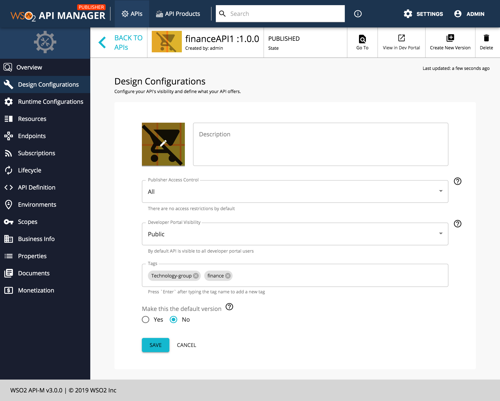
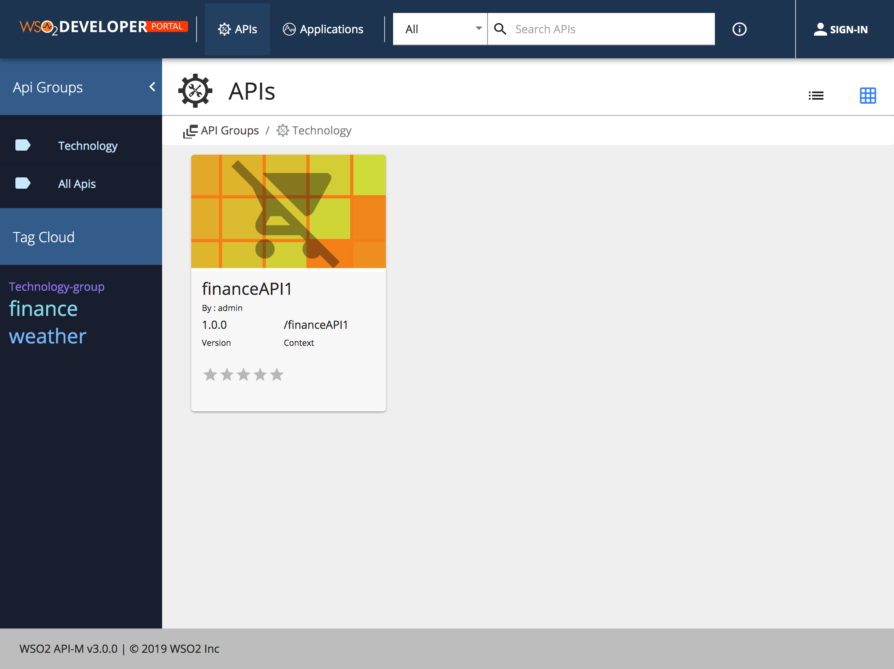

# Categorizing and grouping APIs

API providers add tags to APIs when designing them using the API Publisher. Tags allow API providers to categorize APIs that have similar attributes. When a tagged API gets published to the API Store, its tags appear as clickable links to the API consumers, who can use them to quickly jump to a category of interest. The font size of the tag in the Store varies based on the number of APIs that are assigned to it. Therefore, for example the font size of a tag which has 10 APIs assigned to it will be bigger than the font size of a tag that has only 2 APIs assigned to it.

If you want to see the APIs grouped according to different topics in the API Store, add an API group:

!!! note
Although the way in which you add a Tag and API group appears to be similar there are differences. Therefore, you need to note the following:

-   The **group name should always have** the **suffix `-group`** and it **can have spaces** in it (e.g., APIs groups-group).
-   The **tag name** should **not have a suffix or prefix** , but it **can have spaces** .


1.  Go to  `<API-M_HOME>/repository/deployment/server/jaggeryapps/devportal/site/public/theme/` directory, open the `defaultTheme.js` file and set the `themes.light.custom.tagWise.active` attribute as true.
2.  Add an API group to the APIs that you wish to group.
    1.  Go to the API Publisher ( `https://<HostName>:9443/publisher` ).
    2.  Click on the respective API and go to `Design Configurations`.
    [  ](../../../../../assets/img/Learn/categorizing-and-grouping-apis-publisher.png)
    3.  Add a group name to the APIs that you wish to group.

        For example add the "Technology-group".

    4.  Save the API for the tag to appear in the Devloper Portal.


    Sign in to the API Devloper Portal and note the API groups.
    If you wish, you can click on a group to see the APIs that belong to a specific group.

    [  ](../../../../../assets/img/Learn/categorizing-and-grouping-apis-group-list-view.png)

    ## API grouping configuration options

    Following JSON defines the look and feel and behavior of the tagWise filtering.

    ``` js
    tagWise: {
        active: true,
        style: 'fixed-left', 
        thumbnail: {
            width: 150,
            image: '/site/public/images/api/api-default.png',
        },
        key: '-group',
        showAllApis: true,
    }
    ```

| Option | type | Values | Description |
| ------ | -- | ----------- | ----------- |
| active | boolean | true, false | If true the feature is enabled. If false(default), the feature is disabled  |
| style   | string | 'page', 'fixed-left' | If 'page' it will show a different page. Else if 'fixed-left'( default ) will show a fixed menu with all the group tags on the left.  |
|thumbnail.width | integer | |  This value is applicable only when the style='page'. It defines the width of the thumbnail in api groups |
| thumbnail.image | string | | This is the path to api grouping icon. |
| key | string | | Set the sufix of the api tag |
| showAllApis | boolean | true, false | If true( default ) the All Apis link will be displayed under the api group listing |


