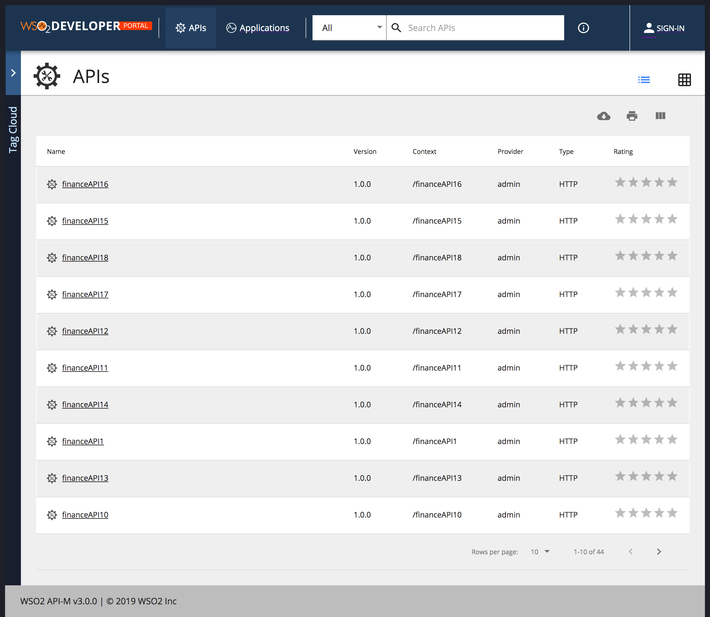

# Change Default View

By default the API Listing view is a grid view. 

Open `<API-M_HOME>/repository/deployment/server/jaggeryapps/devportal/site/public/theme/defaultTheme.js` file in a text editor.

Make sure to take a backup of the defaultTheme.js before making any changes.

If you want to change it to listing view change `themes.light.custom.defaultApiView` value to `list`

Changes done in the defaultTheme.js will be reflected directly in the devportal. ( It's not required to restart the server or rebuild the source code)

