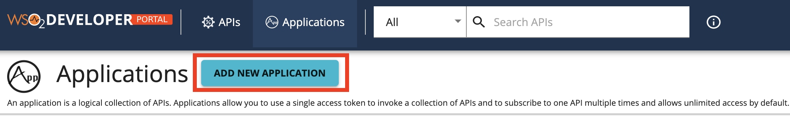
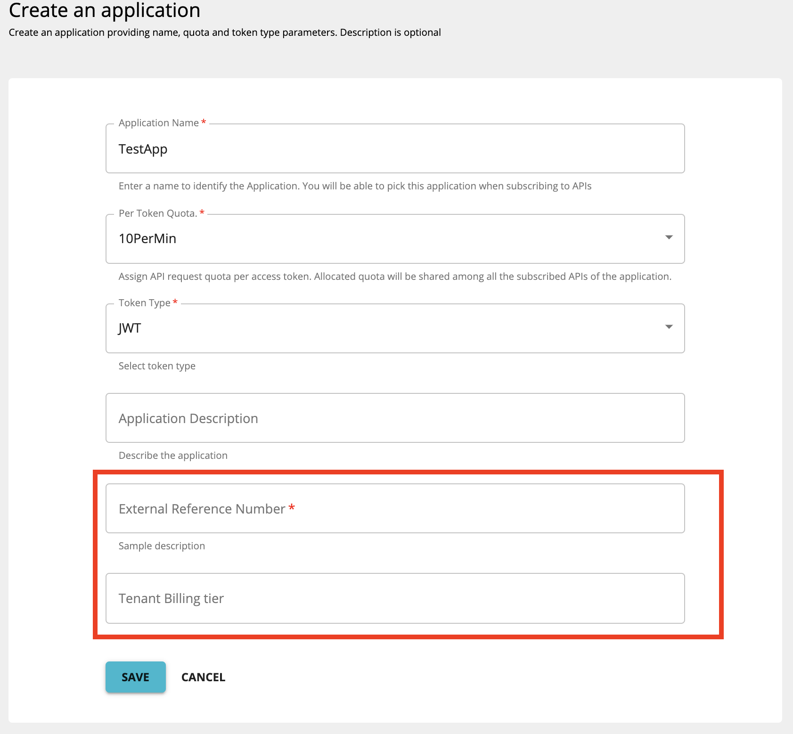

# Add Custom Attributes to Applications

Applications in the API Developer Portal are created and subscribed to APIs allowing users to consume the APIs, and helping developers to expose and monetize their APIs. Applications can be created with a predefined set of properties. This feature enables the functionality to provide a set of custom attributes while creating an application.

Follow the steps below to configure adding custom attributes to applications

-   [Step 1 - Configuring custom attributes for applications](#step-1-configuring-custom-attributes-for-applications)
-   [Step 2 - Creating an application with custom attributes through the API Developer Portal](#step-2-creating-an-application-with-custom-attributes-through-the-api-developer-portal)

### Step 1 - Configuring custom attributes for applications

Custom attributes can be configured in the following ways.

-   [Server-specific configuration](#server-specific-configuration)
-   [Tenant-specific configuration](#tenant-specific-configuration)

#### Server-specific configuration

To configure server-specific custom attributes, open the `<API-M-home>/repository/conf/deployment.toml` file. Add `application_attributes` as shown in the example below.

``` java
[[apim.devportal.application_attributes]]
required=true
hidden=false
name="External Reference Id"
description="Sample description of the attribute"
```

#### Tenant-specific configuration

To configure tenant-specific custom attributes follow the steps below,

1.  Sign in to the WSO2 Carbon console `https://<hostname>:9443/carbon`.
2.  Click on Resources --> Browse and navigate to `/_system/config/apimgt/applicationdata/tenant-conf.json`.
3. Add `ApplicationConfigs` under `Attributes` as shown below in the **tenant-conf.json** file

``` java
"ApplicationConfigs": {
    "Attributes" : [
        {
            "Attribute" : "External Reference Number",
            "Required" : true,
            "Description" : "Sample description"
        },
        {
            "Attribute" : "Tenant Billing tier"
        }
     ]
    }
```

### Step 2 - Creating an application with custom attributes through the API Developer Portal

After configuring the custom attributes as shown in the previous section, you will be able to add these attributes to the applications you create in the API Developer Portal.

1.  Log in to the API Developer Portal. Click **Add Application** , to add a new application

    [  ](/../../../assets/img/Learn/application-attributes-application-add.png)

2.  You will see the configured custom attribute as shown below.

    [  ](/../../../assets/img/Learn/application-attributes.png)
