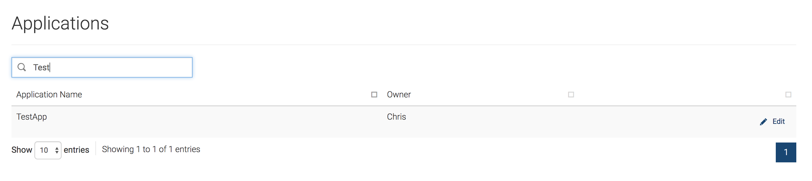
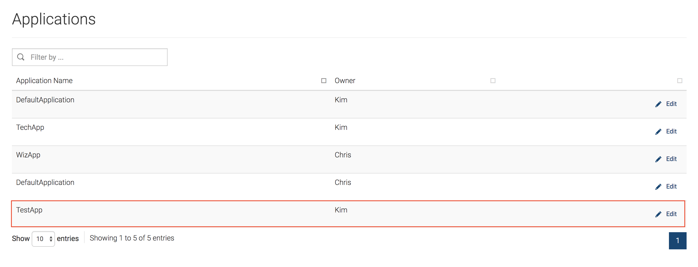

# Changing the Owner of an Application

If required, you can transfer the ownership of your application to another user in your organization. Thereby, when transferring ownership the new owner will have the required permission to delete or edit the respective application.

For example, let's consider that Chris and Kim are in the same organization and that Chris owns TestApp and that Chris wants to transfer the ownership of TestApp to Kim.

Follow the instructions below to change the ownership of an application:

1.  Start the WSO2 API-M Server.
2.  If the users do not exist in the system, create them.
    Sign in to the WSO2 API-M Management Console and create two users named Chris and Kim with the `Internal/subscriber` role.
`https://<APIM-hostname>:9443/carbon/          `

3.  Check the details of the application that you wish to share in the Developer Portal (e.g., TestApp).

    1.  Sign in to the WSO2 API-M Developer Portal using the application owner's (Chris's) user credentials.
`https://<APIM-hostname>:9443/devportal/            `

    2.  If the application does not exist, create it in the Developer Portal.

4.  Change the ownership of the application.
    1.  Sign in to the WSO2 API-M Admin Portal using admin credentials.
`https://<APIM-hostname>:9443/admin/            `

    2.  Click **Applications** under **Settings** .
        This shows you the list of applications together with the respective owners.

    3.  Search for the application that you want to share and click **Edit** .
        
    4.  Update the **Owner** field with the new owner's username (Kim).

        !!! Troubleshooting
            If you get a " `<username> is not a subscriber` " error (e.g., Kim is not a subscriber) in the Admin Portal, make sure to request that specific user (e.g., Kim) to sign in to the WSO2 Developer Portal, because users are not added as subscribers until they log in to the Developer Portal at least once.

        The application page shows the new ownership.
           
        Now, when Chris signs in to the Developer Portal, the TestApp does not appear, and when Kim signs in to the Developer Portal the TestApp appears under the application list.

