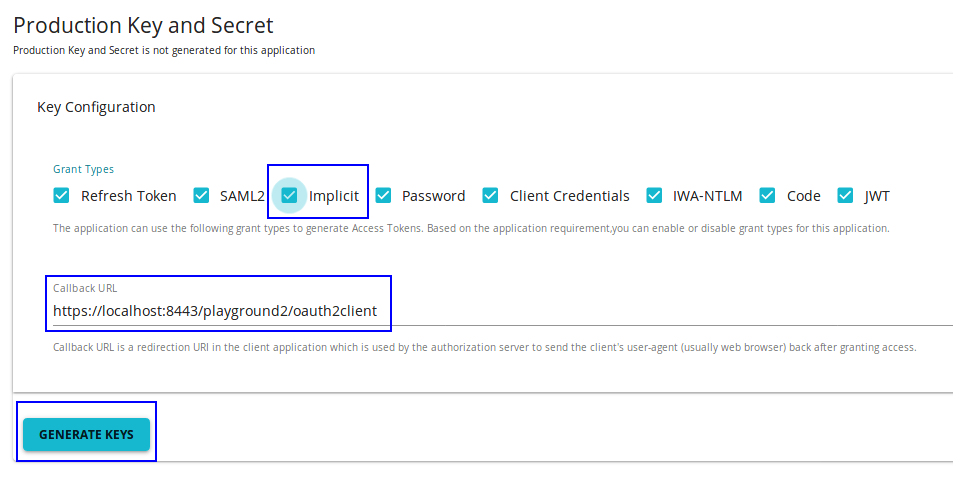
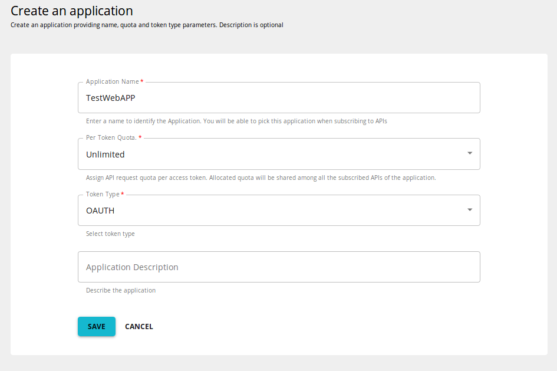
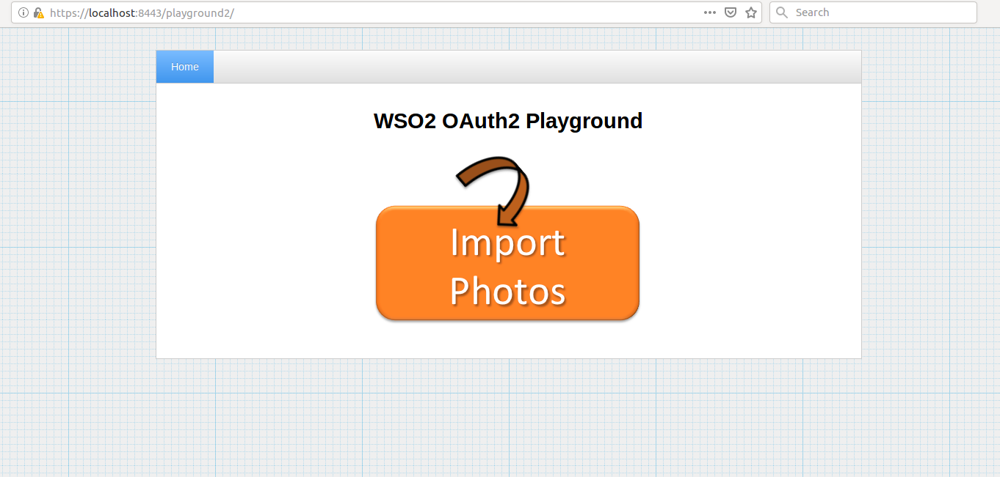
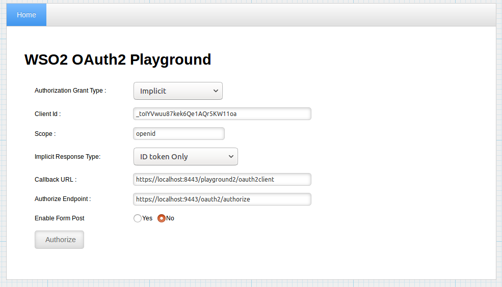
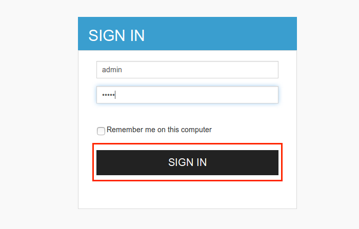
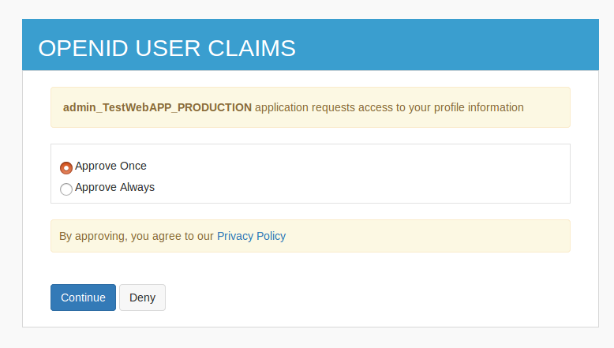
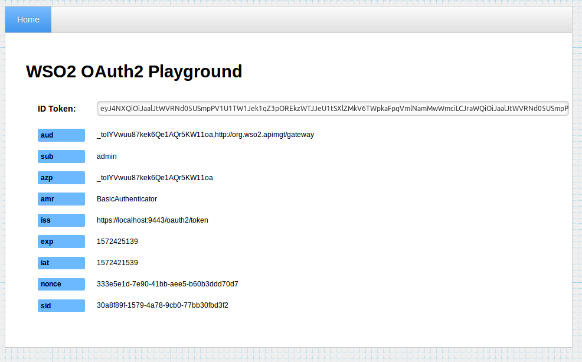

# Implicit Grant

#### Flow

Implicit grant type is used to obtain access tokens if your application (client) is a mobile application or a browser based app such as a JavaScript client. Similar to authorization code grant, the implicit grant type is also based on redirection flow. The redirection URI includes the access token in the URI fragment. Therefore, the client application is capable of interacting with the resource owner user agent to obtain the access token from the redirection URI which is sent from the authorization server.

The implicit grant type does not require client authentication, and relies on the presence of the resource owner and the registration of the redirection URI. The resource owner is authenticated by the authorization server to obtain the access token. The access token is encoded into the redirection URI. This may be exposed to the resource owner and other applications residing inside the same device.

The diagram below depicts the flow of Implicit Grant.

[](../../../../../assets/img/Learn/implicit-grant-flow.png)

1.  The client requests for the access token with the client ID and grant type, and other optional parameters.

2.  Since the resource owner authenticates directly with the authorization server, their credentials will not be shared with the client.

3.  The Authorization Server sends the access token through a URI fragment to the client.

4.  The client extracts the token from the fragment and sends the API request to the Resource Server with the access token.

!!! note
    The refresh token will not be issued for the client with this grant, as the client type is public. Also note that, Implicit grant does not include client authentication using client secret of the application


The following parameters are required to implement the Implicit grant type in WSO2 API Manager.

<table>
<thead>
<tr class="header">
<th>Name</th>
<th>Description</th>
<th>Sample value</th>
</tr>
</thead>
<tbody>
<tr class="odd">
<td>scope</td>
<td>The OAuth scope you are requesting for the particular token</td>
<td><code>openid</code></td>
</tr>
<tr class="even">
<td>response_type</td>
<td>The required response format</td>
<td><code>id_token</code></td>
</tr>
<tr class="odd">
<td>redirect_uri</td>
<td>The URL of the Oauth application requesting for the token</td>
<td><code>https://localhost:8443/playground2/oauth2client</code></td>
</tr>
<tr class="even">
<td>nonce</td>
<td>Any random value</td>
<td><code>13e2312637dg136e1</code></td>
</tr>
<tr class="odd">
<td>client_id</td>
<td>Client ID of the OAuth application </td>
<td><code>mzdQQ0RZOIqAf549ucIImB4h0SIa</code></td>
</tr>
</tbody>
</table>

An example is given below :

``` java
    https://localhost:8243/authorize?scope=openid&response_type=id_token&redirect_uri=http://localhost:8080/playground2/oauth2client&nonce=13e2312637dg136e1&client_id=mzdQQ0RZOIqAf549ucIImB4h0SIa
```

#### Try implicit grant to generate tokens

In this example we use the WSO2 Playground app, which is hosted as a web application, to obtain the access token with implicit grant.

!!! note
    **Before you begin**

    The following instructions use the sample playground webapp. For instructions on how to set up the sample webapp, see [Setting up the Sample Webapp](https://is.docs.wso2.com/en/5.9.0/develop/deploying-the-sample-app/) .


1.  Login to WSO2 API Manager Store and create an application as shown below.

    [](../../../../../assets/img/Learn/create-application.png)
    
2.  Go to the **Production keys** tab for the application. Add <https://localhost:8443/playground2/oauth2client> as the **Callback URL.** Select **Implicit** from the list of grant types and click **Generate Keys** .

    [](../../../../../assets/img/Learn/implicit-grant.png)

    !!! note
        The Implicit grant and Code grant type checkboxes are disabled by default in the UI. To enable selecting the checkboxes, enter the Callback URL for the application.
    
3.  Go to playground app <https://localhost:8443/playground2/index.jsp> and click **import photos.**

    [](../../../../../assets/img/Learn/playground2-app.png)

4.  Give the information in the table below and click **Authorize** .

    <table>
    <thead>
    <tr class="header">
    <th>Field</th>
    <th>Sample value</th>
    </tr>
    </thead>
    <tbody>
    <tr class="odd">
    <td>Authorization Grant Type</td>
    <td>Implicit</td>
    </tr>
    <tr class="even">
    <td>Client Id </td>
    <td>Consumer Key obtained for your application</td>
    </tr>
    <tr class="odd">
    <td>Scope</td>
    <td>The scope you have selected for your applicaton</td>
    </tr>
    <tr class="even">
    <td>Implicit Response Type</td>
    <td>ID token Only or ID token & Access Token</td>
    </tr>
    <tr class="odd">
    <td>Callback URL</td>
    <td>The callback URL of your application</td>
    </tr>
    <tr class="even">
    <td>Authorize Endpoint</td>
    <td><code>https://localhost:9443/oauth2/authorize</code></td>
    </tr>
    </tbody>
    </table>

    [](../../../../../assets/img/Learn/playground2-implicit-grant.png)

5.  The playground application redirects to the login page. Enter you username and password and click **Sign In.**

    [](../../../../../assets/img/Learn/login-page.png)

6.  Select **Approve Once** or **Approve Always** to provide access to your profile information.

    [](../../../../../assets/img/Learn/authorization-code-consent-page.png)  

7.  You will receive the access token as follows

    [](../../../../../assets/img/Learn/implicit-grant-access-token-page.png)

!!! note
    For users to be counted in the [Registered Users for Application statistics](../../../../../Analytics/AnalyzingAPIMStatisticsWithBatchAnalytics/viewing-api-statistics/#ViewingAPIStatistics-TopUsersperApplication) , which takes the number of users shared each of the Application, they have to generate access tokens using [Password Grant](../password-grant/) type.


