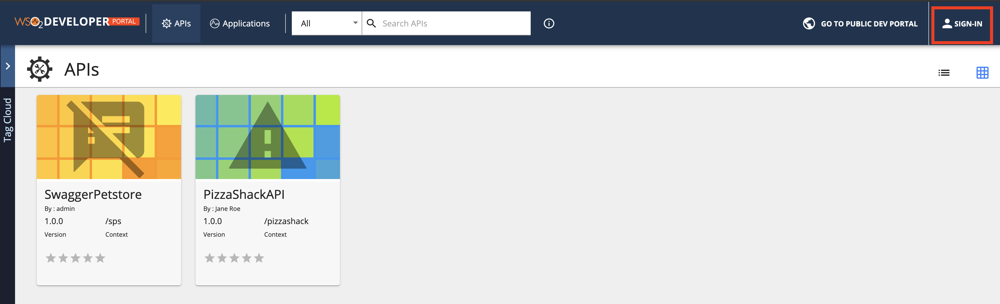
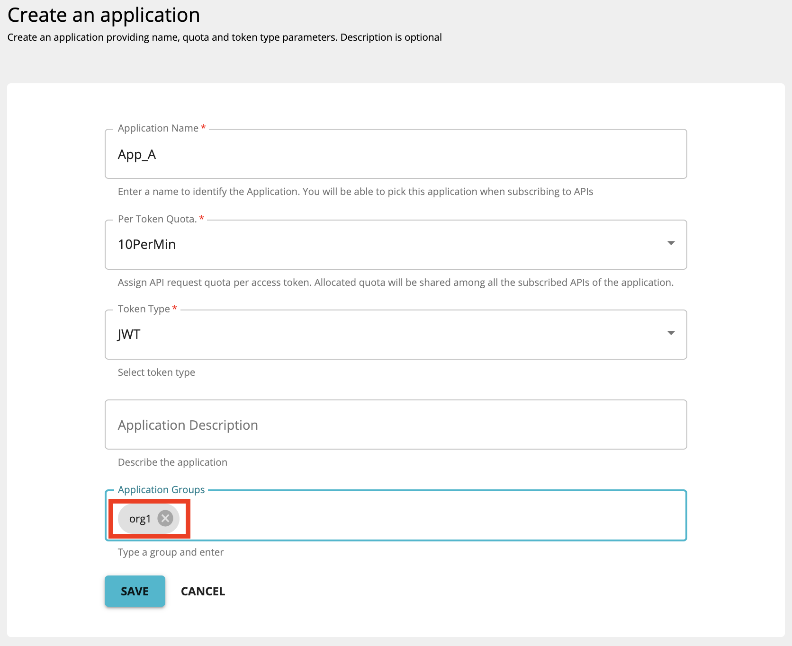
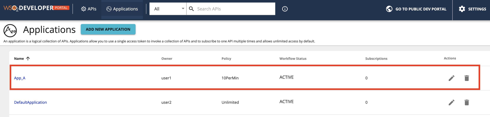
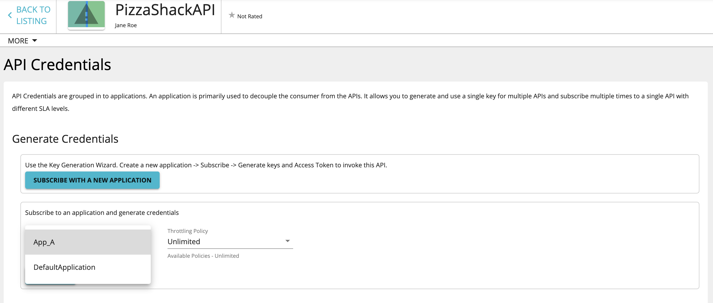
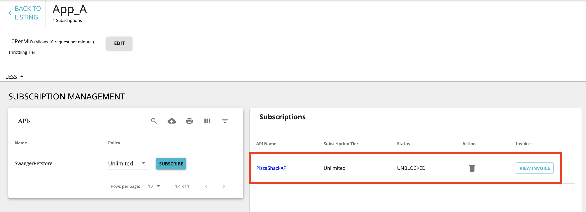

# Sharing Applications

WSO2 API Manager provides the facility for users to share their applications and subscriptions with a specific logical group/groups such as an organization. As a result of application sharing, users can view and modify applications and subscriptions belonging to other users in the same group or a different group.

WSO2 API Manager considers the organization name you enter when signing up to the Developer Portal as the group ID. All the users specifying the same organization name belong to the same group. Therefore, such users that belong to a single group can view each others' subscriptions and applications provided that you have [enabled group sharing](#enabling-application-sharing) . WSO2 API Manager also provides the flexibility to change this default authentication implementation.

-   [Enabling application sharing](#enabling-application-sharing)
-   [Sharing an application with multiple users](#sharing-an-application-with-multiple-users)
-   [Using application sharing](#using-application-sharing)
-   [Extending the group ID extractor](#extending-the-group-id-extractor)
-   [Defining a custom user claim as the group extractor claim](#defining-a-custom-user-claim-as-the-group-extractor-claim)

### Enabling application sharing

You can enable application sharing with users in a single group or between users in multiple groups by following the steps below.

1.  Shutdown the server if its running.

2.  The following configuration changes must be done in the `<API-M_HOME>/repository/conf/deployment.toml` file according to the application sharing type required.


    #### Default

    ``` java
    [apim.devportal]
    enable_application_sharing = true
    application_sharing_type = "default"
            
    ```

    #### SAML

    ``` java
    [apim.devportal]
    enable_application_sharing = true
    application_sharing_type = "saml"
            
    ```

    #### Custom

    ``` java
    [apim.devportal]
    enable_application_sharing = true
    #application_sharing_type = "default"
    application_sharing_impl = "org.custom.group.extension.DefaultGroupIDExtractorImpl"
            
    ```

3.  Restart the server.

### Sharing an application with multiple users

Group IDs are extracted using a `GroupingExtractor` class which is an implementation of `NewPostLoginExecutor` interface. The default implementation is done through the [DefaultGroupIDExtractorImpl](https://github.com/wso2/carbon-apimgt/blob/master/components/apimgt/org.wso2.carbon.apimgt.impl/src/main/java/org/wso2/carbon/apimgt/impl/DefaultGroupIDExtractorImpl.java) class. The organization claim is extracted using the group ID. If a particular user is in more than one organization, provide the organizations as a string separated by commas.

Share an application with multiple users who are in the same group or who are in multiple groups as follows:

1.  Start WSO2 API Manager, navigate to the WSO2 Devoloper Portal, and click **Sign-in** .

    [  ](/../../../assets/img/Learn/application-sharing-signin.png)

2. Click on the **Register Now** option in the Sign-in form.

     <a href="../../../../../assets/img/Learn/application-sharing-signup.png"></a>


3.  Sign up to the API Developer Portal as two different users (e.g., user1, user2) belonging to the same organization.
    - Provide the username and proceed to Self Register.
     <a href="../../../../../assets/img/Learn/application-sharing-username.png"></a>

    - Provide user details and Register.
     <a href="../../../../../assets/img/Learn/application-sharing-signup-form.png"></a>

4.  Sign in as **user1** and add application **App\_A** .

5.  Enter the Group ID as **org1** and press enter. Click **Save** . App\_A will be shared with all the users in **org1** group.

    !!! note
        - You can enter one group ID or multiple group IDs based on the groups with which you wish to share the application.

        - If you have [enabled group sharing](#enabling-application-sharing) , but if you have not entered a group ID in the **Groups** section, WSO2 API-M will automatically share the application with the users who are in the same organization that you are in, because they are considered as part of the same group.

    [  ](/../../../assets/img/Learn/application-sharing.png)

### Using application sharing

You can use application sharing as follows:

1.  Sign out of the API Developer Portal.
2.  Sign in to the API Developer Portal as **user2** .
3.  Go to the **Applications** tab. You will see App\_A which was added by **user1** .
    [  ](/../../../assets/img/Learn/application-sharing-sharedapp.png)   
   
4.  Subscribe to the default API using App\_A.
    [  ](/../../../assets/img/Learn/application-sharing-subscribe.png) 
5.  Log in to the API Developer Portal as **user1.** The subscriptions for App\_A by **user2** will be displayed.
    [  ](/../../../assets/img/Learn/application-shared-subscriptions.png) 

### Extending the group ID extractor

The default implementation picks the organization claim as the group ID. The organization names are returned in a string array. To use a different claim or a different type of group ID , you should create your own group ID extractor class by extending the `NewPostLoginExecutor` interface and overriding the following method.

``` java
    String[] getGroupingIdentifierList(String response);
```

When a user signs in to the Developer Portal, the latter mentioned method is called and it will return all the group IDs that correspond to the user who has logged in to the Developer Portal. After users sign in to the Developer Portal, they will be able to see their own applications, which they created, and also the applications that are shared with the group IDs that were returned by the `getGroupingIdentifierList` method.

Once you have written your custom group extractor, add the jar of the custom group extractor to `<API-M_HOME>/repository/components/lib` and do the necessary configuration changes mentioned in [enabling application sharing](#enabling-application-sharing)


### Defining a custom user claim as the group extractor claim

To define a custom user claim URI as the default group extractor claim URI, add the following configuration under the **[apim.devportal]** configuration in the `<API-M_HOME>/repository/conf/deployment.toml` file.

**Format**

``` java
application_sharing_claim=[custom-claim]
```

**Example**
``` java
application_sharing_claim="http://wso2.org/claims/role"
```
        
