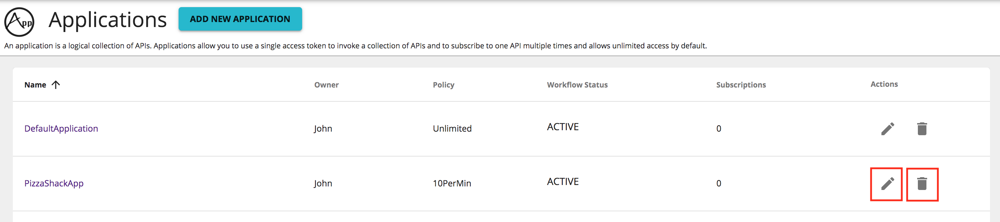

# Create Application

#### Overview

An application is a logical collection of APIs/API Products and it is primarily used to decouple the consumer from the 
APIs.
 It allows you to:

-   Generate and use a single key for multiple APIs
-   Subscribe multiple times to a single API with different tiers/Service Level Agreement (SLA) levels

You can subscribe to APIs through an application. Applications are available at different SLA levels and have 
application-level throttling tiers engaged to them. A throttling tier determines the maximum number of calls you can 
make to an API during a given period of time.

The API Manager comes with a pre-created default application, which allows unlimited access by default. You can also 
[create](create-application.md####Create Applications) your own.

#### **Create Applications**

1.  Sign in to the WSO2 API developer portal ( `https://<hostname>:9443/devportal` ).
    
    !!! tip
        In a multi-tenanted WSO2 API Manager setup, you can access any tenant's store using the URL 
            `http://<hostname>:<port>/devportal?tenant=<tenant_name>`

2.  Click **Applications** tab.

3.  Click **ADD NEW APPLICATION** button.
   

4.  Enter the application details and click **SAVE** button to create the application.
   
       Let's create an application with the following details.
   
     <html>
        <table>
        <th>Field</th><th>Value</th>
        <tr><td>Application Name</td><td>PizzaShackApp</td></tr>
        <tr><td>Per Token Quota</td><td>10PerMin</td></tr>
        <tr><td>Token Type</td><td>JWT</td></tr>
        <tr><td>Description</td><td>PizzaShack Application</td></tr>
        </table>
     </html>
   
     
      
    If the application creation is successful, you will be redirected to the application overview page

     
    
5.  Navigate to Applications listing page, and you will find the PizzaShack application listed with other applications
. The application can be edited or deleted by the application owner.

    

    
