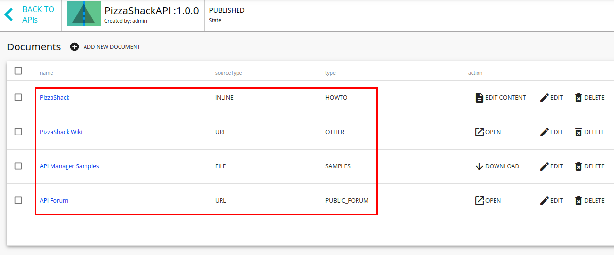

# Add API Documentation

**API documentation** helps API subscribers understand the functionality of the API, and API publishers to market their APIs better and sustain competition. Using the API Publisher, you can add different types of documentation from different sources. All documents created in the API Publisher have unique URLs to help improve SEO support.

The documentation types supported in the API Publisher are as follows:

-   **In-line** : Hosts documentation (How-tos, Samples, SDK, forums etc.) in WSO2 API Publisher itself and allows it to be edited directly from the UI.
-   **URL** : Links of public or support forums or file references (URLs) of an external configuration management system.
-   **File:** Allows to upload the documentation directly to the server.
-   Using the integrated API Console

Follow the steps below to learn how to add a documentation to an API.

1.  Sign in to the WSO2 API Publisher.
`https://<hostname>:9443/publisher`
2.  Click the API (e.g., `PizzaShackAPI 1.0.0` ) for which you want to add documentation.
    
3.  **Add in-line documentation.**

    1.  Select the **Documents** tab of the API and click **Add New Document** .
        
    2.  Enter the following details to create documentation in-line.

        |         |                                      |
        |---------|--------------------------------------|
        | Name    | PizzaShack                    |
        | Summary | This is the official documentation for the PizzaShack API |
        | Type    | How To                               |
        | Source  | In-line                              |

        

    3.  Click **Add Document** .
    4.  Click **Add Content** to open an embedded editor.

        

        !!! note
            You can edit the content later by clicking **Edit Content**. It will open up the embedded editor to proceed.

        

        !!! info
            Edit button can be used to update/change the document information.

    5.  Edit the document content in-line using the embedded editor and click **Update Content** .
        
        The API's **Documents** tab opens.

4.  **Add documentation using a URL** .

    You can use either **Public Forum**, **Support Forum** or **Other** types to add documentation using a URL.

    1.  Click **Add New Document** to add another doc type.

    2.  Enter the following information to create another doc using a URL of a Public or Support forum.

        <table>
        <tbody>
        <tr class="odd">
        <td>Name</td>
        <td>API Forum</td>
        </tr>
        <tr class="even">
        <td>Summary</td>
        <td>

        
Forum to discuss about APIs

        
</td>
        </tr>
        <tr class="odd">
        <td>Type</td>
        <td>Public Forum/Support Forum</td>
        </tr>
        <tr class="even">
        <td>Source</td>
        <td>URL 
        <a href="http://www.dummyforum.com" class="uri">http://www.dummyforum.com</a></td>
        </tr>
        </tbody>
        </table>

        

    3.  Enter the following information to create another doc using a URL. This can be used if you want to add a documentation using Other type pointing to a link to a file reference of an external source.

        <table>
        <tbody>
        <tr class="odd">
        <td>Name</td>
        <td>PizzaShack Wiki</td>
        </tr>
        <tr class="even">
        <td>Summary</td>
        <td>

        
Sample PizzaShack API

        
</td>
        </tr>
        <tr class="odd">
        <td>Type</td>
        <td>Other</td>
        </tr>
        <tr class="even">
        <td>Other Document Type</td>
        <td>Other (Provide a type as required)</td>
        </tr>
        <tr class="even">
        <td>Source</td>
        <td>URL 
        <a href="http://www.dummy.com/PizzaShackAPIDoc.pdf" class="uri">http://www.dummy.com/PizzaShackAPIDoc.pdf</a></td>
        </tr>
        </tbody>
        </table>

        

    4.  Click **Add Document** .
        The API's **Documents** tab opens.

5.  **Add documentation using a file** .

    1.  Click **Add New Document** to add yet another document using a file.

    2.  Enter the following information.

        |         |                                                                                                                                                                                                                                                                                                                              |
        |---------|------------------------------------------------------------------------------------------------------------------------------------------------------------------------------------------------------------------------------------------------------------------------------------------------------------------------------|
        | Name    | API Manager Samples                                                                                                                                                                                                                                                                                                          |
        | Summary | API Manager Samples                                                                                                                                                                                                                                                                                                          |
        | Type    | Samples & SDK                                                                                                                                                                                                                                                                                                                |
        | Source  | You can provide any file format (common formats are `.pdf` , `.html` , `.doc` , `.txt` ) of any size. For example, use the sample PDF file [here](../../../assets/attachments/Learn/api-docs-sample.pdf) . |

        

    3.  Click **Add Document** .
    
6. You have now added three documents to the API: in-line, using a URL, and a file.
        

7.  Log in to the WSO2 Developer Portal and click the `PizzaShackAPI` 1.0.0 version.
`https://<hostname>:9443/devportal         `
    

8.  Go to the API's **Documentation** tab and see the documents listed by type.
    Click the links to see the documentation content. As a subscriber, you can read the documentation and learn about the API.
    

You have created documentation using the API Publisher and viewed them as a subscriber in the Develper Portal.
