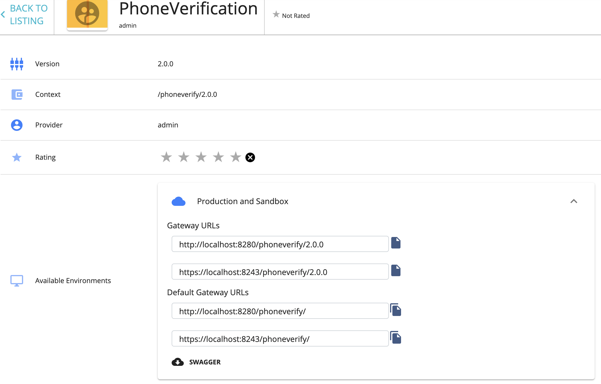

# Backward Compatibility

## Default version
The **Default Version** option means that you make this version the default in a group of different versions of 
the API. A default API can be invoked without specifying the version number in the URL. For example, if you mark
`http://<hostname>:<port>/phoneverify/2.0` as the default version when the API has 1.0 and 3.0 versions as well, requests 
made to `http://<hostname>:<port>/phoneverify/` get automatically routed to version 2.0.

If you mark any version of an API as the default, two API URLs are listed in its **Overview** tab in the Developer Portal. 
One URL is with the version and the other is without. You can invoke a default version using both URLs.
   
   

## Default version and Backward Compatibility
When you want to modify a published API, a new version of the API can be created. 
We can make the new version as the default API version, 
so the subscribers who are using the default API URL for accessing the API can get the changes immediately.
However, the changes made to the API version must be backward compatible. That means, the subscriber should be able to 
use the API as before without failures. 