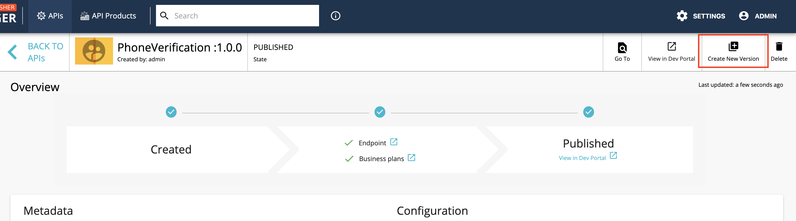
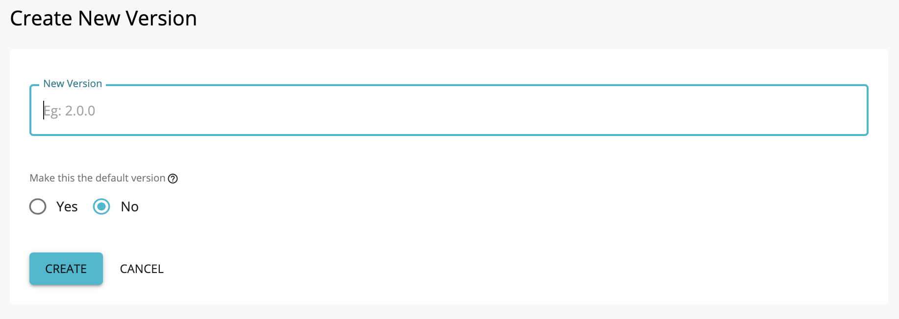

# Create a New API Version

A new **API version** is created when you want to change a published API's behavior,
authentication mechanism, resources, [throttling tiers](../../../../Learn/RateLimiting/introducing-throttling-use-cases/),
target audiences, etc. It is not recommended to modify a published API that has subscribers plugged into it.

After creating a new version, you typically deploy it as a prototype for early promotion.
A prototype can be used for testing, without a subscription, along with the published versions of the API. After a period
of time during which the new version is used in parallel with the older versions, the prototyped API can be published
and its older versions can be deprecated.

!!! note
    The example here uses the PhoneVerification API, which you created in the
    [Create and Publish an API](../../../../Learn/Tutorials/create-and-publish-an-api/) section.

The steps below show you how to create a new version of an existing API.

1.  Sign in to the WSO2 API Publisher.
`https://<hostname>:9443/publisher` 
Refer [Create and Publish an API](../../../../Learn/Tutorials/create-and-publish-an-api/) to create and publish an API.

2.  Go to the APIs listing page. Then click on the API name that corresponds to the API for which you want to create a
new version (e.g., `PhoneVerification 2.0.0` ). 
                                        
3.  Click **Create New Version**.
   

4.  Enter a version number. Select **Create**. Then you will be redirected to the API **overview** page. 
   

!!! note
    For more details on the default version, 
    see [Backward Compatibility](../../../../Learn/DesignAPI/APIVersioning/backward-compatibility/) section.

!!! note
    By default, only the latest version of an API is shown in the Developer Portal. If you want to display multiple
    versions, add/change following configuration in `<API-M_HOME>/repository/conf/deployment.toml` file,
    and restart the server.
    ``` toml
       [apim.devportal]
       display_multiple_versions = true
    ```

You have created a new version of an API. In the next tutorial, let's learn how to
[publish the new version and deprecate old API versions](../../../../Learn/DesignAPI/APIVersioning/deprecate-the-old-version/).

