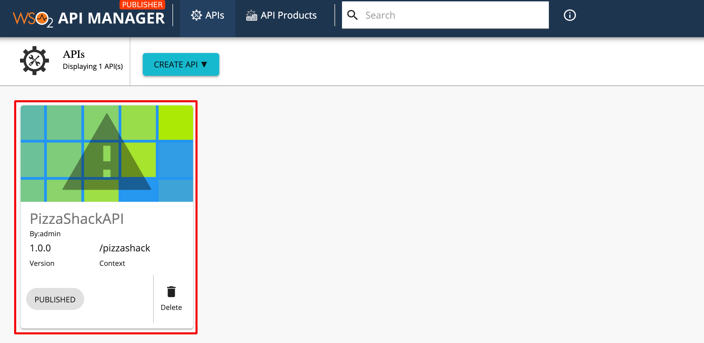
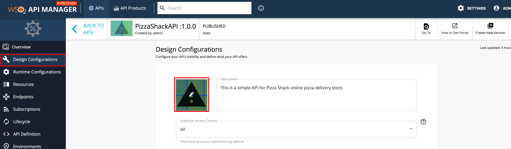
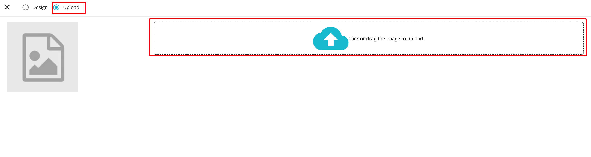
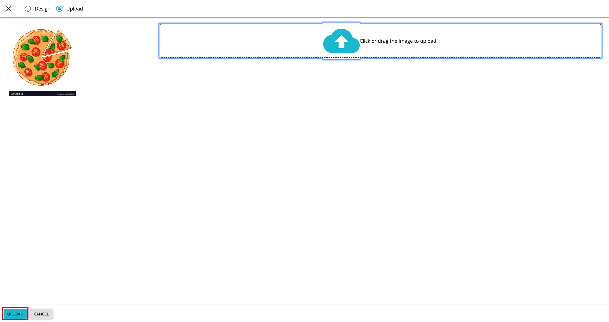
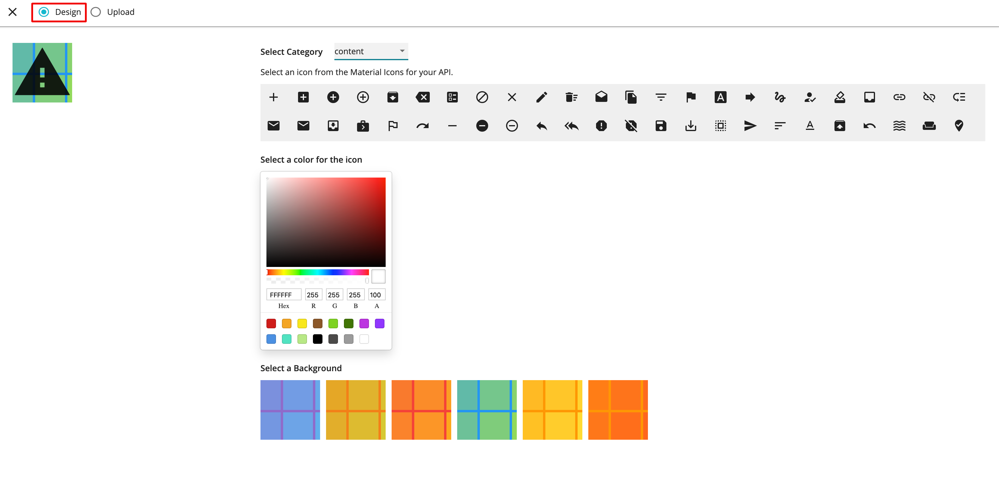
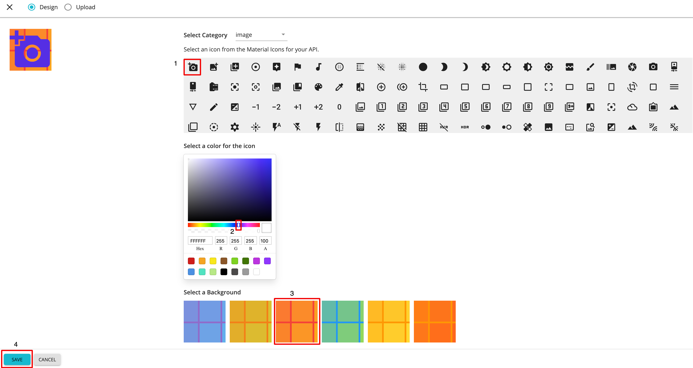

# Change the Thumbnail of an API.

The thumbnail of an API can be changed by uploading an image for the thumbnail or designing a new thumbnail image
 from the Publisher UI.

## Upload new API Thumbnail
1. Log in to API Publisher and click on the API that you want to change the thumbnail.
   
  
2. Click on the ***Design Configurations*** from the left navigation panel and click on the API Thumbnail image.
   
4. In the dialog box, select ***Upload*** radio button from the top panel and click on the Drop Zone to select an image
 for the thumbnail.
   
 
5. Click on ***Upload*** to save the newly uploaded thumbnail.
   
  
    The newly updated image is applied as the api thumbnail.
    
    
      
## Design a new API Thumbnail

Follow the steps 1 - 3 of the above section.

4. Select ***Design*** from the top panel of the dialog box.
     
    
5. Select an icon, color and background for the thumbnail.
    
    - ***Category***
        
        Select the icon category. Currently API Publisher supports following categories.
        
        

    - ***Icon Color***
        
        Select the icon color from the color picker.
    
        
        
    - ***Background***
        
        Select the thumbnail background from the designs.
        
        
          
6. After selecting the icon, color and the background, click on ***SAVE*** button to save the thumbnail.
     

7. The API is updated with the designed thumbnail.

    
    