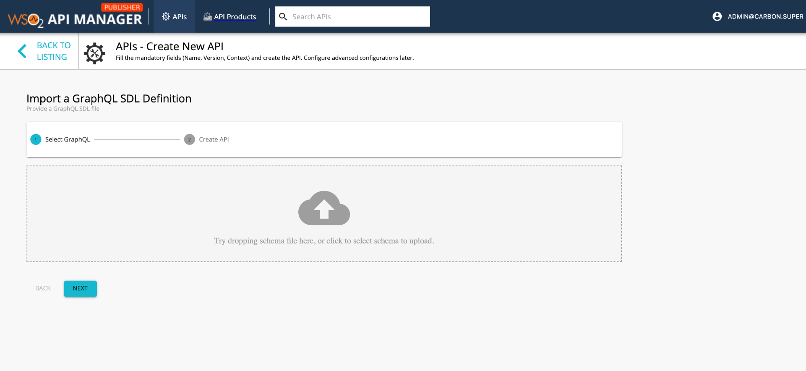

# Create and Publish a GraphQL API

GraphQL, which has been developed by Facebook, is a data query language for APIs. When using GraphQL, users can explicitly specify as to what data they need from an API. GraphQL APIs are an alternative to REST-based APIs. 

You can use a Schema Definition Language (SDL) schema to design a GraphQL API in WSO2 API Manager (WSO2 API-M) similar to creating SOAP APIs using WSDLs and developing REST APIs using OpenAPI Specifications (a.k.a. Swagger Definitions).

All GraphQL schemas generally have three operation root types, which are namely query, mutation, and subscription. Therefore, every POST request or GET request against a GraphQL endpoint of a GraphQL server should have a payload starting with any one of the root types, including its related operation name. You can manage the security, authorization, and rate limiting aspect of each operation based on its operation name. 

Follow the instructions below to design and publish a GraphQL API:

### Step 1 - Design a GraphQL API

1. Sign in to the API Publisher Portal.
   
    `https://<hostname>:9443/publisher` 
   
    Example: `https://localhost:9443/publisher`

    Use your username and password to sign in.

2. Click **CREATE API** and then click **I Have a GraphQL SDL schema**.

    <html>
    <head>
    </head>
    <body>
         
    </body>
    </html>

3. Import the schema and click **Next**.  

    Let's use the [StarWarsAPI schema definition](../../../../assets/attachments/learn/schema_graphql.graphql) to create the schema file. 
   
      <html>
      <div class="admonition note">
      <p class="admonition-title">Note</p>
      <ul><li>
      <p>You need to define the SDL Schema based on the [GraphQL schema design best practices](https://leapgraph.com/graphql-schema-design-best-practices).</p></li>
      <li>The file extension can be either `.graphql`, `.txt`, or `.json`. </li><li> The file name can be any name, which is based on your preference.</li></ul>
      </div> 
      </html>


      

4. Enter the GraphQL API related details and click **Create**. 
    
    Let's create an API named "StarWarsAPI" using the following sample data.
      <html>
         <table>
            <thead>
            <tr class="header">
            <th><div>
            <div>
            Protocol State
            </div>
            </div></th>
            <th><div>
            <div>
            Description
            </div>
            </div></th>
            </tr>
            </thead>
            <td >
               <p>Name</p>
            </td>
            <td>
               <p>StarWarsAPI</p>
            </td>
            </tr>
            <tr>
            <td>
               <p>Context</p>
            </td>
            <td>
               <p>	
               /swapi</p>
            </td>
            </tr>
            <tr>
            <td>
               <p>Version</p>
            </td>
            <td>
               <p>1.0.0</p>
            </td>
            </tr>
            <tr>
            <td>
               <p>Endpoint</p>
            </td>
            <td>
               <a href="https://api.graph.cool/simple/v1/swapi" target="_blank">https://api.graph.cool/simple/v1/swapi</a>
            </td>
            </tr>
            <tr>
            <td >
               <p>Business Plans</p>
            </td>
            <td>
               <p>Unlimited</p>
            </td>
            </tr>
            <tr>
            <td >
               <p>Visibility on Store</p>
            </td>
            <td>
               <p>Public</p>
            </td>
            </tr>
         </table>
      </html>

      

5. Optionally, modify the existing GraphQL schema definition.

    1. Click **Schema Definition**.

    2. Click **DOWNLOAD DEFINITION**.

        The existing GraphQL API schema will get downloaded.

         

    3. Update the schema definition as required.

    4. Click **IMPORT DEFINITION** to import the updated schema definition.

6. Update the GraphQL API operations as required.

    Instead of resources, which get populated for REST APIs, operations get populated for GraphQL APIs.

    1. Click **Show More** under the **Operations** section in the **OVERVIEW** page to navigate to the operations page.

         
     
    2. Update the operations as required.
         
        The Publisher can add rate limiting policies, scopes, and enable/disable security for each of the GraphQL API operations.

        1. Create scopes.

            Repeat the following sub-steps to create two scopes named `adminScope` and `FilmSubscriberScope`.

            1. Click **Scopes** > **ADD NEW SCOPE**.

                  <html>
                  <head>
                  </head>
                  <body>
                  
                  </body>
                  </html>

            2. Enter the required details.

                  <html>
                  <head>
                  </head>
                  <body>
                  <div class="admonition note">
                  <p class="admonition-title">Note</p>
                  <p> 
                  The role that you enter should be a valid role that already exists in WSO2 API Manager. Make sure to assign the role to the user.
                  </p>
                  </div>
                  
                  Create a role named `FilmSubscriber` and assign it to the `admin` user for this example scenario. For more information, see [Adding Users](../../../../Administer/ProductAdministration/ManagingUsersAndRoles/adding-users/) and [Adding User Roles](../../../../Administer/ProductAdministration/ManagingUsersAndRoles/adding-user-roles/).


                  
                  </body>
                  </html>

            3. Click **SAVE**.
                

         2. Define the operation level configurations.

            1. Click **Operation Level** to apply rate limiting for operations.

                 

            2. Select a throttling policy, scope, and enable or disable security for each of the operations.

                For more information on the payload, see [GraphQL operations](#graphql-operations). 

                Apply the `adminScope` and `FilmSubscriberScope` scopes to the `allFilms` and `allPlanets` operations, respectively.
            
            3. Click **Save**.

                If you check the list of scopes, it should appear as follows:

                


7. Click **LIFECYCLE** to navigate to the API lifecycle and click **PUBLISH** to publish the API.

    

### Step 2 - Invoke a GraphQL API

1. Navigate to the Developer Portal.
   
    `https://<hostname>:9443/devportal` 
   
    Example: `https://localhost:9443/devportal`

    
    
2. Click on the GraphQL API.
   
    The API overview appears.

    

3. Optionally, download the API schema if required.

    Click **More** on the API overview page and then click **GRAPHQL SCHEMA** to download the API schema.

    

4. Sign in to the Developer Portal.

      `https://<hostname>:9443/devportal`

      

5. Subscribe to the API.

    1. Click **KEY GENERATION WIZARD**.
    
        This wizard takes you through the steps of creating a new application, subscribing, generating keys, and generating an access token to invoke the API. Add the two scopes (allFilms, allPlanets) that you assigned to the operations.

    2. Copy the authorization token that appears.

       

6. Try out the operations.
    1. Click **TEST** to navigate to the developer console.

        

    2. Select whether to invoke the API using HTTP or HTTPS from **Servers**.

    3. Paste the access token that you previously copied into the **Access Token** field.

    4. Click **POST**.
    
    5. Click **Try it out** and enter the following sample payload as the StarWarsAPI POST request.
         ```
         {
         "query": "{ allFilms{title  episodeId}  allPlanets {films { species {skinColor} } }}"
         }   
         ```

         

    6. Click **Execute**.

        


### GraphQL operations

The following sub-sections explain as to how authorization, security, and throttling affect API operations.

#### Authorization for GraphQL operations

A scope acts as a limiting factor on what API resources can be accessed using an access token and thereby defines the authorization aspect for API requests.

- **Authorization for a single operation**

    When a query has a single operation, the access token should include the scope that is attached to that specific operation to be able to invoke the API.

- **Authorization for multiple operations**
 
    When a query has multiple operations, the access token should include all the scopes that are attached to the operations that correspond to that specific API to be able to invoke the API.

#### Security for GraphQL operations

Security can be enabled or disabled for GraphQL operations. Security is enabled for GraphQL operations by default.

- **Security for a single operation**

    When a query has an operation that has security enabled, the users need to enter their credentials to invoke the respective API. However, when security is disabled for the operation, the users can invoke the respective API without entering their credentials.

- **Security for multiple operations**
  
    The API request takes into consideration the security configurations of all the operations that belong to the API. When a query has security enabled for one of the operations that belong to a specific API, then security is automatically applied for all the operations. Therefore, in such cases, users have to use their credentials when invoking that respective API.

#### Rate limiting for GraphQL operations

Rate limiting is set to unlimited, and thereby disabled by default. 

- **Rate limiting for a single operation**

    When a query has an operation with a rate limiting policy applied to it, the respective rate limiting policy is taken into account to rate limit the request when it exceeds the desired limit. 

- **Rate limiting for multiple operations**

    WSO2 API Manager checks all the operation related rate limiting policies when determining the overall rate limit. When the requests exceed the minimum rate limit, which corresponds to the operations in the query, they will be throttled out.
   
