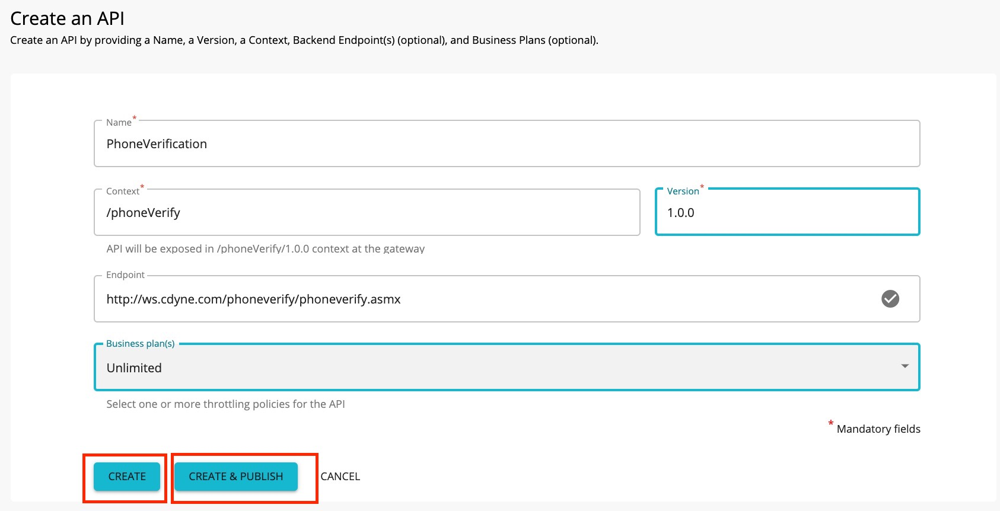
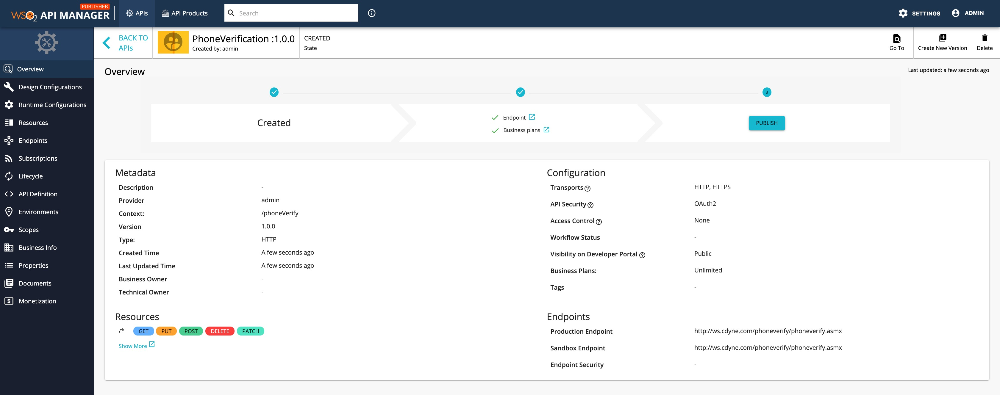
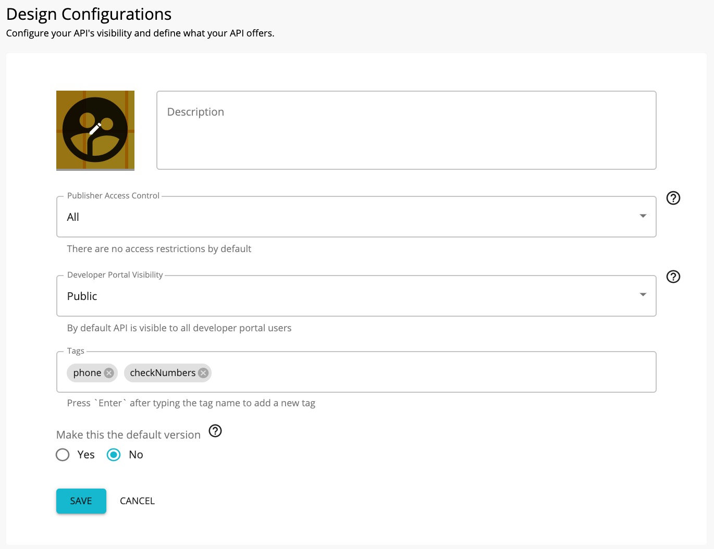
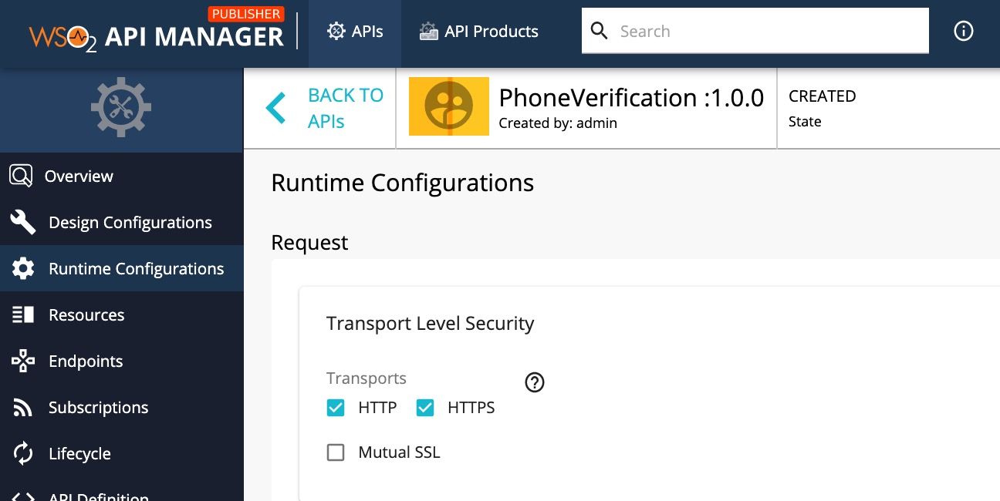
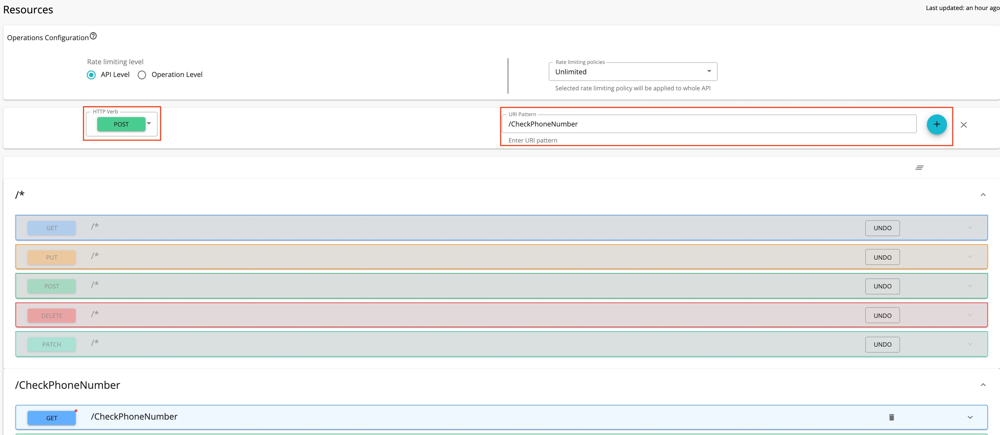
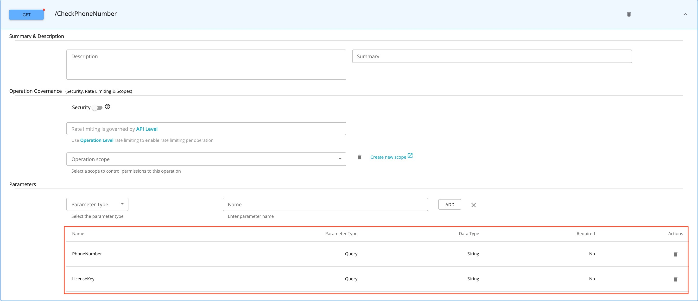
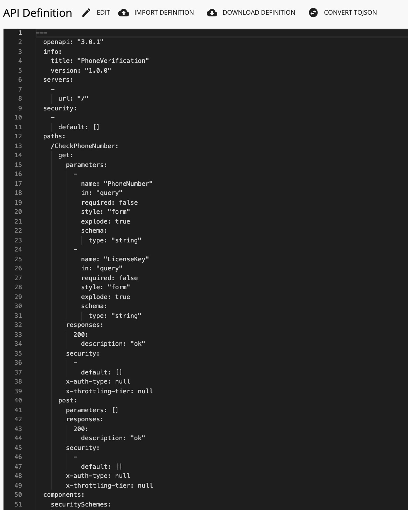

# Create and Publish an API

**API creation** is the process of linking an existing backend API implementation to the [API Publisher](/GettingStarted/overview/#api-publisher) so that you can manage and monitor the [API's lifecycle](/Learn/DesignAPI/LifecycleManagement/api-lifecycle/) , documentation, security, community, and subscriptions. Alternatively, you can provide the API implementation in-line in the [API Publisher](/GettingStarted/overview/#api-publisher) itself.

!!! note
        Click the following topics for a description of the concepts that you need to know when creating an API:
       -   [API visibility](https://docs.wso2.com/display/AM300/Key+Concepts#KeyConcepts-APIvisibility)
       -   [Resources](https://docs.wso2.com/display/AM300/Key+Concepts#KeyConcepts-APIresources)
       -   [Endpoints](https://docs.wso2.com/display/AM300/Key+Concepts#KeyConcepts-Endpoints)
       -   [Throttling tiers](https://docs.wso2.com/display/AM300/Key+Concepts#KeyConcepts-Throttlingtiers)
       -   [Sequences](https://docs.wso2.com/display/AM300/Key+Concepts#KeyConcepts-Sequences)
       -   [Response caching](https://docs.wso2.com/display/AM300/Configuring+Caching#ConfiguringCaching-Responsecache)

1. Sign in to the WSO2 API Publisher providing username and password `https://<hostname>:9443/publisher` (e.g., `https://localhost:9443/publisher` ).

2.  Go to **CREATE AN API** and Click **Design a New REST API**.
    

4.  Enter the information provided in the table below and click **CREATE** or **CREATE & PUBLISH** to create the API.

     <table><colgroup> <col/> <col/> <col/> </colgroup><tbody><tr><th colspan="2" >Field</th><th >Sample value</th></tr><tr><td colspan="2" class="confluenceTd">Name</td><td class="confluenceTd">PhoneVerification</td></tr><tr><td colspan="2" class="confluenceTd">Version</td><td colspan="1" class="confluenceTd">1.0.0</td></tr><tr><td colspan="2" class="confluenceTd">Context</td><td class="confluenceTd">

<code>/phoneverify</code>

 

The API context is used by the Gateway to identify the API. Therefore, the API context must be unique. This context is the API's root context when invoking the API through the Gateway.

You can define the API's version as a parameter of its context by adding the <code>{version}</code> into the context. For example, <code>{version}/phoneverify</code>. The API Manager assigns the actual version of the API to the <code>{version}</code> parameter internally. For example, <code>https://localhost:8243/1.0.0/phoneverify</code>. Note that the version appears before the context, allowing you to group your APIs based on the versions.

</td></tr><tr><td colspan="2" class="confluenceTd">Endpoint</td><td colspan="1" class="confluenceTd">
This sample service has two operations as <code>CheckPhoneNumber</code> and <code>CheckPhoneNumbers</code>. Let's use <code>CheckPhoneNumber</code> here. <a class="external-link" href="http://ws.cdyne.com/phoneverify/phoneverify.asmx" rel="nofollow">http://ws.cdyne.com/phoneverify/phoneverify.asmx</a>

This is the actual endpoint where the API implementation can be found. The endpoint that you add is automatically added as the production and sandbox endpoints.
</td></tr></tbody></table>
        
     <html>
     

     
Note

     
The **CREATE & PUBLISH** option will appear only if the optional fields **Endpoint** and **Business plan(s)** are provided.

     

     </html>
     
   

5.  When click **CREATE** or **CREATE & PUBLISH**, page will be redirected to overview page of the             newly created api 

6.  Navigate to **Design Configurations** page and add tags as phone and checkNumbers
        <html>

        
Note

        
Tags can be used to filter out APIs matching certain search criteria. It is recommended that you add tags that explain the functionality and purpose of the API as subscribers can search for APIs based on the tags.

        

        </html>
        

       

7. Navigate to **Runtime Configuration** page. 
   Transport Level Security can be defined the transport protocol on which the API is exposed.  
   

     <html>

     
Note

     
 Both HTTP and HTTPS transports are selected by default.It is able to limit the API availability to only one transport (e.g., HTTPS), clear the checkbox of the other transport.

     

     </html>

8. By default, the api will have five resources with /* uri 
   template.
   Click **Show More** option to navigate **Resource** page.
   

9. Add/Update/Remove the resources as follows.

    <html>
      <table>
      <tr>
      <td>URL pattern</td>
      <td>CheckPhoneNumber</td>
      </tr>
      <tr>
      <td>Request types</td>
      <td>GET, POST</td>
      </tr>
      </table>
    </html>

     
     

10. Expand GET operation to add the following parameters.
        <html>
        <table>
        <td>Parameter Name</td>
        <td>Parameter Type</td>
        </tr>
        <tr>
        <td>PhoneNumber</td>
        <td> query</td>
        </tr>
        <tr>
        <td>LicenseKey</td>
        <td>query</td>
        </tr>
        </table>
        </html>

      

11. Click Save and navigate to **API Definition** tab.
   

