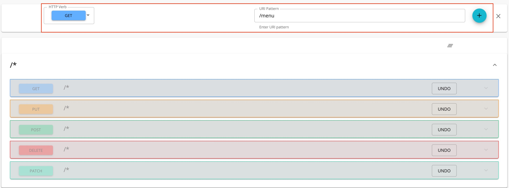

# Create a REST API

**API creation** is the process of linking an existing backend API implementation to the [API Publisher](/GettingStarted/overview/#api-publisher) , so that you can manage and monitor the [API's lifecycle](/Learn/DesignAPI/LifecycleManagement/api-lifecycle/) , documentation, security, community, and subscriptions. Alternatively, you can provide the API implementation in-line in the [API Publisher](/GettingStarted/overview/#api-publisher) itself.

Follow the instructions below to create a REST API.
## Create an API using basic flow
1. Sign in to the WSO2 API Publisher providing username and password `https://<hostname>:9443/publisher` (e.g., `https://localhost:9443/publisher` ).
    <html>

      
Note

      
CREATE button will only appear for user who has creator role permission.

      

    </html>

2.  Go to **CREATE API** and Click **Design a New REST API**.

    

3.  Enter the information provided in the table below and click **CREATE** or **CREATE & PUBLISH** to create the API.

     <table><colgroup> <col/> <col/> <col/> </colgroup><tbody><tr><th colspan="2" >Field</th><th >Sample value</th></tr><tr><td colspan="2" class="confluenceTd">Name</td><td class="confluenceTd">PizzaShack</td></tr><tr><td colspan="2" class="confluenceTd">Version</td><td colspan="1" class="confluenceTd">1.0.0</td></tr><tr><td colspan="2" class="confluenceTd">Context</td><td class="confluenceTd">

<code>/pizzashack</code>

The API context is used by the Gateway to identify the API. Therefore, the API context must be unique. This context is the API's root context when invoking the API through the Gateway.

You can define the API's version as a parameter of its context by adding the <code>{version}</code> into the context. For example, <code>{version}/pizzashack</code>. The API Manager assigns the actual version of the API to the <code>{version}</code> parameter internally. For example, <code>https://localhost:8243/1.0.0/pizzashack</code>. Note that the version appears before the context, allowing you to group your APIs based on the versions.

</td></tr><tr><td colspan="2" class="confluenceTd">Endpoint</td><td colspan="1" class="confluenceTd">
<a class="external-link" href="http://ws.cdyne.com/phoneverify/phoneverify.asmx" rel="nofollow">https://localhost:9443/am/sample/pizzashack/v1/api/</a>

The endpoint that you add is automatically added as the production and sandbox endpoints.
</td></tr></tbody></table>
        
     <html>
     

     
Note

     
The **CREATE & PUBLISH** option will appear only if the optional fields **Endpoint** and **Business plan(s)** are provided by a user who has publisher permission.

     

     </html>
     
      

4.  When click **CREATE** or **CREATE & PUBLISH**, page will be redirected to the overview page of the newly created API. 

## Design Configuration
  1. Navigate to **Design Configurations** page.

     <html>

      
Note

      
By default **Publisher Access Control** allowed for **All** users who has creator permission (see more <a href='../../AdvancedTopics/enable-publisher-access-control-in-api-publisher-portal'>Publisher Access Control</a> ) and **Developer Portal Visibility** available in **Public** (see more <a href='../../AdvancedTopics/control-api-visibility-and-subscription-availability-in-developer-portal/'> 
      Developer Portal visibility </a>
      )

      

      

    </html>

   2. Add tag as **pizza**.
        <html>

        
Info

        
Tags can be used to filter out APIs matching certain search criteria. It is recommended that you add tags that explain the functionality and purpose of the API as subscribers can search for APIs based on the tags.

        

        </html>

   **Make this the Default Version** checkbox ensures that the API is available in the Gateway without a version specified in the production and sandbox URLs.  This option allows you to create a new version of an API and set it as the default version. Then, the same resources can be invoked in the client applications without changing the API gateway URL. This allows you to create new versions of an API with changes, while at the same time allowing existing client applications to be invoked without the client having to change the URLs.
    

## Runtime Configuration
  Navigate to **Runtime Configuration** page. 

  Transport Level Security  defines the transport protocol on which the API is exposed.  
   

  <html>

     
Note

     
 Both HTTP and HTTPS transports are selected by default.It is able to limit the API availability to only one transport (e.g., HTTPS), clear the checkbox of the other transport.

     

     </html>

## Resources
1. By default, the api will have five resources with /* URL pattern.
   Click **Show More** option to navigate **Resource** page.
   

2. Modify the resources as follows and click **SAVE** to update the resources.
      1. Click following button to remove all existing resources.
      

      2. Click (+) to add a new resouce.
          
      
      3. Newly added resource is displayed as follows.
         
         

3. Expand the created **GET** operation to add **Summary and Description** and **Operation governance**.
   Also, resource **Parameters** can be added using **Parameters** section.

      

    
    The following parameter types can be defined according to the resource parameters you add.

    | Parameter Type                          | Description                                                                                                                                                                                     |
    |-----------------------------------------|-------------------------------------------------------------------------------------------------------------------------------------------------------------------------------------------------|
    | `query`| Contains the fields added as part of the invocation URL that holds the data to be used to call the backend service.                                                                             |
    | `header`| Contains the case-sensitive names followed by a colon (:) and then by its value that carries additional information with the request which defines the operating parameters of the transaction. |
    | `cookie` | Operations can also pass parameters in the Cookie header, as Cookie: name=value. Multiple cookie parameters are sent in the same header, separated by a semicolon and space.                                                                                            |
    | `body`| An arbitrary amount of data of any type sent with a POST message                                                                                                                                |

## API Definition
   Navigate to **API Definition** page, then it will display the swagger definition of the PizzaShack API.
   

Now, a REST API has been created and configured successfully. Refer [Publish API](../../../../Learn/DesignAPI/PublishAPI/publish-an-api/) 
for get to know about the details of publishing API.

!!! More
        Click the following topics for a description of the concepts that you need to know when creating an API:
       -   [API visibility](../../AdvancedTopics/control-api-visibility-and-subscription-availability-in-developer-portal/)
       -   [Endpoints](../../../../Learn/DesignAPI/Endpoints/endpoint-types/)
       -   [Throttling tiers](../../../../Learn/RateLimiting/introducing-throttling-use-cases/)
       -   [Custom Properties](../../../../Learn/DesignAPI/AdvancedTopics/adding-custom-properties-to-apis/)
       -   [API Security](../../../../Learn/APISecurity/Authentication/securing-apis-using-oauth2-access-tokens/)
       -   [Life Cycle Management](../../../../Learn/DesignAPI/LifecycleManagement/api-lifecycle/)
       -   [API Documentation](../../../../Learn/DesignAPI/APIVersioning/create-a-new-api-version/)
       -   [API Monetization](../../../../Learn/APIMonetization/monetizing-an-api/)

