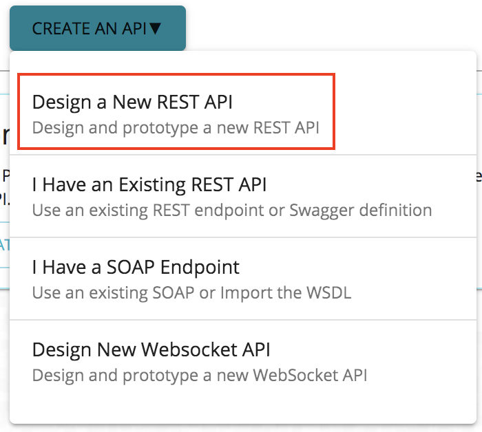
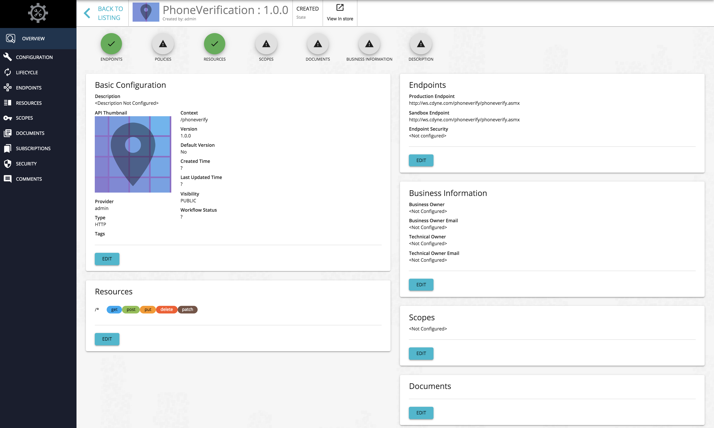

# Create and Publish an API

**API creation** is the process of linking an existing backend API implementation to the [API Publisher](https://docs.wso2.com/display/AM300/Key+Concepts#KeyConcepts-APIPublisher) so that you can manage and monitor the [API's lifecycle](https://docs.wso2.com/display/AM300/Key+Concepts#KeyConcepts-APILifecycle) , documentation, security, community, and subscriptions. Alternatively, you can provide the API implementation in-line in the [API Publisher](https://docs.wso2.com/display/AM300/Key+Concepts#KeyConcepts-APIPublisher) itself.

!!! note
        Click the following topics for a description of the concepts that you need to know when creating an API:
       -   [API visibility](https://docs.wso2.com/display/AM300/Key+Concepts#KeyConcepts-APIvisibility)
       -   [Resources](https://docs.wso2.com/display/AM300/Key+Concepts#KeyConcepts-APIresources)
       -   [Endpoints](https://docs.wso2.com/display/AM300/Key+Concepts#KeyConcepts-Endpoints)
       -   [Throttling tiers](https://docs.wso2.com/display/AM300/Key+Concepts#KeyConcepts-Throttlingtiers)
       -   [Sequences](https://docs.wso2.com/display/AM300/Key+Concepts#KeyConcepts-Sequences)
       -   [Response caching](https://docs.wso2.com/display/AM300/Configuring+Caching#ConfiguringCaching-Responsecache)

1.  Sign in to the WSO2 API Publisher.
    `          https://<hostname>:9443/publisher-new         ` (e.g., `                     https://localhost:9443/publisher-new                   ` ). Use **admin** as the username and password.
    `                                        `
2.  Click **CREATE AN API** .

    
3.  Click **Design a New REST API** .
    

4.  Enter the information provided in the table below and click **Create** to create the API.

  <table><colgroup> <col/> <col/> <col/> </colgroup><tbody><tr><th colspan="2" >Field</th><th >Sample value</th></tr><tr><td colspan="2" class="confluenceTd">Name</td><td class="confluenceTd">PhoneVerification</td></tr><tr><td colspan="2" class="confluenceTd">Version</td><td colspan="1" class="confluenceTd">1.0.0</td></tr><tr><td colspan="2" class="confluenceTd">Context</td><td class="confluenceTd">

<code>/phoneverify</code>

 

The API context is used by the Gateway to identify the API. Therefore, the API context must be unique. This context is the API's root context when invoking the API through the Gateway.

You can define the API's version as a parameter of its context by adding the <code>{version}</code> into the context. For example, <code>{version}/phoneverify</code>. The API Manager assigns the actual version of the API to the <code>{version}</code> parameter internally. For example, <code>https://localhost:8243/1.0.0/phoneverify</code>. Note that the version appears before the context, allowing you to group your APIs based on the versions.

</td></tr><tr><td colspan="2" class="confluenceTd">Endpoint</td><td colspan="1" class="confluenceTd">
This sample service has two operations as <code>CheckPhoneNumber</code> and <code>CheckPhoneNumbers</code>. Let's use <code>CheckPhoneNumber</code> here. <a class="external-link" href="http://ws.cdyne.com/phoneverify/phoneverify.asmx" rel="nofollow">http://ws.cdyne.com/phoneverify/phoneverify.asmx</a>

This is the actual endpoint where the API implementation can be found. The endpoint that you add is automatically added as the production and sandbox endpoints.
</td></tr></tbody></table>

!!! note
        It is mandatory to add the endpoint for this milestone. However, in the future this will be an optional feild.

The created API appears in the publisher as follows:

!!! note
        In this milestone release you will not be able to click EDIT to add the advanced configurations related to an API. However, if you add an API via the old Publisher interface ( <https://localhost:9443/publisher> ), you will be able to view all its details via the new Publisher interface ( <https://localhost:9443/publisher-new> ).

