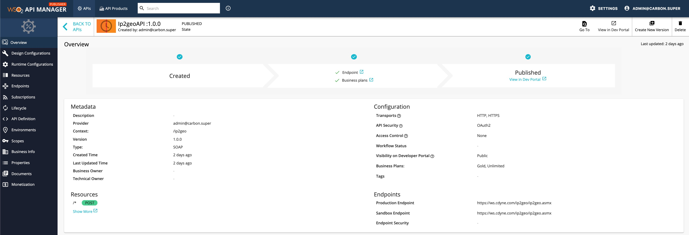

# Expose a SOAP service as a REST API

WSO2 API Manager supports the management of an existing SOAP and WSDL based services exposing as REST APIs.
The organizations who have SOAP/ WSDL based services, can easily bridge their existing services to REST without the cost of a major migration. WSO2 API Manager supports two kinds of services as one for performing a  "pass through" of the SOAP message to the backend and other one is generating [a RESTful api from the backend SOAP service](../../../../Learn/DesignAPI/CreateAPI/generate-rest-api-from-soap-backend/).

Follow the instructions below to create a SOAP service as a RESTful API using **Pass Through**

1.  Sign in to the API Publisher and click **CREATE API**.
      <html>
     
     </html>

2.  Select **Pass Through** option and thereafter, select one of the following options:

     * WSDL URL - If you select this option, you need to provide an endpoint URL.

     * WSDL Archive/File - If you select this option, click Browse and upload either an individual WSDL file or a WSDL archive, which is a WSDL project that has multiple WSDLs.

     <html>

     
Note

     
When uploading a WSDL archive, all the dependent wsdls/xsds that are referred in the parent WSDL file should reside inside the WSDL archive itself. If not, the validation will fail at the point of API creation.

     

     </html>

     This example uses the WSDL `http://ws.cdyne.com/phoneverify/phoneverify.asmx?wsdl` from CDYNE as the endpoint here, but you can use any SOAP backend of your choice.
        

3.  Click **NEXT** button to proceed to the next phase and Provide the information in the table below and click **CREATE** button.

    | Field   | Sample value       |
    |---------|--------------------|
    | Name    | PhoneVerification  |
    | Context | /phoneverify       |
    | Version | 1.0                |
    | Endpoint| http://ws.cdyne.com/phoneverify/phoneverify.asmx|
    | Business Plans| Unlimited|

    

4.  The created API appears in the publisher as follows.
    
  
    <html>

Note

            

            If you wish to add scopes to the resources that were created, navigate to ***Resources*** and expand the resources. Thereafter, creating new scopes and specify them under operation scope. If you specify a scope, you need to use the same scope when generating access tokens for the subscribed application to invoke the API. For more information on working with the scopes, see
    [OAuthscopes](../../../../Learn/APISecurity/Authentication/securing-apis-using-oauth2-access-tokens/)
            

        
</html>   

    
     <html>

     
Note

     
 Note that when creating this API, the default option of **Rate limiting level** , was selected to **API Level**. For more information on setting advanced throttling policies,
     see [Enforce Throttling and Resource Access Policies](../../../../Learn/RateLimiting/setting-throttling-limits/).

     

     </html>

5. Now, the SOAP service as a RESTful API created and configured successfully. Refer [Publish API](../../../../Learn/DesignAPI/PublishAPI/publish-an-api/) to know details of publishing API.

Refer a tutorial on [Create and Publish a SOAP service as a RESTful API](../../../../Learn/Tutorials/expose-a-soap-service-as-a-rest-api/) to learn more.