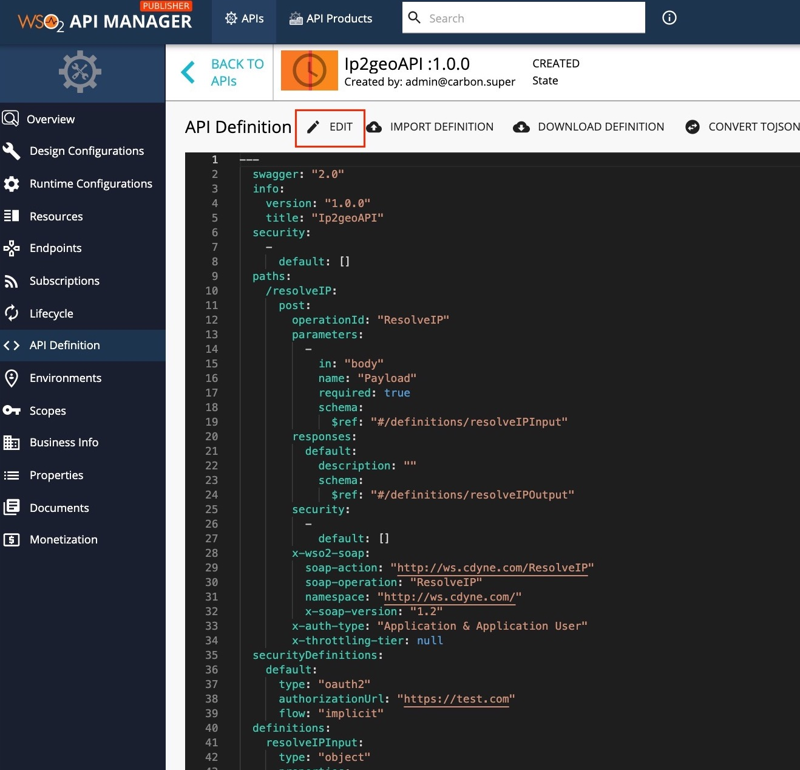
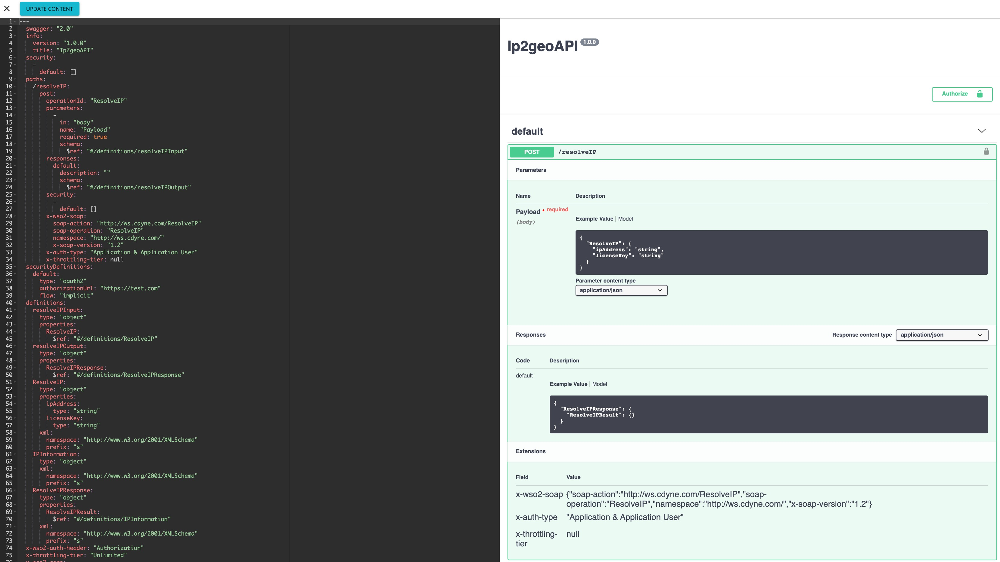
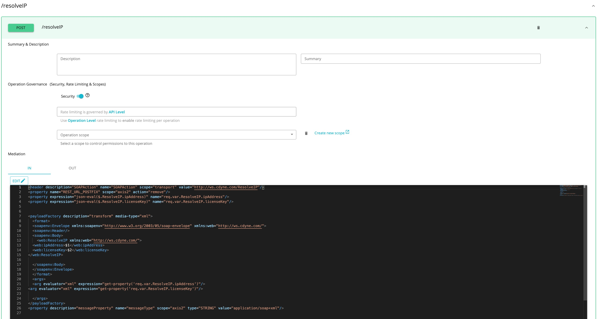

# Generate REST API from SOAP Backend

This feature allows users to expose their legacy SOAP backends as REST APIs through WSO2 API Manager. 
WSO2 API Manager supports WSDL 1.1 based SOAP backends.

Follow the instructions below to generate REST APIs in WSO2 API Manager for an existing SOAP backend.

   <html><div class="admonition note">
      <p class="admonition-title">Note</p>
      <ul>Before you begin... </ul>
      <ul>Make sure that you have a valid WSDL URL from the SOAP backend. It should belong to the WSDL 1.1 version.</ul>
      </div>
    </html>

1.  Sign in to the API Publisher and click **CREATE API**
   <html>
     
     </html>
 
    <html><div class="admonition info">
      <p class="admonition-title">Info</p>
      <ul>There are two options to create APIs for SOAP backend
      <li>**Pass Through** – Create a pass through proxy for SOAP requests coming to the API Gateway</li>
      <li>**Generate REST APIs** – This option is used to generate REST API definitions from the given WSDL URL</li>
      </ul>
      </div>
    </html>

2. Select **Generate REST APIs** and provide the WSDL URL for the SOAP backend. After, click **NEXT** button to proceed to the next phase.
    This example uses the WSDL `https://ws.cdyne.com/ip2geo/ip2geo.asmx?wsdl` from CDYNE as the endpoint here, but you can use any SOAP backend of your choice.
      

3.  Provide the information in the table below and click **CREATE** button.

    | Field   | Sample value       |
    |---------|--------------------|
    | Name    | Ip2geoAPI  |
    | Context | /ip2geo      |
    | Version | 1.0.0        |
    | Endpoint| https://ws.cdyne.com/ip2geo/ip2geo.asmx|
    | Business Plans| Unlimited|

    [](../../../assets/img/Learn/create-form-for-soap-api.jpg)

4.  Navigate to the **API Definition** tab and click on **Edit** to view the open API Definition of the API.
     [](../../../assets/img/Learn/api-definition-of-generated-restapi-soap-backend.jpg)
    
6.  The generated API definitions are added to the API as shown below.
     [](../../../assets/img/Learn/edit-view-generated-rest-api-from-soap-backend.jpg)

    !!! note 
         The definition properties are mapped with a Swagger vendor-specific field `x-xpath` , which is used to map the SOAP binding operation parameters with the REST parameters. If a parameter does not have this field it is not mapped with a backend operation. To ensure the mapping functions smoothly, do not make any changes to the properties.


7.  Click on a resource to view the In and Out sequences of the API.
    [](../../../assets/img/Learn/in-sequence-generated-rest-api-from-soap.jpg)

8.  The following sample shows the generated API In-sequence for a POST method.

    ``` java
            <header description="SOAPAction" name="SOAPAction" scope="transport" value="http://ws.cdyne.com/ResolveIP"/>
            <property name="REST_URL_POSTFIX" scope="axis2" action="remove"/>
            <property expression="json-eval($.ResolveIP.ipAddress)" name="req.var.ResolveIP.ipAddress"/>
            <property expression="json-eval($.ResolveIP.licenseKey)" name="req.var.ResolveIP.licenseKey"/>
            <payloadFactory description="transform" media-type="xml">
            <format>
               <soapenv:Envelope xmlns:soapenv="http://www.w3.org/2003/05/soap-envelope" xmlns:web="http://ws.cdyne.com/">
               <soapenv:Header/>
               <soapenv:Body>
                  <web:ResolveIP xmlns:web="http://ws.cdyne.com/">
               <web:ipAddress>$1</web:ipAddress>
               <web:licenseKey>$2</web:licenseKey>
               </web:ResolveIP>

               </soapenv:Body>
               </soapenv:Envelope>
            </format>
            <args>


               <arg evaluator="xml" expression="get-property('req.var.ResolveIP.ipAddress')"/>
            <arg evaluator="xml" expression="get-property('req.var.ResolveIP.licenseKey')"/>
            </args>
            </payloadFactory>
            <property description="messageProperty" name="messageType" scope="axis2" type="STRING" value="application/soap+xml"/>

    ```

    The incoming JSON message parameters are stored using properties. The SOAP payload needed for the backend is generated using a payload factory mediator.

