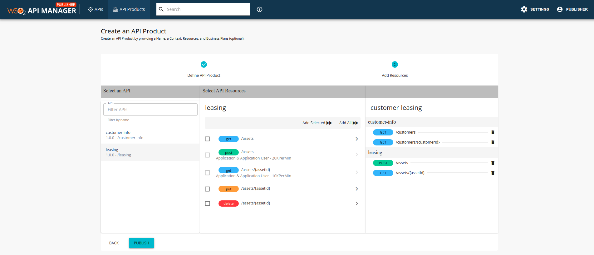

# Create an API Product

Let's create an API Product named customer leasing that includes resources from the Customer Info API & Leasing API, as discussed in the [previous example](../../../../Learn/DesignAPI/CreateAPIProduct/api-product-overview/#how-it-works).

1. Sign in to the Publisher Portal.

     `https://<hostname>:9443/publisher` 

     (e.g., `https://localhost:9443/publisher`). 

2. Create the following two APIs by importing 
the attached OpenAPI definition (a.k.a Swagger definition) files.
     - Customer Info API - [customer-info-api.yaml](../../../assets/attachments/Learn/DesignAPI/CreateAPIProduct/customer-info-api.yaml) 

     - Leasing API - [leasing-api.yaml](../../../assets/attachments/Learn/DesignAPI/CreateAPIProduct/leasing-api.yaml)

     <html>
     

     
Note

     <ul>
     <li>
Ensure that you provide an endpoint for each API after it is imported. The API Product will reuse the endpoint specified at the API-level.
</li>
     
     <li>It is not necessary to publish an API in order to use it to create an API Product.
     </li></ul>
     
 
     </html>
        
     After the APIs are created, the respective resources for each of the APIs will appear as follows:

     - Customer info API
         
         
      
     - Leasing API
         
         

     <html>
     

     
Note

     
     <ul>
      <li>
Only users with <b>publisher</b> permission are allowed to create an API Product.
     
</li>

     <li>

     If you have not already signed in to the Publisher Portal as a user who has <b>publisher</b> permissions (e.g., <code>admin</code>), you need to sign out and sign in with this permission in order to be able to carry out the following instructions. 
</li>
     
    </ul>
     
 
     </html>

3. Click **API Products**, and then click **CREATE AN API PRODUCT**.

    

    The **Create an API Product** page appears.
    
4. Enter the API Product details.
    
     <html>
     <table>
     <tr>
     <td>
     Name
     </td>
     <td>
     customer-leasing
     </td>
     </tr>
     <tr>
     <td>
     Context
     </td>
     <td>
     customer-leasing
     </td>
     </tr>
     <tr>
     <td>
     Business plan(s)
     </td>
     <td>
     Bronze
     </td>
     </tr>
     </table>
     </html>

     
    
5.  Click **NEXT**.

     The Add Resources page appears. 

     
    
     - The leftmost pane shows the available list of APIs. 
     - The central pane lists the available resources of a given API, which is selected in the left pane. 
     - You can select a resource in the central pane and add it to the right pane, which shows the resources that will be added to the API Product.

6. Add resources from the `customer-info` API.

     1. Click the `customer-info` API in the left pane.
     2. Select the `GET /customers` and `GET /customers/{customerId}` resources in the central pane.
     3. Click **Add Selected** to add them to the right pane so that it can be used for the API Product.

     

7. Add resources from the `leasing` API.
     1. Click the `leasing` API in the left pane.
     2. Select the `GET /assets/{assetId}` and `POST /assets` resources in the central pane.
     3. Click **Add Selected** to add them to the right pane so that it can be used for the API Product.

     
    
8. Click **PUBLISH** to create and publish the API Product. 

     The API Product will appear in the 
Publisher Portal, as shown below.

     

     The API Product will also appear in the Developer Portal, as shown below. 

     

9. Sign in to the Developer Portal to subscribe
and consume the API Product in the same way that you would do so for an API. 
     
     For more information on how to subscribe to an API, see [Subscribe to an API](../../../../Learn/ConsumeAPI/ManageSubscription/subscribe-to-an-api/).

     `https://<hostname>:9443/devportal` 

     (e.g., `https://localhost:9443/devportal`). 
    
     
