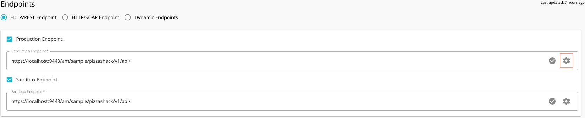
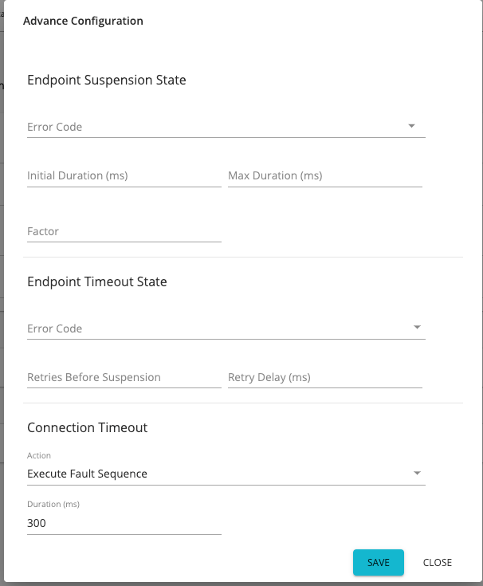

# Endpoint Timeouts

WSO2 API Manager provides controlling the production and sandbox endpoints with the Advanced Endpoint Configuration.

To configure your endpoints with this feature, click on an API in the API Publisher listing page, navigate to the
 **Endpoints** tab and click the cogwheel icon next to the endpoint you want to configure.
 


The Advanced Endpoint Configuration dialog box appears as below.


Following are the configurations that we can do with the Advanced Endpoint Configurations. You can do advanced configurations for both production and sandbox endpoints.
<table>
    <tbody>
        <tr class="odd">
            <td>Endpoint Suspend State</td>
            <td>
                <div class="content-wrapper">
                    <p>If you want to configure the suspension of an endpoint specifying error codes, maximum suspension time, suspension factors etc., you can use the endpoint suspension state in the Advanced Endpoint Configuration.</p>
                    <p><strong>Error Codes:</strong> Error codes which need to make the endpoint suspended. If the
                     selected error codes are received from the backend endpoint, the endpoint will be marked as
                      suspended. Specify the [transport error codes](../../../../Troubleshooting/error-handling.md) where the endpoint suspension should be
                      triggered. You can select single or multiple error codes here.</p>
                    <p><strong>Initial duration:</strong> The time duration for which the endpoint will be suspended, when one or more suspend error codes are received from the endpoint for the first time.</p>
                        <div class="admonition note">
                              <p class="admonition-title">Note</p>
                              <p>When creating (or updating) Failover endpoints through the Publisher UI, you need to go into this configuration box of each endpoint and specify a set of Error Codes for the endpoint to fail over on and take off the Initial Duration by setting its value to -1.</p>
                        </div> 
                    <p><strong>Max duration:</strong> The maximum time duration for which the endpoint will be suspended</p>
                    <p><strong>Factor:</strong> The duration to suspend can vary from the first time suspension to the subsequent time. The factor value decides the suspense duration variance between subsequent suspensions.</p>
                </div>
            </td>
        </tr>
        <tr class="even">
            <td>Endpoint Timeout state</td>
            <td><p>Configurations of retry, error codes and delays in terms of endpoint timeout can be configured with the endpoint timeout state in the Advanced Endpoint Configuration.</p>
            <p><strong>Error Codes:</strong> A list of error codes. If these error codes are received from the endpoint, the request will be subjected to a timeout.</p>
            <p><strong>Retries Before Suspension:</strong> The number of re-tries performed by the gateway before
             the endpoint timeout when any  of the selected error codes are received</p>
            <p><strong>Retry Delay:</strong> The delay between retries in milliseconds.</p></td>
        </tr>
        <tr class="odd">
            <td>Connection Timeout</td>
            <td>
                <div class="content-wrapper">
                    <p>Duration and the response actions after a connection timeout can be configured here in the Advanced Endpoint Configuration.</p>
                    <p><strong>Action:</strong> Response action to be performed after connection timeout.
                    You can select from 
                        <ul>
                            <li><strong>Discard Message</strong></li>
                            <li><strong>Execute Fault Sequence</strong></li>
                        </ul>
                    The default value is <strong>Execute Fault Sequence</strong> .
                    </p>
                    <p><strong>Duration:</strong> The time duration of connection timeout in milliseconds.</p>
                    <div class="admonition note">
                        <p class="admonition-title">Note</p>
                        <p>if you want to change the endpoint connection timeout duration globally affecting all APIs, do the following.</p>
                        <ol>
                            <li>
                                <p>Open the <code>&lt;APIM_HOME&gt;/repository/conf/deployment.toml</code> file
                                 and add/ change the value of the timeout as given below.</p>
                                <code class="toml plain">
                                ```toml
                                    [synapse_properties]
                                    'synapse.global_timeout_interval'=3000
                                ```
                                </code>
                            </li>
                            <li>
                                <p>Open the <code>&lt;APIM_HOME&gt;/repository/conf/deployment.toml</code> file
                                 and add/ change the socket timeout value.</p>
                                <code>
                                ```toml
                                    [passthru_http]
                                    'http.socket.timeout'=3000
                                ```
                                </code>
                            </li>
                        </ol>
                        <p>Note that the <strong>socket timeout value</strong> should be greater than both the synapse global timeout and any endpoint timeouts given for your API.</p>
                    </div>
                </div>
            </td>
        </tr>
    </tbody>
</table>

For more information about endpoints and how to add, edit or delete them, see the [WSO2 ESB documentation](https://docs.wso2.com/display/EI611/Working+with+Endpoints) .
