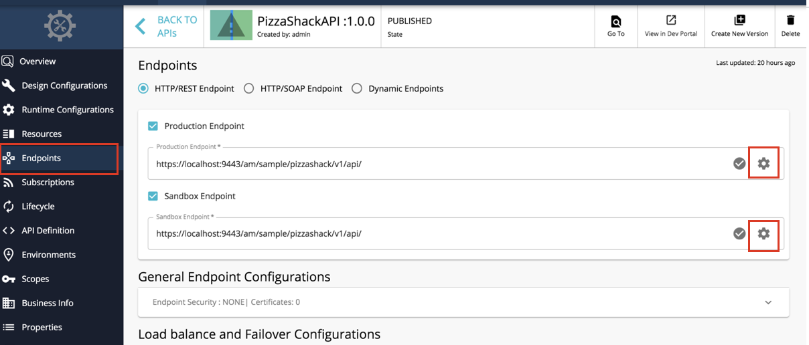
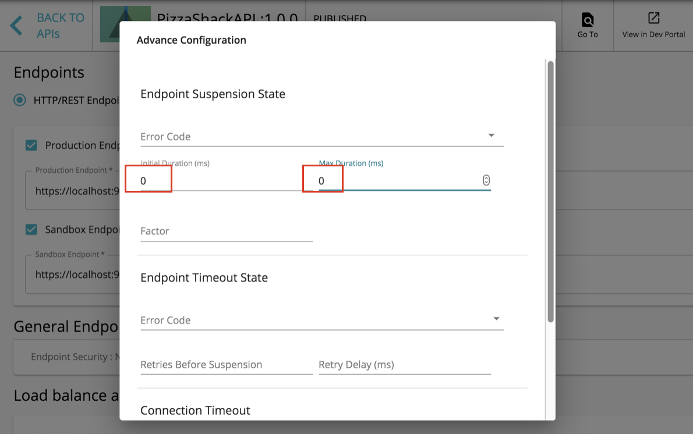

# Prevent API Suspension

WSO2 API Manager suspends your API if the endpoint of your API cannot be reached. The default suspension time is 30 seconds. Any request to your API will not be able to reach your endpoint for 30 seconds and will return an error message, as shown below.

``` java
    <am:fault xmlns:am="http://wso2.org/apimanager">
    <am:code>303001</am:code>
    <am:type>Status report</am:type>
    <am:message>Runtime Error</am:message>
    <am:description>Currently , Address endpoint : [ Name : somename-AT-sometenant--test_me_APIproductionEndpoint_0 ] [ State : SUSPENDED ]</am:description>
    </am:fault>
```

To prevent or turn off API suspension, do the following:

1.  Log in to API Publisher ( `https://<HostName>:9443/publisher` ). Select your API and click **Endpoints** tab.
2.  In the **Endpoints** tab, click the cogwheel icon next to the endpoint you want to re-configure.
3.  In the dialogue box that appears, set the values for **Initial Duration** and **Max Duration** to zero to turn off suspension.
    4.  Click **Save** and re-publish the API.

For more details on creating and publishing an API, see [Create](../../../../Learn/DesignAPI/CreateAPI/create-a-rest-api.md) and [Publish an API](../../../../Learn/DesignAPI/PublishAPI/publish-an-api.md).

!!! info
    To avoid backend endpoint suspension,
    Navigate to the `<API-M_HOME>/repository/deployment/server/synapse-configs/default/api` folder. Open the configuration file of the API that has to be prevented from being suspended. (e.g. `admin--testApi_v1.0.0.xml` ) Add the following configurations.

    ``` java
         <endpoint name="admin--testApi_APIproductionEndpoint_0">
            <address uri="http://localhost:9000/services/SimpleStockQuoteService">
                <timeout>
                    <duration>30000</duration>
                    <responseAction>fault</responseAction>
                </timeout>
                <suspendOnFailure>
                    <errorCodes>-1</errorCodes>
                    <initialDuration>0</initialDuration>
                    <progressionFactor>1.0</progressionFactor>
                    <maximumDuration>0</maximumDuration>
                </suspendOnFailure>
                <markForSuspension>
                    <errorCodes>-1</errorCodes>
                </markForSuspension>
            </address>
         </endpoint>
    ```


For more details on configuring different timeouts, see [Timeout configurations for an API call](../../../../Administer/ProductAdministration/PerfromanceTuningAndTestResults/tuning-performance.md) in the Performance Tuning guide.
