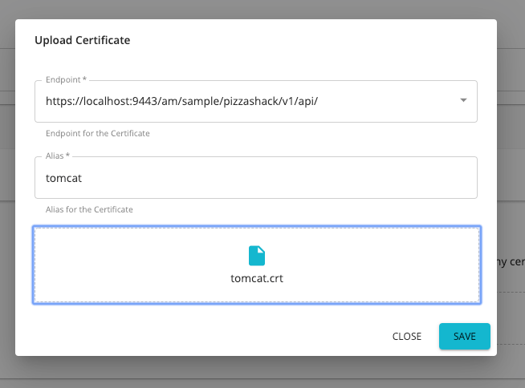
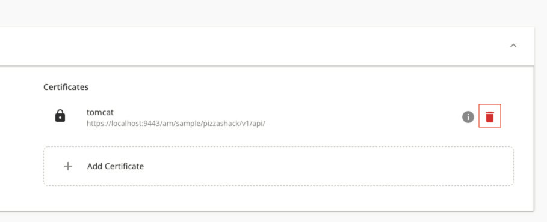

# Managing Endpoint Certificates

If your api backend is secured with a self-signed certificate (or a certificate which is not signed by a CA) you need to
 import the backend certificate to the api manager (gateway) client-truststore and restart the server. This feature
  enables you to upload the backend certificate through API Publisher while creating or editing your API **without
   restarting the server**. Follow the steps below to add a certificate to an endpoint. 
    
   <html>
        <div class="admonition note">
            <p class="admonition-title">Note</p>
            <p>Note that this feature supports only <b>HTTP/REST</b> and <b>HTTP/SOAP</b> endpoints.
            </p>
        </div> 
   </html>

### Configuration (Optional)

1.  The configurations for the Endpoint Certificates can be modified by adding following config elements to the 
 `<API-M_HOME>/repository/conf/deployment.toml` file as shown below. 
    ``` toml
        [transport.passthru_https.sender.ssl_profile]
        file_path = "repository/resources/security/sslprofiles.xml"
        interval = 600000
    ```
    
    | Configuration Parameter        | Description|
    |-------------|---------------------------------------------------|
    | file_path   | The sslprofiles.xml file path. ***DO NOT MODIFY***|
    | interval    | The time taken to load the newly added certificate|
      

      <html>
          <div class="admonition note">
              <p class="admonition-title">Note</p>
              <p>
                 The default time to apply the certificate is 10 minutes. You can
                 configure this by changing  the  `interval` parameter.
              </p>
              <p>
                The time is given in <b>milliseconds</b>.
              </p>
          </div> 
      </html>

2.  If you use a different Trust Store/ Keystore configuration for `[transport.passthru_https.sender]` in `deployment.toml` file, modify the KeyStore and TrustStore location in
`<API-M_HOME>/repository/resources/security/sslprofiles.xml` file accordingly.  The `sslprofiles.xml` file is configured with the default client-truststore.jks
    
    <html>
      <div class="admonition note">
          <p class="admonition-title">Note</p>
          <p>
            This feature currently supports only the following keystore and certificate types.
          </p>
          <ul>
            <li>Keystore : `.jks`</li>
            <li>Certificate : `.crt`</li>
          </ul>
          <p>
            If you need to use a certificate in any other format, you can convert it to `.crt/ .cert` using a standard
             tool before uploading.
          </p>
      </div> 
    </html>

    <html>
      <div class="admonition info">
          <p class="admonition-title">Info</p>
          <p>
            The certificate will be added to the Gateway nodes which are defined under the
             `[[apim.gateway.environment]]` in `deployment.toml` . 
             In a clustered setup, since gateway configurations are identical, sync the
             `[API-M_HOME]/repository/resources/security/sslprofiles.xml` and `[API-M_HOME]/repository/resources
             /security/client-truststore.jks` among the gateway nodes in the cluster. After the configured interval, the
              synapse transport will be reloaded in all the gateway nodes.
          </p>
      </div> 
    </html>

### Adding a Certificate for an Endpoint

1.  Log in to the API Publisher. [Create a new API](../CreateAPI/create-a-rest-api.md) or edit an existing API.
2.  Go to the **Endpoints** tab and expand **General Endpoint Configuration**. 
    
3.  In the Certificates section, click on **\+ Add Certificates** button.
   
   
    The Upload Certificate dialog box will be open.
    

    *  Enter the following information and click **Save** .
    
    | Name        | Description                                                                              |
    |-------------|------------------------------------------------------------------------------------------|
    | Alias       | Enter a name for your certificate.                                                       |
    | Endpoint    | Select an endpoint from the dropdown list                                                |
    | Certificate | Drop the certificate file or click on the drop zone to select the certificate through the UI |

    

4.  The uploaded certificate will be displayed.
    
5.  You can repeat from step 3 to add certificates to the other endpoints.

### Check Certificate Information

You can check the information of the certificate, i.e: Status and subject DN.

Click on the 'Info Icon' in the certificate listing adjacent to the required certificate.


The details of the selected certificated will be displayed.


### Deleting a certificate

To delete a certificate, click the Delete button adjacent to the certificate, as shown below.



