# Create a Mock API with an Inline Script

## Introduction
In this tutorial, we will be creating a prototyped API with an inline script, deploy it as a prototype, and
 invoke it using the API Console integrated in the API Developer Portal.
Typically, you create APIs with inline scripts for testing purposes. An API prototype is created for the purpose of early promotion and testing. You can deploy a new API or a new version of an existing API as a prototype. It gives subscribers an early implementation of the API that they can try out without a subscription or monetization, and provide feedback to improve. After a period of time, publishers can make changes that the users request and publish the API.

## Creating Mock API with Inline Script
1.  Sign in to the API Publisher using `admin` as the username and password.
`https://<hostname>:9443/publisher` (e.g., `https://localhost:9443/publisher` ).

2.  Click ***CREATE API***, and click on the ***Design a new REST API*** menu item. 

    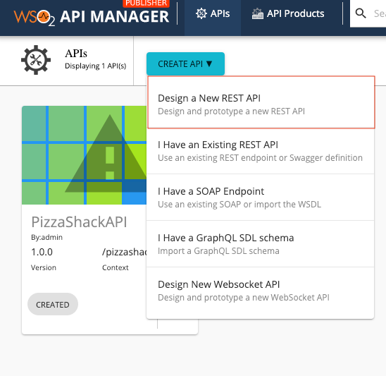
   
3.  Provide the the api name, context and version and click on ***CREATE*** button. (In this example, we have provided
 following values.)

    |||
    |------|-------------|
    |Name|Location_API|
    |Context|/location|
    |Version|1.0.0|

    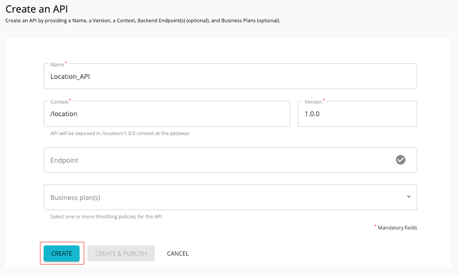
    
    You will be directed to the API Overview page.
    
4. From the left navigation panel, click on the ***Resources*** tab to go to the ***Resources*** page.
   <br/>Select the ***HTTP Verb***, provide the ***URI Pattern*** and click on ***+*** button to add a new resource.
    
    | | |
    |------|-------------|
    |HTTP Verb|GET|
    |URI Pattern|/{town}|
    
    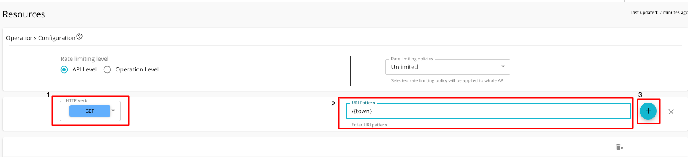
    
    !!! tip
        Once the new Resource is added, delete the default Resources (/\*) by clicking on the Delete Button \[1\] of
         each resource. Or select all the resources at once by clicking on ***Select all for Delete*** \[2\] button.
      
    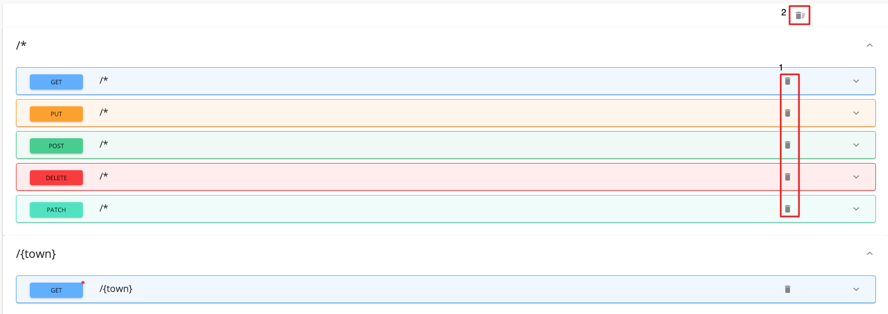
      

5. Expand the newly added resource and note that the path parameter by the name `town` is set properly under Parameters.

    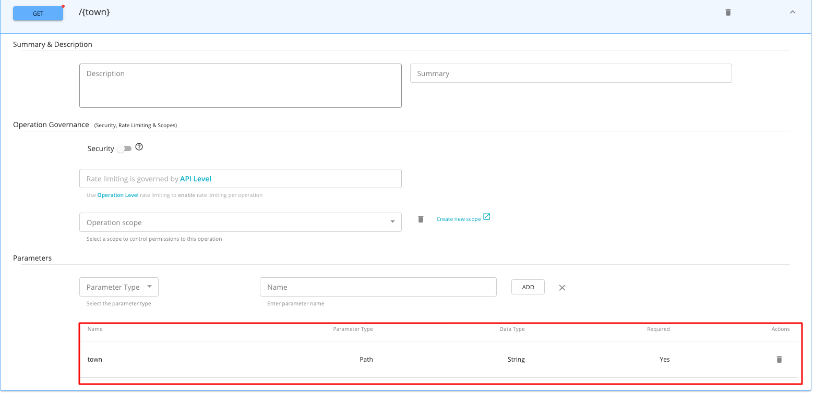

    !!! tip
        To specify multiple parameters in the API resource, separate the parameters with a forward slash in the URI
         Pattern.
    
        ``` js
            {param1}/{param2}
        ```
        
5. Click on ***SAVE*** button to save the API.

6. Goto the ***Endpoints*** page by clicking on the Endpoints tab in the left panel.

7. In the ***Select an Endpoint Type to Add*** page, select ***Prototype Implementation*** in Prototype Endpoint card
 and Click ***ADD***. (This page has been prompted because, there is no endpoint has been added to the api yet.)
 
    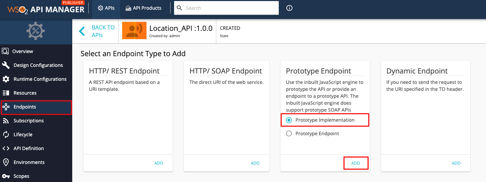

    You will be directed to the endpoints page.
    
    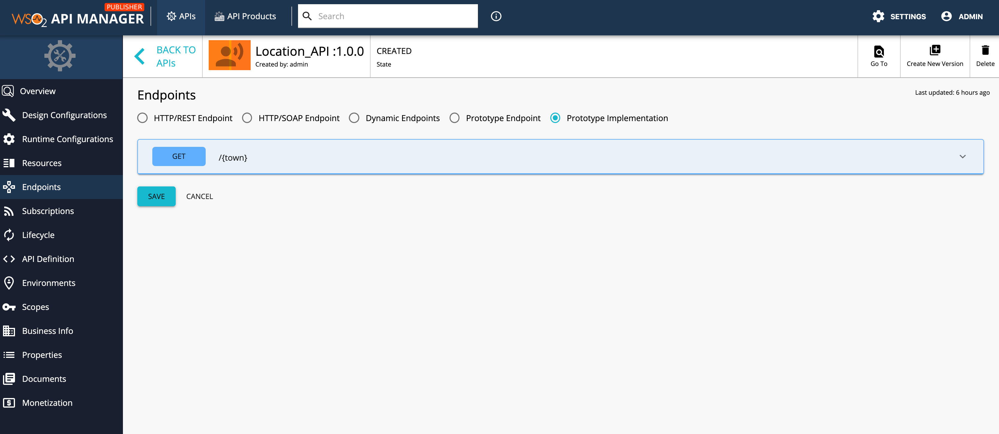

    !!! note
        The inline JavaScript engine does not provide support for SOAP APIs. If you opt for the endpoint implementation method instead of inline, you need to provide an endpoint to a prototype API. For example, <http://ws.cdyne.com/phoneverify/phoneverify.asmx>

6.  Expand the `GET` method and give the following as the script. It reads the payload that the user sends with the API request and returns it as a JSON value. The value **mc** is the message context.

    ``` java
        mc.setProperty('CONTENT_TYPE', 'application/json');
        var town = mc.getProperty('uri.var.town');
        mc.setPayloadJSON('{ "Town" : "'+town+'"}');
    ```

    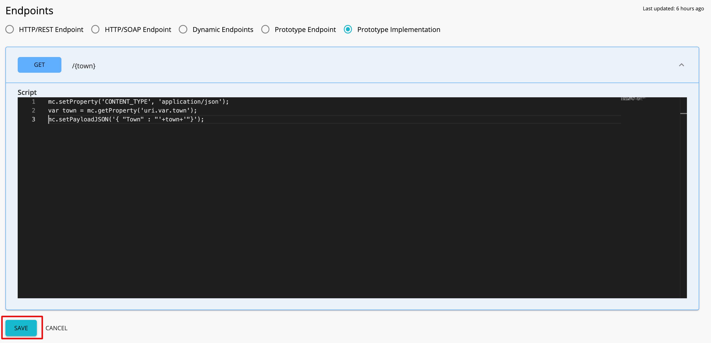
    
    Click on ***SAVE*** button to save the api.

7. To Deploy the api as a prototype, goto ***Lifecycle*** page by clicking on the Lifecycle tab in the left
 navigation panel. Click on ***DEPLOY AS A PROTOTYPE*** button to deploy the api as a prototype
 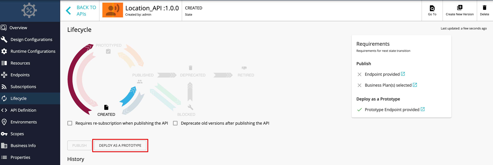 
 
8.  Once the API is deployed, click on the ***View in Dev Portal*** button to goto the API Developer Portal.

    !!! tip
        You can invoke prototyped APIs without signing in to the API Developer Portal or subscribing to the API. The
         purpose of a prototype api is advertising and giving an early implementation for users to test.


9.  The Location API opens in the Developer Portal. Click the **Try Out** tab from the left menu to go to the
 API Console.
    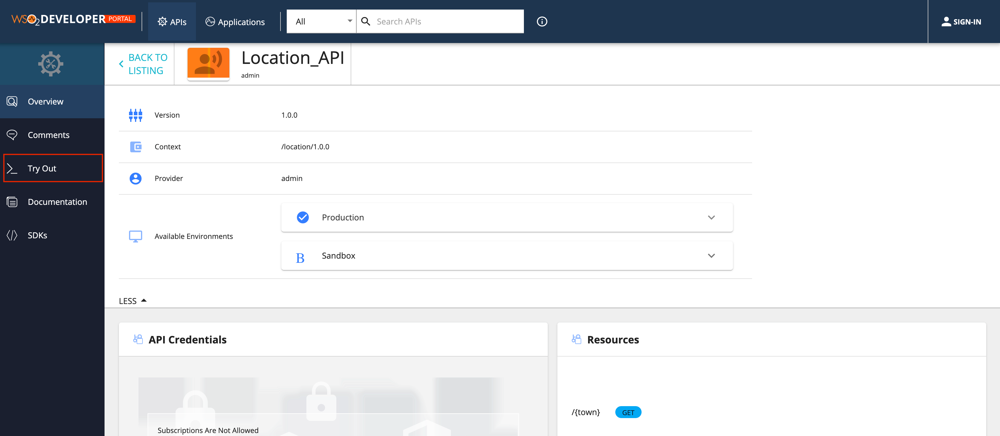 

10. Expand the `GET` method, click **Try it out** . Give any value for the town (e.g. London) and click **Execute** to invoke the API.
    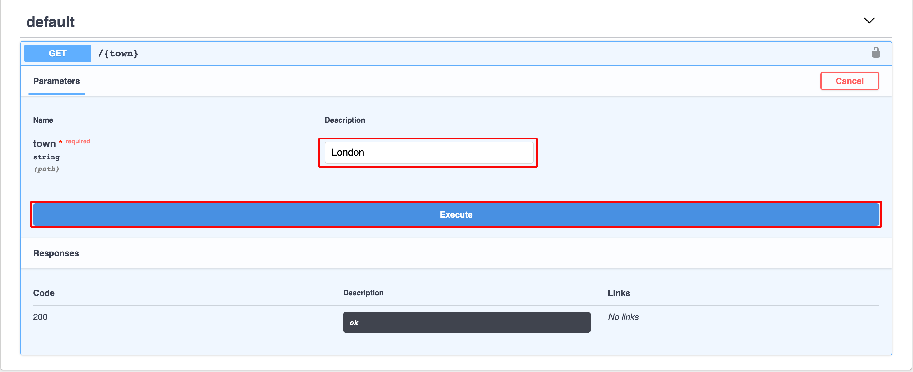 
11. Note the payload you gave as a JSON output in the response.
    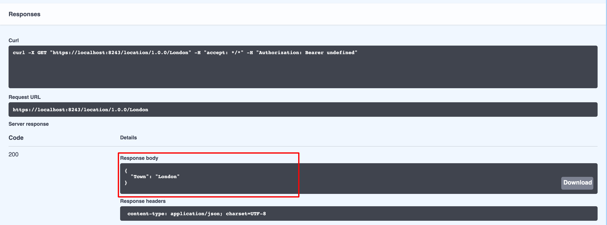

You have successfully created an API with inline script, deployed it as a prototype and invoked it through the
 integrated API Console.

An API can also be prototyped by moving the API to the prototyped state by changing the API lifecycle state and
 providing prototype endpoints. For more information, see the [Deploy and Test Mock APIs](deploy-and-test-mock-apis.md) tutorial.

!!! info
    Related Tutorials
    
    - [Create and Publish an API](../CreateAPI/create-a-rest-api.md)
    
    - [Create a WebSocket API](../CreateAPI/create-a-websocket-api.md)

    - [Create and Publish an API from a Swagger definition](../CreateAPI/create-a-rest-api-from-a-swagger-definition.md)


