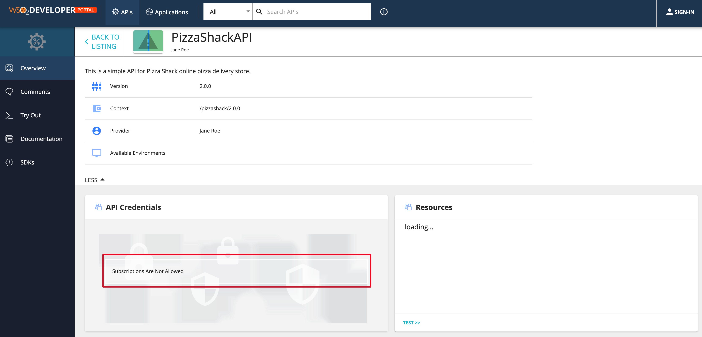

# Deploy and Test Prototype APIs

An **API prototype** is created for the purpose of early promotion and testing. You can deploy a new API or a new version of an existing API as a prototype. It gives subscribers an early implementation of the API that they can try out without a subscription or monetization, and provide feedback to improve. After a period of time, publishers can make changes that the users request and publish the API.

!!! note
    The example here uses the API `PhoneVerification 2.0.0` , which was created in the [ceate new version of an api](../APIVersioning/create-a-new-api-version.md)

1.  Sign in to the WSO2 API Publisher and select the API (e.g., `PhoneVerification 2.0.0` ) that you want to prototype.
`https://<hostname>:9443/publisher         `
    
2. Click on ***Endpoints*** from the left navigation menu and select ***Prototype Endpoint*** radio button to select
 the prototype endpoint type.
 
    and click on ***PROCEED*** in the ***Change Endpoint Type*** dialog box.
    
    
 
2.  Enter the prototype endpoint for the API. In this example the same endpoint is used.

    Once the endpoint is added, click on ***SAVE*** button to save the api.
    
    

3.  Click the **Lifecycle** item from the left navigation panel of the API and click **Deploy as Prototype**.
    

    !!! note
        After creating a new version, you typically deploy it as a prototype for the purpose of testing and early promotion.
   
    
    !!! tip
        -   Leave the **Requires Re-Subscription** check box cleared if you want all users who are subscribed to the older version of the API to be automatically subscribed to the new version. If not, they need to subscribe to the new version again.
        -   You can choose to deprecate old versions of this API at this stage by selecting the **Deprecate Old Versions** check box.

4.  Sign in to the Developer Portal and click on the newly prototyped API `https://<hostname>:9443/devportal`. (Or
 click on the ***View in Dev Portal*** button in the api publisher.)
 
    
    !!! note
        It is not necessary to log in to the Developer Portal to invoke prototyped APIs.

    
    
    The APIs **Overview** page opens. Note that the Subscriptions are not allowed for this api.

    

5.  To invoke the Prototyped API, click the **Try Out** on the left navigation menu.
   
    

6.  In the **API Console** of the prototyped API, expand the GET method, click **Try it out** , and enter the following parameter values.

    |                 |                              |
    |-----------------|------------------------------|
    | **PhoneNumber** | E.g., 18006785432            |
    | **LicenseKey**  | Give 0 for testing purposes. |

    

7.  Click **Execute** to invoke the API.
    Note the response that appears in the console. You do not have to subscribe to the API or pass an authorization key to invoke a prototyped API.
    

8.  Similarly, try to invoke the 1.0.0 version of the API without an access token.
    Note that you get an authentication error as "Missing credentials", because version 1.0.0 is a published API.
    
