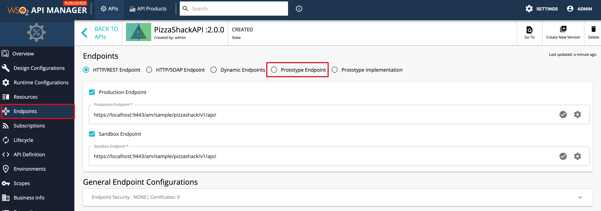
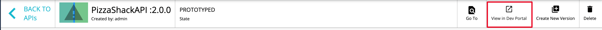

# Deploy and Test Prototype APIs

## Introduction
An **API prototype** is created for the purpose of early promotion and testing. You can deploy a new API or a new version of an existing API as a prototype. It gives subscribers an early implementation of the API that they can try out without a subscription or monetization, and provide feedback to improve. After a period of time, publishers can make changes that the users request and publish the API.

## Deploy a Created API as a Prototype

!!! note
    The example here uses the API `PizzaShackAPI 2.0.0` , which was created by following the instructions in the
    [create new version of an api](../APIVersioning/create-a-new-api-version.md) tutorial.

1.  Sign in to the WSO2 API Publisher `https://<hostname>:9443/publisher` and select the API (e.g., `PizzaShackAPI 2.0.0` ) that you want to prototype.

2. Click on ***Endpoints*** from the left navigation menu and select ***Prototype Endpoint*** radio button to select
 the prototype endpoint type.
 
    and click on ***PROCEED*** in the ***Change Endpoint Type*** dialog box.
    
    
 
2.  Enter the prototype endpoint for the API. In this example the same endpoint is used.

    Once the endpoint is added, click on ***SAVE*** button to save the api.
    
    

3.  Click the **Lifecycle** item from the left navigation panel of the API and click **Deploy as Prototype**.
    

    !!! note
        After creating a new version, you typically deploy it as a prototype for the purpose of testing and early promotion.
   
    
    !!! tip
        -   Leave the **Requires Re-Subscription** check box cleared if you want all users who are subscribed to the older version of the API to be automatically subscribed to the new version. If not, they need to subscribe to the new version again.
        -   You can choose to deprecate old versions of this API at this stage by selecting the **Deprecate Old Versions** check box.

4.  Sign in to the Developer Portal and click on the newly prototyped API `https://<hostname>:9443/devportal`. (Or
 click on the ***View in Dev Portal*** button in the api publisher.)
 
    
    !!! note
        It is not necessary to log in to the Developer Portal to invoke prototyped APIs.

    
    
    The APIs **Overview** page opens. Note that the Subscriptions are not allowed for this api.

    

5.  To invoke the Prototyped API, click the **Try Out** on the left navigation menu.
   
    

6.  In the **API Console** of the prototyped API, expand the `GET /menu` method and click **Try it out**.

    

7.  Click **Execute** to invoke the API.
    
    Note the response that appears in the console. You do not have to subscribe to the API or pass an authorization key to invoke a prototyped API.
    
    

## Publish a Prototyped API.

To publishing a prototyped api with proper production/ sandbox endpoints (after testing and promotions), follow the
 instructions below.
 
 Once published the api, users will need to subscribe and generate an access token to invoke the api. 

1. Goto the API Publisher and click on the Prototyped api that is required to Publish.
    
    
    
2. Goto the ***Lifecycle*** Page by clicking on the Lifecycle menu item from the left navigation panel and click on
 the ***DEMOTE TO CREATED*** button.

    

4. Check the Requirements section for Publish. 

    !!! tip
        In the Lifecycle page, the requirements for the next lifecycle state change are listed in the right panel.
        You can click the link button next to each requirement item to navigate to the corresponding page.
        
        
        
    !!! note
        In this scenario, the current endpoint is set as a prototype endpoint. In order to publish the api, Production / Sandbox endpoints should be provided.
         
    Go to the Endpoints Page by clicking on the Endpoints menu item (or the link icon next to Endpoints Provided in
     the right panel)
   
 
5. In the Endpoints page, select the Endpoint type.
   

6. Check the Production/ Sandbox check boxes, add the corresponding endpoint and click on ***SAVE*** button to save
 the api.
   
   
7. To Publish the API, goto the Lifecycle page and Click on ***PUBLISH*** Button.

    
   
