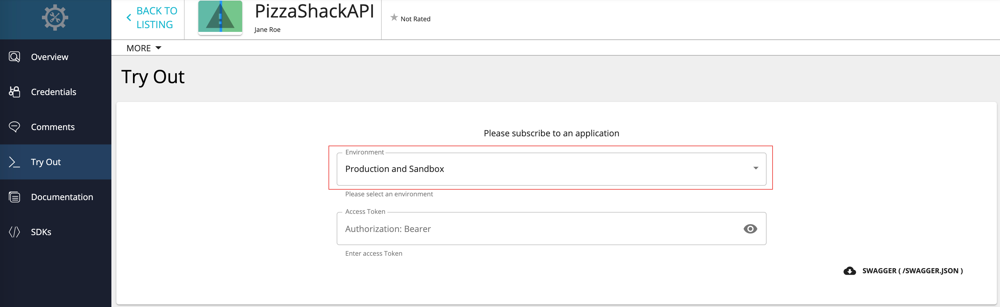
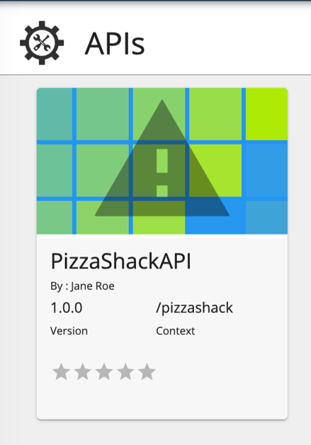
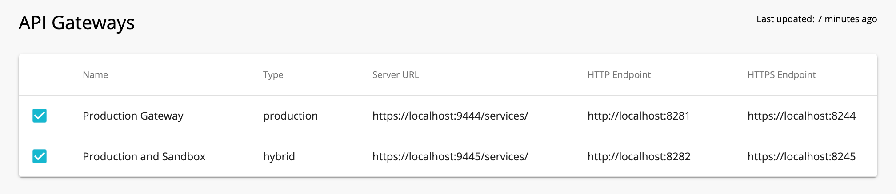
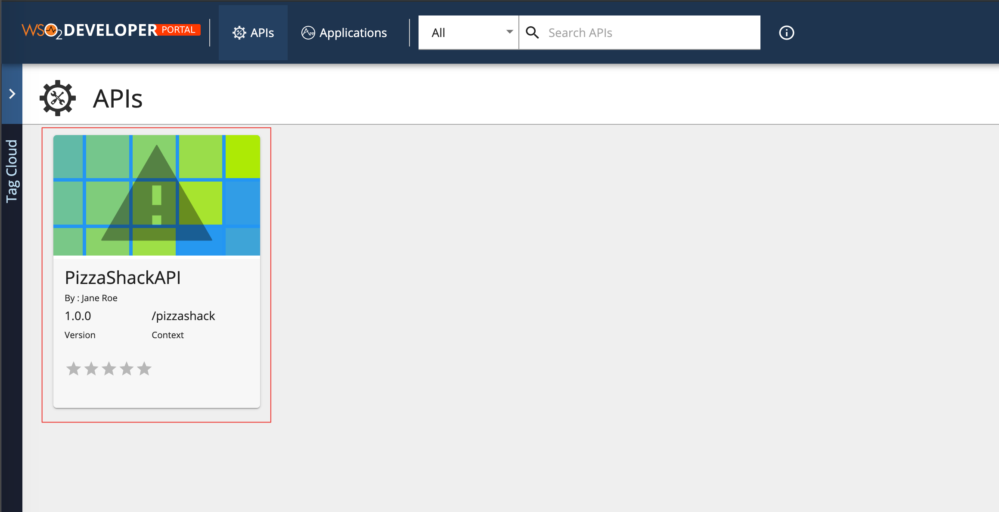
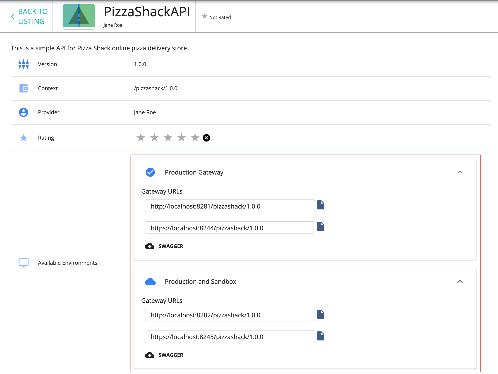
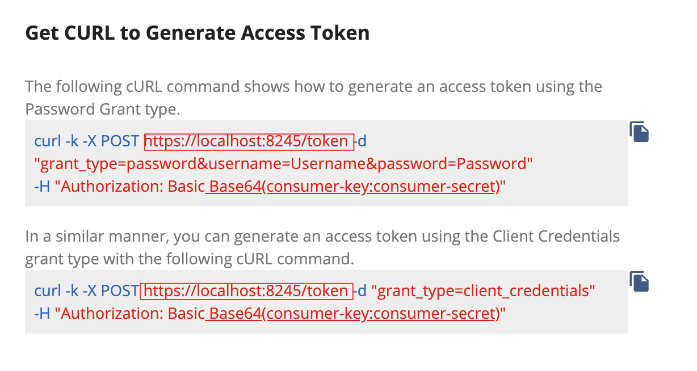

# Publish through Multiple API Gateways

You can configure multiple API Gateway environments in WSO2 API Manager that publish to a single API Developer Portal when you require distributing the gateway load comes in. It helps you to distribute the API Gateway load to multiple nodes and also gives you some logical separation (e.g., production vs. sandbox) between the APIs in the API Developer Portal. When you publish an API through multiple Gateway environments, the APIs in the API Developer Portal will have different server hosts and ports.

The steps below explain how to configure and publish to multiple Gateways. In this guide, we set up three (3) WSO2 API Manager (WSO2 API-M) instances in the same server. 

-   **Instance 1** : Acts as the node that provides the API Publisher, Developer Portal, and the Key        Manager functionality.
-   **Instance 2** : Acts as a production Gateway node.
-   **Instance 3** : Acts as a sandbox Gateway node.

In a typical production environment, the Gateways will ideally be in separate servers.

1. Copy the WSO2 API Manager (WSO2 API-M) product pack into three (3) separate folders.
    Let's add offsets to the default ports of the two Gateway instances. A port offset ensures that there are no port conflicts when more than one WSO2 product runs on the same server.

2.  Open the `<API-M_HOME>/repository/conf/deployment.toml` file in the **second** API Manager instance, and add an offset of 1 to its default port. This increments its default server port, which is 9443, by 1.

    ``` toml
    [server]
    offset=1
    ```

3.  Open the `<API-M_HOME>/repository/conf/deployment.toml` file in the **third** API Manager instance and add an offset of 2 to its default port. This increments its default server port, which is 9443, by 2.

    ``` toml
    [server]
    offset=2
    ```

4.  Open the `<API-M_HOME>/repository/conf/deployment.toml` files in the **second and the third** Gateway instances and change the following.
    This is done for the two Gateway instances to be able to communicate with the Key Manager that is in the first API Manager instance.

    ``` toml
    [apim.key_manager]
    service_url = "https://localhost:9443/services/"
    username = ""
    password = ""

    [apim.oauth_config]
    revoke_endpoint = "https://localhost:8243/services/"
    ```

    You are done configuring the two API Gateway instances.

5.  Open the `<API-M_HOME>/repository/conf/deployment.toml` file in the **first** API Manager instance, add two API Gateway environments by adding two `[[apim.gateway.environment]]` sections and comment out the `[[apim.gateway.environment]]` section that comes by default.
    This is done to point to the two API Gateway instances from the first instance.

    !!! note
            -   There can be different types of environments, and the allowed values are `hybrid` , `production` , and `sandbox` .

                -   An API deployed on a `production` type gateway will only support production keys.

                -   An API deployed on a `sandbox` type gateway will only support sandbox keys

                -   An API deployed on a `hybrid` type gateway will support both production and sandbox keys.

            -   The `api-console` element specifies whether the environment should be listed in API Console or not.

            -   The Gateway environment names must be unique.


    **Example**

    ```toml
    [[apim.gateway.environment]]
    name = "Production Gateway"
    type = "production"
    display_in_api_console = true
    description = "Production Gateway Environment"
    show_as_token_endpoint_url = true
    service_url = "https://localhost:9444/services/"
    username= ""
    password= ""
    http_endpoint = "http://localhost:8281"
    https_endpoint = "https://localhost:8244"

    [[apim.gateway.environment]]
    name = "Production and Sandbox"
    type = "hybrid"
    display_in_api_console = true
    description = "Hybrid Gateway Environment"
    show_as_token_endpoint_url = true
    service_url = "https://localhost:9445/services/"
    username= ""
    password= ""
    http_endpoint = "http://localhost:8282"
    https_endpoint = "https://localhost:8245"

    ```

    !!! tip
            If you have multiple gateways that support one type of key (e.g., when there are two gateways that support the production keys, as seen in the above code snippet.), the environments you add via the `<API-M_HOME>/repository/conf/deployment.toml` file will be visible in a drop-down list of the API Try Out tab, which is in the API Developer Portal of instance 1. This allows subscribers to send API requests to any selected Gateway.

    [](../../../assets/img/Learn/api-tryout-tab.png)

    To stop a given Gateway environment from being displayed in the API Try Out tab, you can set the `display_in_api_console` attribute to `false` in the `apim.gateway.environment` element in the `deployment.toml` file.
    For example,

    ``` toml
    [[apim.gateway.environment]]
    display_in_api_console = false
    ```

6.  Start all the WSO2 API-M instances.
    Make sure to start instance 1 first before starting the other two instances.
7.  Sign in to the API Publisher in the **first** WSO2 API-M instance and click to edit an API.
    [](../../../assets/img/Learn/new-devportal-app.png)
8.  Navigate to the **Manage** tab, expand the **API Gateways** section.
    Note that the two Gateway environments are listed there.
    [](../../../assets/img/Learn/api-gateways.png)
9.  Select both Gateways and **Save and Publish** the API in order to be able to publish to both the gateways.
10. Sign in to the API Developer Portal (of the **first** instance) and click the API to open it.
    [](../../../assets/img/Learn/dev-portal-apis.png)
11. In the API's **Overview** tab, note that it has two sets of URLs for the two Gateway instances:
    [](../../../assets/img/Learn/api-overview-tab.png)

You have published an API to the API Developer Portals through multiple Gateway environments.

!!! tip
        If you have published your API through more than one Gateway, When you have generated keys for the Applications, the sample cURL command shows how to generate an access token using the Password Grant type provides the Gateway URL of the first published Gateway Environments listed in API Publisher as shown in the step 8.
        [](../../../assets/img/Learn/generate-access-tokens.png)
        
        Change this gateway URL according to the Gateway that you want to publish the API if you are using this cURL command to generate access tokens.

!!! note
        If you wish to use the API-M pack that you used as the first instance to try-out other tutorials, please ensure to delete the API Gateway configurations that you added in step 5, and uncomment the default `[[apim.gateway.environment]]` configurations in the `<API-M_HOME>/repository/conf/deployment.toml` file.


