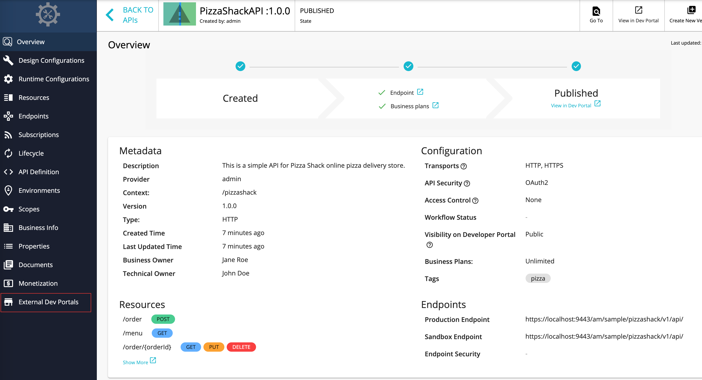
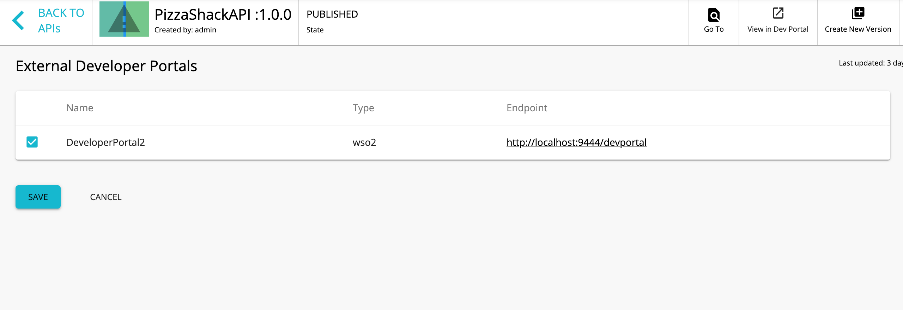

# Publish to Multiple External Developer Portals

You can share an API with application developers who are subscribed to the Developer Portals of other tenants. This allows you to advertise your APIs to a wider community. Subscribers of other tenant developer portals can view and browse your APIs; however, the users must visit your (the original publisher's)Developer Portal to subscribe to the APIs.

The following diagram illustrates the process involved when an API Publisher publishes to multiple Developer Portals.


The API Publisher of Tenant\_1, who is located in Node\_1, is publishing an API to it's API Developer Portal. In addition to that the API Publisher publishes the API to the following three external developer portals.

-   API Developer Portal of Tenant\_2 in same node.
-   API Developer Portal of Tenant\_3 in same node.
-   API Developer Portal of Tenant\_1 in Node 2

The capability to publish to external Developer Portals is not configured by default. Follow the steps below to configure it. In this guide, we use two separate instances of WSO2 API Manager and we publish from one instance to the Developer Portal of the other instance.

1.  Copy the WSO2 API Manager product pack to two different locations.
    If needed, you can download the WSO2 API Manager product pack from [here](http://wso2.com/products/api-manager/) .
2.  Go to the `<API-M_HOME>/repository/conf/deployment.toml` file of the **second** instance and change its port by an offset of 1.
    The port offset is set to avoid the port conflicts that occur when you run more than one WSO2 product on the same host.

    ``` toml
    [server]
    offset=1
    ```

3.  Start both API-M servers.
    Let's publish from the first instance of WSO2 API Manager to the Developer Portal of the second instance, which in this tutorial we consider as the external API Developer Portal.
4.  Sign in to the WSO2 API-M management console of the **first** instance ( `https://<Server Host>:9443/carbon` ) as admin.

    !!! tip
            In a **multi-tenant environment** , you must sign in using the tenant's credentials.


5.  Click **Main&gt; Resources &gt; Browse**. The Registry opens.
    
    


6.  Go to the `/_system/governance/apimgt/externalstores/external-api-stores.xml` resource.
    

7.  Click the **Edit as Text** link, uncomment the `<StoreURL>` element under the `<ExternalAPIStores>` element, and add the details of each external API Developer Portal that you need to publish APIs to.
    In this example,

    -`http://localhost:9464/devportal` is the API Developer Portal of the second WSO2 API Manager instance.
    -   You publish to its super tenant's Developer Portal (admin/admin).
    -   For this tutorial change the `DisplayName` to `DeveloperPortal2` , so that it is clear that we are referring to the second WSO2 API-M instance, which we are using as the external Developer Portal.
    -   The port is 9464 as you incremented it by 1 in step 2.
    -   If the second WSO2 API Manager instance has multiple tenants and you want to publish to a tenant's Developer Portal, the tenant's Developer Portal URL and credentials must be given here.

    ``` xml
    <ExternalAPIStores>
        <StoreURL>http://localhost:9443/devportal</StoreURL>
            <ExternalAPIStore id="DeveloperPortal2" type="wso2" className="org.wso2.carbon.apimgt.impl.publishers.WSO2APIPublisher">
                <DisplayName>DeveloperPortal2</DisplayName>
                <Endpoint>http://localhost:9444/devportal</Endpoint>
                <Username>admin</Username>
                <Password>admin</Password>
            </ExternalAPIStore>
    </ExternalAPIStores>
    ```

    !!! tip
            If you want to configure more than one external developer portal, change the configuration in `<ExternalAPIStore>` and add it to the **external-api-stores.xml** .

            For example, if we have three Developer Portals, and one is a super tenant and other two are tenant developer portals, you can configure these three external developer portals as shown below.

        ``` xml
            <ExternalAPIStores>
                <!--Configuration to set the Developer Portal URL of the current running APIM deployment. 
                APIs published to external developer portals will be redirected to this URL-->
                
                    <StoreURL>http://<ip_address>:<port>localhost:9463/devportal</StoreURL>

                    <ExternalAPIStore id="SLStore" type="wso2" className="org.wso2.carbon.apimgt.impl.publishers.WSO2APIPublisher">
                        <DisplayName>SL-Store</DisplayName>
                        <Endpoint>http://<ip_address>:<port>/devportal</Endpoint>
                        <Username>admin</Username>
                        <Password>admin</Password>
                    </ExternalAPIStore>
                    
                    <ExternalAPIStore id="USStore" type="wso2" className="org.wso2.carbon.apimgt.impl.publishers.WSO2APIPublisher">
                        <DisplayName>US-Store</DisplayName>
                        <Endpoint>http://<ip_address>:<port>/devportal</Endpoint>
                        <Username>{tenantadmin_username}@{tenant_domain}</Username>
                        <Password>{tenantadmin_password}</Password>
                    </ExternalAPIStore>


                    <ExternalAPIStore id="UKStore" type="wso2" className="org.wso2.carbon.apimgt.impl.publishers.WSO2APIPublisher">
                        <DisplayName>UKStore</DisplayName>
                        <Endpoint>http://l<ip_address>:<port>/devportal</Endpoint>
                        <Username>{tenantadmin_username}@{tenant_domain}</Username>
                        <Password>{tenantadmin_password}</Password>
                    </ExternalAPIStore>
            </ExternalAPIStores>
        ```
    
    !!! tip
            In a **multi-tenant environment**, each tenant can publish to different external Developer Portals by changing the above file in their tenant space. For more information on how APIs appear and are available for subscription in a multi-tenant environment, see [API visibility](../../../../GettingStarted/key-concepts#api-visibility). Note that publishing to an external Developer Portal only means that the API is advertised there. To subscribe, you must always register and sign in to the original publisher's tenant Developer Portal.


    Note the following in the configuration above:

    <table>
    <thead>
    <tr class="header">
    <th>Element</th>
    <th>Description</th>
    </tr>
    </thead>
    <tbody>
    <tr class="odd">
    <td><p><code>                &lt;ExternalAPIStore id=&quot;&quot; type=&quot;&quot; className=&quot;&quot;&gt;               </code></p></td>
    <td><div class="content-wrapper">
    <p><code>                 id                </code> : The external Developer Portal identifier, which is a unique value.<br />
    <code>                 type                </code> : The type of the Developer Portal. This can be a WSO2-specific API Developer Portal or an external one, which has a different implementation from the default API Developer Portal.<br />
    <code>                 className                </code> : The implementation class inside the WSO2 API Manager distribution.</p>
        !!! info
        <p>The default className specified is <code>                 org.wso2.carbon.apimgt.impl.publishers.WSO2APIPublisher                </code> , which is used when WSO2 specific API Developer Portal is used. However, if you are using an external API Developer Portal, the class should be customized by extending the <code>                                   org.wso2.carbon.apimgt.api.model.APIPublisher                                 </code> interface, and the fully qualified class name of the new implementation should be used as the <code>                 className                </code> parameter.</p>

    </div></td>
    </tr>
    <tr class="even">
    <td><p><code>                &lt;StoreURL&gt;               </code></p></td>
    <td>The URL of the API Developer Portal of the current API-M deployment. This is the URL to the API in the original publisher's store. APIs that are published to external developer portals are redirected to this URL.</td>
    </tr>
    <tr class="odd">
    <td><code>               &lt;DisplayName&gt;              </code></td>
    <td>The name of the external API Developer Portal that is displayed in the Publisher UI.</td>
    </tr>
    <tr class="even">
    <td><p><code>                &lt;Endpoint&gt;               </code></p></td>
    <td>The URL of the external API Developer Portal.</td>
    </tr>
    <tr class="odd">
    <td><code>               &lt;Username&gt;              </code> and <code>               &lt;Password&gt;              </code></td>
    <td><p>The credentials of a user who has permissions to create and publish APIs.</p></td>
    </tr>
    </tbody>
    </table>

    !!! info
            The registry changes are applied dynamically. You do not need to restart the server.


8.  Click **Save Content** .

9.  Sign in to the API Publisher of the first instance as admin/admin and if you do not have any APIs that are in the published state created, [create an API](/Learn/DesignAPI/CreateAPI/create-a-rest-api/) .

    !!! tip
            In a multi-tenant environment, sign in to the API Publisher using your tenant's credentials.


10. Click on the newly created or existing API.
    Here you see a new tab named **External Developer Portals** added to the API Publisher console.

    !!! info
            This tab is only visible when viewing API's that are in the published state.


    [](../../../assets/img/Learn/external-dev-portals.png)

    !!! note
            -   You can select multiple external API developer portals and click **Save** to publish your API to them.
            -   If the API creator updates the API after publication to external developer portals, either the creator or a publisher can simply push those changes to the published developer portals by selecting the developer portals, and clicking **Save** again.
            -   If the API creator deletes the API, each external Developer Portal that it is published to receives a request to delete the API.


11. Select the Developer Portal that you want to publish to (in this case, DeveloperPortal2) and click **Save** .
    [](../../../assets/img/Learn/publish-to-external-devportal.png)

12. Sign in to the external API Developer Portal (in this case, `http://localhost:9444/devportal` ) and click on the API that you just published.

    A link appears as **Visit Publisher Developer Portal** , which directs you to the original publisher’s Developer Portal (in this case, `http://localhost:9443/devportal`) through which you can subscribe to the API.
    [](../../../assets/img/Learn/external-dev-portals.png)

You have successfully added multiple external developer portals to your registry and published your APIs to them.
