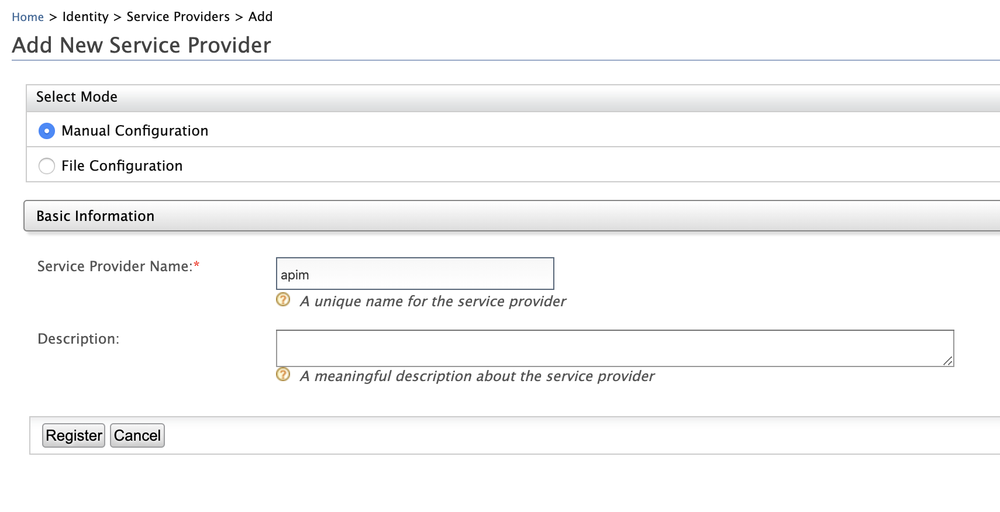
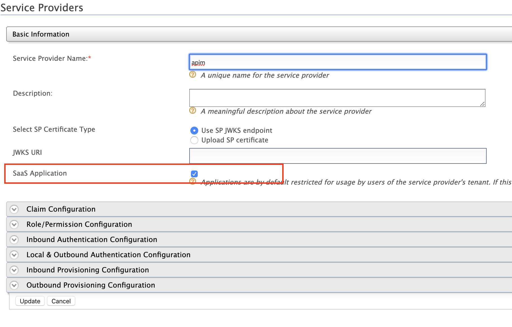
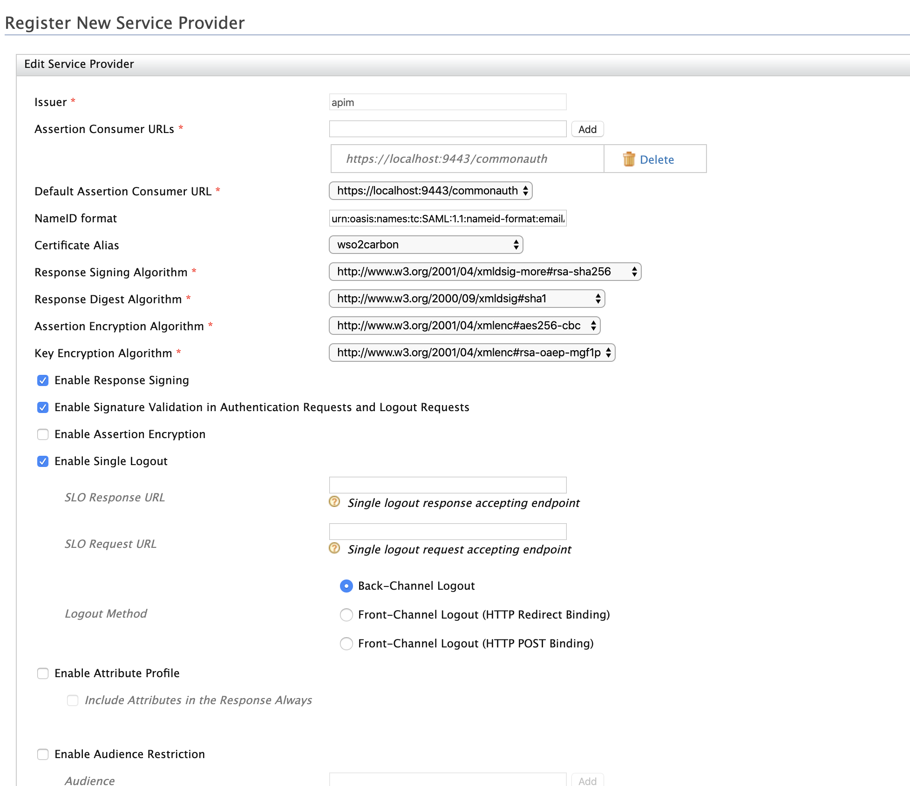
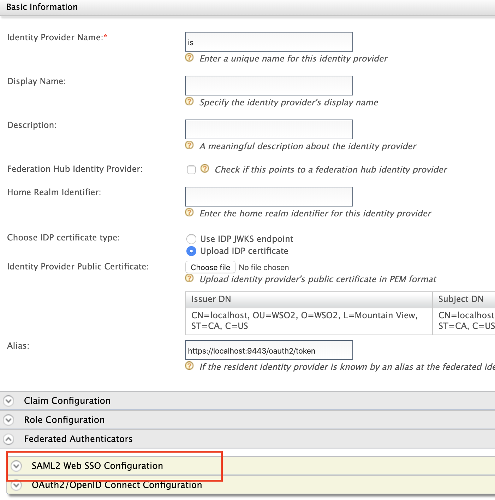
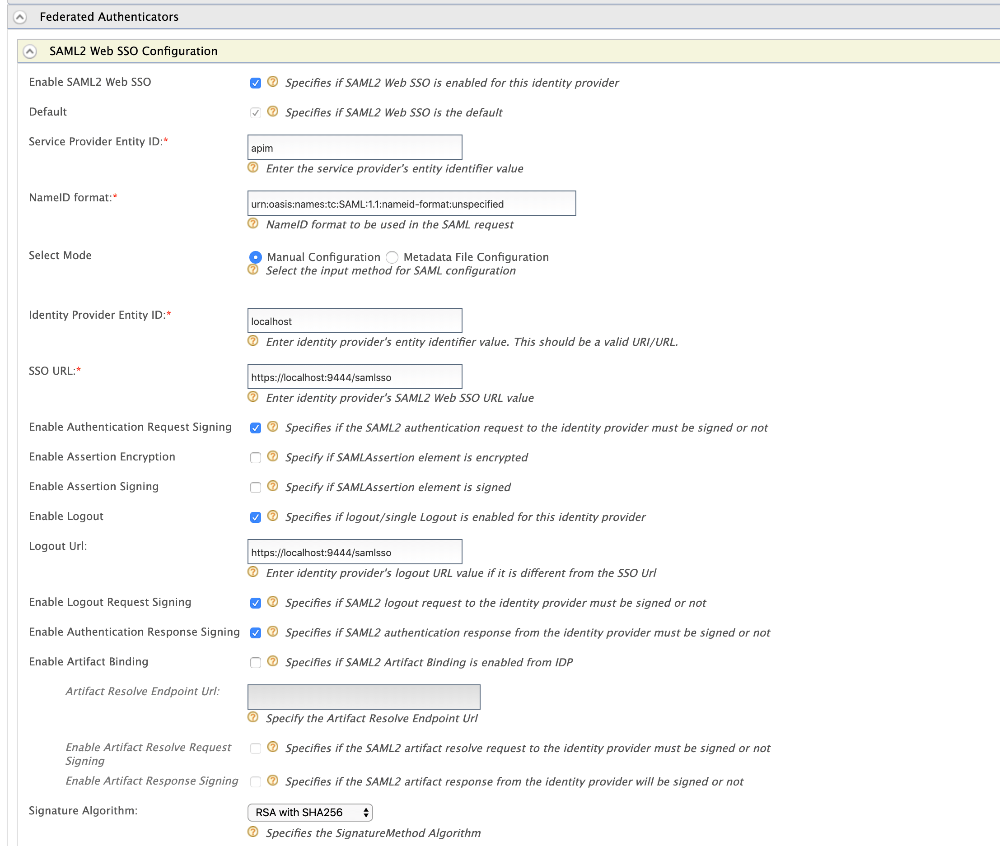
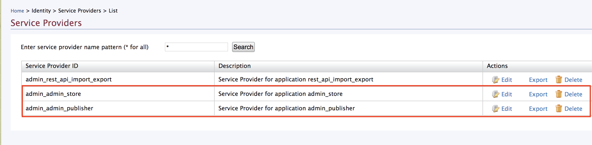
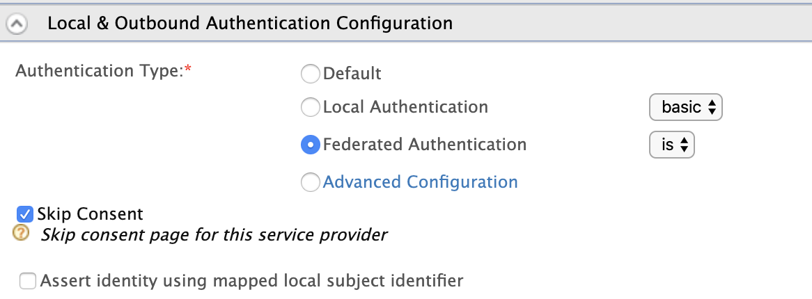

# Configuring Identity Server as IDP for SSO

!!! info
    The **Single Sign-On with openID Connect** feature is enabled by default in the API Manager.  
    
The **Single Sign-On with SAML 2.0** feature in the API Manager is implemented according to the SAML 2.0 browser-based SSO support that is facilitated by WSO2 Identity Server (WSO2 IS). This feature is available in any WSO2 IS version from 4.1.0 onwards. We use **WSO2 IS 5.9.0** in this guide. WSO2 Identity Server acts as an identity service provider of systems enabled with single sign-on, while the Web applications act as SSO service providers. Using this feature, you can configure SSO with SAML 2.0 across the API Publisher and Developer Portal. After configuring, you can access the Developer Portal or API Publisher in a single authentication attempt.

The topics below explain the configurations.

-   [Sharing the user store](#sharing-the-user-store)
-   [Configuring WSO2 API Manager as Service Provider for Identity Server](#configuring-wso2-api-manager-as-service-provider-for-identity-server)
-   [Configuring WSO2 Identity Server as a SAML 2.0 SSO Identity Provider](#configuring-wso2-identity-server-as-a-saml-20-sso-identity-provider)
-   [Configuring WSO2 API Manager apps as SAML 2.0 SSO service providers](#configuring-wso2-api-manager-apps-as-saml-20-sso-service-providers)

!!! tip
    In this documentation, MySQL is used as the database to configure WSO2 API Manager with WSO2 Identity Server. For instructions on replacing the default H2 database with MySQL, see [Setting up MySQL](https://docs.wso2.com/display/ADMIN44x/Setting+up+MySQL).

## Sharing the user store

Initially, configure your user store(s), if you have not done so already, by following the instructions in [Configuring User Stores]({{base_path}}/Administer/ProductAdministration/ManagingUsersAndRoles/ManagingUserStores/introduction-to-userstores/) . Thereafter, point both WSO2 IS and WSO2 API Manager to your user stores(s) using the instructions given below. You do this to make sure that a user who tries to log in to the Developer Portal or the Publisher is authorized. When a user tries to log in to either of the applications, s/he is redirected to the configured identity provider (WSO2 IS in this case) where s/he provides the login credentials to be authenticated. In addition to this, the user should also be authorized by the system as some user roles do not have permission to perform certain actions. For the purpose of authorization, the IS and API Manager needs to have a shared user store and user management database (by default, this is the H2 database in the `<API-M_HOME>/repository/conf/user-mgt.xml` file) where the user's role and permissions are stored.

For example, let's share a JDBC user store (MySQL) with both the WSO2 Identity Server and WSO2 API Manager as follows:

1.  Download WSO2 API Manager from [here](https://wso2.com/api-management/) and unzip it. `<API-M_HOME>` refers to the root folder where WSO2 API-M was unzipped.

    !!! tip
        To use WSO2 IS as the Key Manager, download the **WSO2 Identity Server 5.9.0 as a Key Manager** pack, with pre-packaged Key Manager features, from [here](https://wso2.com/identity-and-access-management).

2.  Download WSO2 Identity Server (WSO2 IS) 5.9.0 from [here](https://wso2.com/identity-and-access-management) and unzip it. `<IS_HOME>` refers to the root folder where WSO2 IS was unzipped.

3.  Create a MySQL database (e.g., 410\_um\_db) and run the `<API-M_HOME>/dbscripts/mysql.sql` script on it to create the required tables.

4.  Open the `<API-M_HOME>/repository/conf/datasources/master-datasources.xml` and `<API-M_HOME>/repository/conf/user-mgt.xml` file and check the datasource configuration for the database that you use for the shared user store and user management information. Go to `<API-M_HOME>/repository/conf/deployment.toml` file and add configurations. For example, you can share a single user store as follows. If you are sharing multiple datasources, you need to define a datasource for each of the user stores that you are working with, so that they can be shared.
  
    **Example**

    ``` toml
       [database.shared_db]
       type = "mysql"
       url = "jdbc:mysql://localhost:3306/410_um_db"
       username = "wso2carbon"
       password = "wso2carbon"   
    ```

    !!! note
        Change the database URL to the URL of the MySQL database you have created above. Modify the username and password parameters in the above configuration with your mysql database credentials.
    
    !!! info
        Refer [Configuring master-datasources.xml](https://docs.wso2.com/display/ADMIN44x/Configuring+master-datasources.xml) for descriptive information about each property of the datasource configuration.

5.  Add the same datasource configuration above to `<IS_HOME>/repository/conf/deployment.toml` file.

7.  The Identity Server has an embedded LDAP user store by default. As this is enabled by default. To change this to database user store, add the following to the `<IS_HOME>/repository/conf/deployment.toml`, follow the instructions in [Internal JDBC User Store Configuration](https://is.docs.wso2.com/en/next/setup/configuring-a-jdbc-user-store/) to disable the default LDAP and enable the JDBC user store instead.
  
    ``` toml
       [user_store]
       type = "database"
    ```
  
    !!! note
        In WSO2 API Manager, the JDBC User Store is enabled by default. By changing the default user store of the WSO2 Identity server to JDBC User Store, we are pointing both WSO2 API Manager and WSO2 Identity Server to the same user store so that, their user stores are shared.

6.  Copy the database driver JAR file to the `<IS_HOME>/repository/components/lib` and `<API-M_HOME>/repository/components/lib` directories.


## Configuring WSO2 API Manager as Service Provider for Identity Server

1.  Start WSO2 Identity Server.

    ```
       ./wso2server.sh -DportOffset=1
    ```

    !!! tip
        You also can change Port offset value in `<IS_HOME>/repository/conf/carbon.xml` file. Add the following to the `<IS_HOME>/repository/conf/deployment.toml`  
        ``` toml
            [server]
            offset = "1"
        ```                

    !!! info
        What is port offset?
        
        The port offset feature allows you to run multiple WSO2 products, multiple instances of a WSO2 product, or multiple WSO2 product clusters on the same server or virtual machine (VM). The port offset defines the number by which all ports defined in the runtime, such as the HTTP/S ports, will be offset. For example, if the HTTPS port is defined as 9443 and the port offset is 1, the effective HTTPS port will be 9444.


2.  Sign in to the WSO2 IS Management Console UI ( e.g. `https://localhost:9444/carbon)`. 

    !!! tip
        If you use sign-in pages that are hosted externally to sign in to the Identity Server, give the absolute URLs of those login pages in the `authenticators.xml` and `application-authenticators.xml` files in the `<IS_HOME>/repository/conf/identity` directory.

3.  Select **Add** under the **Service Providers** menu.

    
  
4.  Give a service provider name and click **Register**.

    

    !!! tip
        **In a multi-tenanted environment,** for all tenants to be able to log in to the APIM Web applications, do the following:

        -   Click the **SaaS Application** option that appears after registering the service provider.
           
           
           
           If not, only users in the current tenant domain (the one you are defining the service provider in) will be allowed to log in to the Web application and you have to register new service providers for all Web applications (Developer Portal and API Publisher in this case) from each tenant space separately. For example, let's say you have three tenants as TA, TB and TC and you register the service provider in TA only. If you tick the **SaaS Application** option, all users in TA, TB, TC tenant domains will be able to log in. Else, only users in TA will be able to log in.
  
        -   Because the servers in a multi-tenanted environment interact with all tenants, all nodes should share the same user store. Therefore, make sure you have a shared registry (JDBC mount, WSO2 Governance Registry, etc.) instance across all nodes.

5.  You are navigated to the detailed configuration page. Inside the **Inbound Authentication Configuration** section, expand **SAML2 Web SSO Configuration** and click **Configure** .
   
  
    !!! note
        To enable tenant-specific SSO with IS 5.9.0 for `API Publisher` and `Developer Portal`, enable **Use tenant domain in local subject identifier** under the Local & Outbound Authentication Configuration section.

    

6.  Provide the configurations to register the API Publisher as the SSO service provider. These sample values may change depending on your configuration.

    -   **Issuer**: apim
    -   **Assertion Consumer URL**: `https://localhost:9443/commonauth`. Change the IP and port accordingly. This is the URL for the Assertion Consumer Services (ACS) page in your running publisher app.
    -   Select the following options:
    
           -   **Enable Response Signing**
        
           -   **Enable Single Logout**
    
    -   Click **Register** once done.

    **Example**
    
    [](../../../assets/img/Learn/Extensions/SAML2SSO/sample-sp.png)

## Configuring WSO2 Identity Server as a SAML 2.0 SSO Identity Provider

Similarly, add Identity Server as an identity provider configurations in `https://localhost:9443/carbon`. These sample values may change depending in your configuration.

1. Start API Manager
  ```
       ./wso2server.sh
   ```
 
2.  Sign in to the WSO2 API Management Console UI ( e.g. `https://localhost:9443/carbon)`.

3.  Select **Add** under the **Identity Providers** menu.

    

4. Configure **Federated authenticators** > **SAML2 Web SSO Configurations**

    
    
    -   **Identity Provider Name**: is
    -   **Service Provider Entity ID**: apim . This value can change depending on the **Issuer** value defined in WSO2 IS SSO configuration above.
    -   **Identity Provider Entity ID**: localhost
    -   **SSO URL**: `https://localhost:9444/samlsso` Change the IP and port accordingly. This is the redirecting SSO URL in your running WSO2 IS server instance.
    -   Select the following options:
        -   **Enable Authentication Response Signing**
        -   **Enable Logout**
        -   **Enable SAML2 Web SSO**
    -   Click **Register** once done.


   **Example**
  
   [](../../../assets/img/Learn/Extensions/SAML2SSO/sample-idp.png)

## Configuring WSO2 API Manager apps as SAML 2.0 SSO service providers

1.  Sign in to the WSO2 API Management Console UI ( `https://localhost:9443/carbon)`.

2.  List service providers and select edit on API Publisher application.

    
  
3.  Go to **Local and Outbound Authentication Configuration** and select Identity Provider as the **Federated Authentication**.

    
  
4.  Click **update** once done.

5.  Repeat the above steps (Step 2 to Step 4) to the Developer Portal Application as well.

4.  Access the API Publisher: `https://localhost:<PORT>/publisher` (e.g., `https://localhost:9443/publisher` ). Observe the request redirect to the WSO2 IS SAML2.0 based SSO login page. For example,
    
  
5.  Enter user credentials. If the user authentication is successful against WSO2 IS, it will redirect to the API Publisher Web application with the user already authenticated.

6.  Access the Developer Portal application, click its **Login** link (top, right-hand corner) and verify that the same user is already authenticated in Developer Portal.

!!! note
    Even with SSO enabled, if the user doesn't have sufficient privileges to access API Publisher/Developer Portal or any other application, s/he will not be authorized to access them.

!!! info
    To learn more about Single Sign-On with WSO2 Identity Server, see [SAML 2.0 Web SSO](https://is.docs.wso2.com/en/5.9.0/learn/saml-2.0-web-sso/) in the WSO2 Identity Server documentation.


