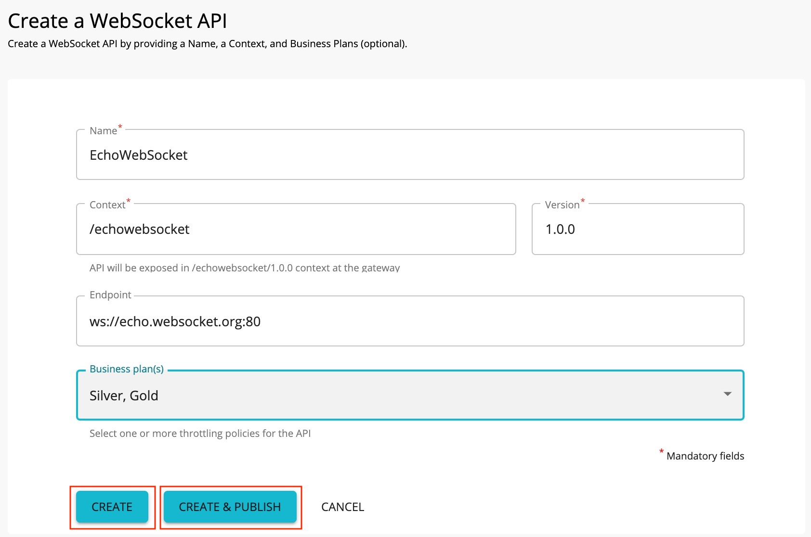
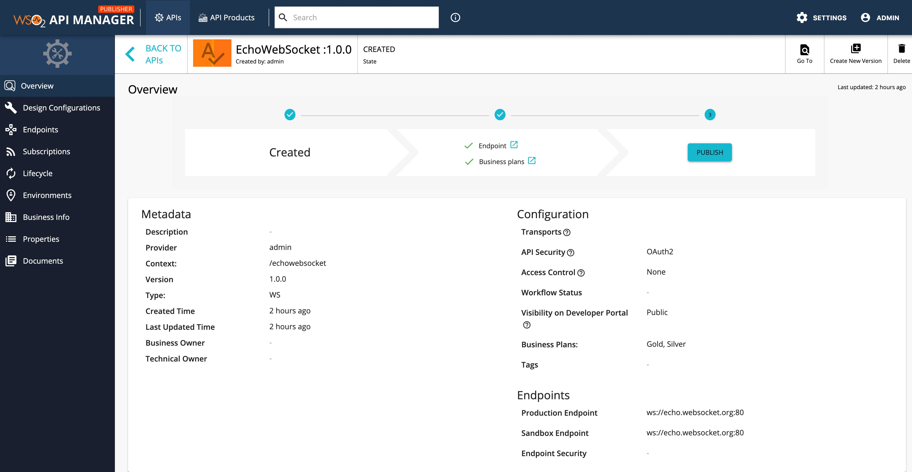
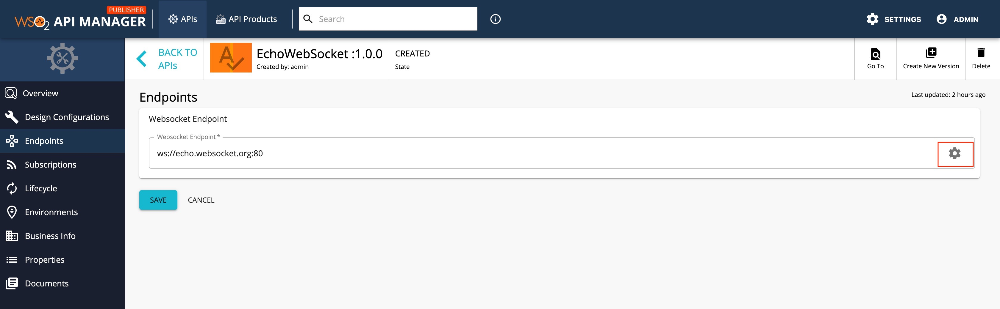
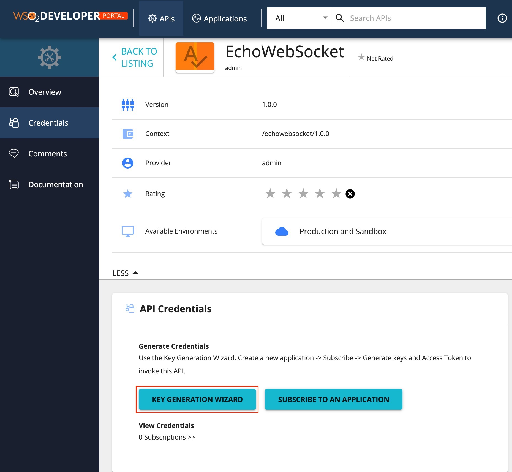
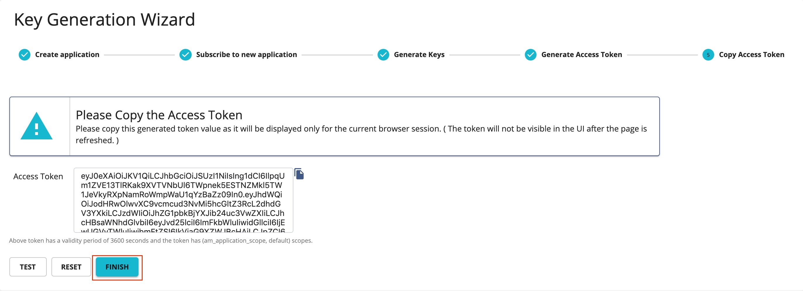

# Create And Publish a WebSocket API

WebSocket is a protocol similar to HTTP that is part of the HTML5 specification. It enables simultaneous two-way communication (full-duplex communication) between the client and the server over a single connection. The WebSocket protocol is designed to achieve the following:

-   Reduce unnecessary network traffic and latency
-   Allow streaming through proxies and firewalls while simultaneously supporting upstream and downstream communication
-   Be backward compatible with the pre-WebSocket world by starting up as an HTTP connection before switching to WebSocket frames

A WebSocket API allows an API creator to expose a WebSocket backend as an API to offer services via a WebSocket protocol while providing [OAuth security](../../../../Learn/APISecurity/Authentication/securing-apis-using-oauth2-access-tokens/), [Throttling](../../../../Learn/RateLimiting/introducing-throttling-use-cases/), [analytics](../../../../Learn/Analytics/overview-of-api-analytics/) , etc.

In this tutorial, you create and publish an API with a WebSocket backend and then invoke it using a **wscat** WebSocket client.

### Step 1 - Design a WebSocket API

1. Sign in to the WSO2 API Publisher providing username and password `https://<hostname>:9443/publisher` (e.g., `https://localhost:9443/publisher` ).
    <html><div class="admonition note">
      <p class="admonition-title">Note</p>
      <p>CREATE button will only appear for user who has creator role permission.</p>
      </div>
    </html>

2.  Go to **CREATE API** and Click **Design a New Websocket API**.
    

3.  Provide the information in the table below and click **CREATE** or **CREATE & PUBLISH**.

    | Field   | Sample value   |
    |---------|----------------|
    | Name    | EchoWebSocket  |
    | Context | /echowebsocket |
    | Version | 1.0            |
    | Endpoint| ws://echo.websocket.org:80|
    | Business Paln | Gold,Silver|
    
    

    <html>
     <div class="admonition note">
     <p class="admonition-title">Note</p>
     <p>The **CREATE & PUBLISH** option will appear only if the optional fields **Endpoint** and **Business plan(s)** are provided by a user who has publisher permission. In order to create the API, Name, Context, version and a valid Enpoint(the protocol should be given as ws://) needs to be provided.</p>
     </div>
     </html>

5.  When click **CREATE** or **CREATE & PUBLISH**, page will be redirected to the overview page of the created WebSocket API.
    

6.  Navigate to the Endpoint page, verfiy the endpoints details and click following to add endpoint configurations if needed.
    

Now, the WebSocket API created and configured successfully. Navigate to **Lifecycle** page or **Overview page** and Click **PUBLISH**.
   You have now published the WebSocket API to the API developer portal.

### Step 2 - Invoke a WebSocket API

1. Sign in to the **DEVELOPER PORTAL** providing username and password. `https://<hostname>:9443/devportal` e.g: `https://localhost:9443/devportal`

2. Click **KEY GENERATION WIZARD**.
     

3. Go through the each step in order to generate accesstoken.

     

3. Copy the generated token and use it as authorization token to invoke the WebSocket API.
    1. Install wscat client. (npm install -g wscat)
    2. Invoke the API using following command.
        
          ```
           wscat -c ws://localhost:9099/echowebsocket/1.0.0 -H "Authorization: Bearer [accesstoken]" 
          ```

      <html>
      <div class="admonition note">
      <p class="admonition-title">Note</p>
      <p> <b> Basic Auth and API Key </b> do not work for security of WebSocket API.</p>
      </div> 
      </html>
