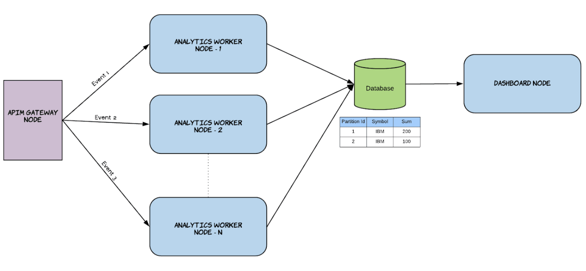

# Configure a Analytics workers as active-active

To configure API-M Analytics as a scalable deployment, you can use the Active-Active deployment pattern. For an 
overview of the Active-Active deployment pattern and instructions to configure it, see the following topics.

- [Overview](#overview)
- [Configuring an active-active cluster](#configuring-an-active-active-cluster)


## Overview


The above diagram represents a deployment where you are not limited to two nodes. You can scale the event processing 
horizontally by adding more API-M Analytics nodes to the deployment. In this deployment, it is recommended to 
configure the gateway node to publish events to multiple API-M Analytics nodes in a Round Robin manner to ensure 
better fault tolerance. The publishing of events can be carried out by one or more APIM gateway nodes.

In order to perform aggregations in a distributed manner and achieve the scalability, this setup uses distributed aggregations.

Distributed aggregations partially process aggregations in different nodes. This allows you to assign one node to 
process only a part of an aggregation (regional scaling, etc.). In order to do this all the aggregations must have a 
physical database and must be linked to the same database.

Partitioning aggregations can be enabled at aggregation level and also at a global level. To enable it at the global 
level, add the following section with the *PartitionById* annotation set to true in the 
<APIM-ANALYTICS_WORKER_HOME>/conf/worker/deployment.yaml file.

``` yaml
siddhi:
 properties:
   partitionById: true
   shardId: wso2-dc
```

This query captures the information relating to the total request counts for different APIs. Each request represents 
an event, and the information captured includes the API name, the country and city from which the request was 
generated,and the timestamp to which the information applies. Each node stores this information in the 
APIM_ANALYTICS_DB data store defined in the <API-M_ANALYTICS_HOME>/conf/worker/deployment.yaml file.

Now let's assume that during a specific hour, the API-M Gateway node publishes 30,000 events in node 1, and 40,000 
events in node 2 for Naples in Italy. When you retrieve the total for this hour via a retrieval query, the result is 70000.

## Configuring an active-active cluster
   
To configure the API-M Analytics nodes to deploy them as an active-active cluster, edit the <API-M_ANALYTICS_HOME>/conf/worker/deployment.yaml file as follows:

!!! note

    Before you begin:
    
        - Download two binary packs of WSO2 API-M Analytics.
        - Set up a working RDBMS instance to be used by the WSO2 API-M Analytics cluster.
        
1. For each node, enter a unique ID for the id property under the wso2.carbon section. This is used to identify each 
node within a cluster. For example, you can add IDs as shown below.
    - For node 1:
    ``` yaml
    wso2.carbon:
      id: wso2-am-analytics-1
    ```
    - For node 2:
    ``` yaml
    wso2.carbon:
      id: wso2-am-analytics-2
    ```
    
2. Enable partitioning aggregations for each node, and assign a unique shard ID for each node. To do this, set the 
partitionById and shardId parameters as Siddhi properties as shown below.

    !!! note 
        
        Assigning shard IDs to nodes allows the system to identify each unique node when assigning parts of the 
        aggregation. If the shard IDs are not assigned, system uses the unique node IDs (defined in step 1) for this purpose.
        
    - For node 1:
        ``` yaml
        siddhi:
          properties:
            partitionById: true
            shardId: wso2-sp-analytics-1
        ```
    - For node 2:
    ``` yaml
    siddhi:
      properties:
        partitionById: true
        shardId: wso2-sp-analytics-2
    ```
    
    !!! note 
    
        - To maintain data consistency, do not change the shard IDs after the first configuration
        - When you enable the aggregation partitioning feature, a new column ID named SHARD_ID is introduced to the 
        aggregation tables. Therefore, you need to do one of the following options after enabling this feature to 
        avoid errors occuring due to the differences in the table schema.
            - Delete all the aggregation tables for SECONDS, MINUTES, HOURS, DAYS, MONTHS, YEARS. 
            - Edit the aggregation tables by adding a new column named SHARD_ID, and specify it as a primary key.

3. Configure a database, and then update the default configuration for the APIM_ANALYTICS_DB data source with 
parameter values suitable for your requirements in <APIM_ANALYTICS_HOME>/conf/worker/deployment.yaml

   ``` yaml
    
   - name: APIM_ANALYTICS_DB
         description: "The datasource used for APIM statistics aggregated data."
         jndiConfig:
           name: jdbc/APIM_ANALYTICS_DB
         definition:
           type: RDBMS
           configuration:
             jdbcUrl: "jdbc:mysql://localhost:3306/APIM_ANALYTICS_DB_1?useSSL=false"
             password: pass
             username: root
             driverClassName: com.mysql.jdbc.Driver
             maxPoolSize: 50
             idleTimeout: 60000
             connectionTestQuery: SELECT 1
             validationTimeout: 30000
             isAutoCommit: false
         
   ```  
   
   - If you are configure analytics for WSO2 Micro Gateway, import the 
   appropriate DB script from <APIM_ANALYTICS_HOME>/wso2/worker/dbscripts/apimgt/

!!! note 

    As explained in above the events are processed in multiple active nodes. Eventhough this is usually a stateful 
    operation, you can overcome the node-dependent calculations via distributed aggregation. This allows WSO2 API-M to 
    execute APIM Analytics scripts that depend on incremental distributed aggregation.
    
    However, an active-active deployment can affect alerts because alerts also depend on some in-memory stateful 
    operations such as windows. Due to this, alerts can be generated based on the events received by specific node. Thus 
    the alerts are node-dependent, and you need to disable them to run scripts with distributed incremental aggregation.

