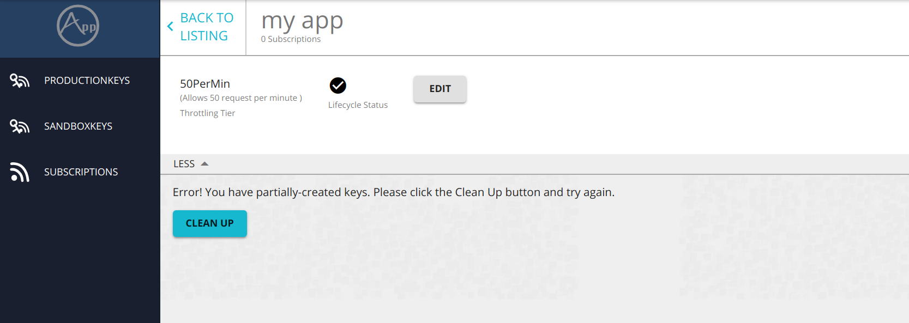

# Cleaning Up Partially Created Keys

An application created in WSO2 API Manager has a corresponding OAuth application in the Key Manager node. An application can be created or deleted partially, where the OAuth application is successfully created/deleted but there is stale data left in the API Manager node. This can happen due to network failures between the API Manager and the Key Manager nodes, partial deletion of applications, etc.

To delete the remaining application data from API Manager, go to the application listing by clicking the  **Applications** tab in the top ribbon, and then click on the desired application name.
After that click on the **Clean up** button.

