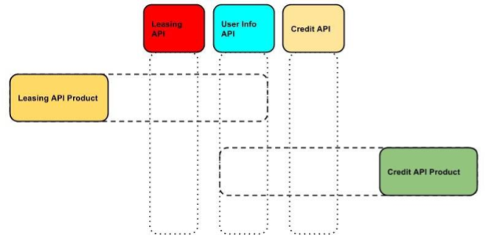

# Overview
This document describes the API Product feature and how it can be used in WSO2 API Manager.

## **What is an API Product** ?

An API Product is packaging mechanism that can be used to bundle a given set of resources from multiple APIs and expose 
it as a separate API interface, which can be consumed by subscribers. This enables publishers to repackage their existing 
API offerings in various combinations, to provide a tailor made experience for their subscribers.

Lets take a look at the below example to understand how this works

   
  
A financial institution has the following three APIs,

- Customer Info API

    Used to access and update the financial information of customers. The API consists of the following resources,

      GET /customers                    - Get list of all existing customers
      GET /customers/{customerId}       - Get details of specific customer with {customerId}
      POST /customers                   - Add a new customer
      PUT /customers/{customerId}       - Update a specific customer with {customerId}
      DELETE /customers/{customerId}    - Delete a specific customer with {customerId}
  
- Leasing API

    Used to access and update the information regarding the leases of the institution. The API consists of the following 
    resources,
    
      GET /assets                   - Get list of all existing assets that can be leased
      GET /assets/{assetId}         - Get details of specific asset with {assetId}
      POST /assets                  - Add a new asset
      PUT /assets/{assetId}         - Update a specific asset with {assetId}
      DELETE /assets/{assetId}      - Delete a specific asset with {assetId}
      
- Credit API
    
    Used to access and update the credit information of a given customer. The API consists of the following resources,      
    
      GET /accounts/{customerId}    - Get list of credit accounts for a customer with {customerId}
      GET /accounts/{accountId}     - Get details of specific credit account with {accountId}
      POST /accounts/{customerId}   - Add a new credit account for a customer with {customerId}
      PUT /accounts/{accountId}     - Update a specific credit account with {accountId}
      DELETE /accounts/{accountId}  - Delete a specific credit account with {accountId}
      
      
The resources of these existing APIs can be reused and exposed via API Products as shown below,

- Leasing API Product
    
      GET /customers                (From Customer Info API)              
      GET /customers/{customerId}   (From Customer Info API)
      GET /assets/{assetId}         (From Leasing API)
      POST /assets                  (From Leasing API)
      
- Credit API Product

      GET /customers                (From Customer Info API)              
      GET /customers/{customerId}   (From Customer Info API)
      GET /accounts/{accountId}     (From Credit API)
      POST /accounts/{customerId}   (From Credit API)
      
A subset of the resources from different APIs have been combined to provide customized hybrid offerings that can appeal 
to different subscribers. This also ensures that only specific resources are exposed via the API Product.

## **How API Products work under the hood**

When a given resource of an API is added to an API Product, the following attributes of the API resource are reused,

- OAuth Scope
- Authentication scheme
- Throttling policy

      !!! info
      In essence, an API Product will share the resource(s) of an existing API.
    

The Publisher is able to define a separate set of subscription level throttling policies which are different from the
ones that exist at the API level.

The same backend endpoint that is defined by the resources respective API will be reused by the API Product.
Due to the fact that the API Product may contain resources from multiple APIs, an API Product may route to multiple
backend endpoints.

    !!! note
    API Products cannot define their own backend endpoints, apart from reusing the existing endpoints belonging to its 
    API resources respective parent API.
    
Once an API Product is created it will be published to the API Gateway as an independent Synapse api artifact.

On the Developer Portal, an API Product can be viewed as a separate entity, independent of the APIs with which it 
shares its resources.

From the perspective of a subscriber on the Developer Portal, the API Product will look and function in the same way
as a standard API.

