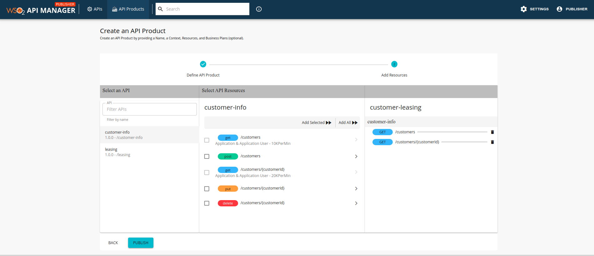
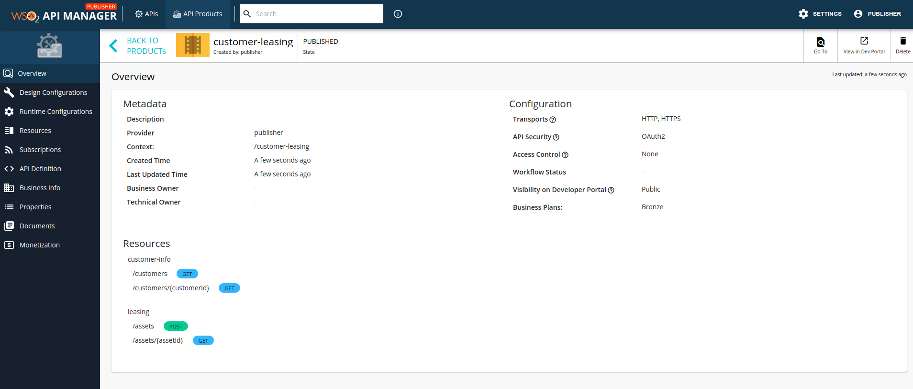

### How to create an API Product

1. Sign in to the WSO2 API Publisher.
`https://<hostname>:9443/publisher` (e.g., `https://localhost:9443/publisher` ). 

2. Lets first create two APIs(Customer Info API & Leasing API) from the example we discussed previously, by importing 
the attached Swagger definition files [customer-info-api.yaml](assets/attachments/api-product/customer-info-api.yaml) 
and [leasing-api.yaml](assets/attachments/api-product/leasing-api.yaml). 

        !!! note
        Ensure that you provide an endpoint for each API after it has been imported. The API Product will reuse the
        endpoint specified at the API level.
        
        !!! note
        It is not necessary to publish an API in order for it to be used to create an API Product
        
3. After the APIs have been created, their respective resources will be as follows,

    - customer-info API
    
      
    - leasing API
    

          !!! note
          If you have not already logged into the WSO2 API Publisher with a user who has **publisher** permissions(such
          as 'admin'), you need to logout and login as a user who has those permissions. The following steps required to
          create and API Product can only be performed by a user with **publisher** permissions.

4. Click on the 'API Products' link in the WSO2 API Publisher and click on the **CREATE AN API PRODUCT** button as 
shown below

    
    
5. You will be redirected to the 'Create an API Product' windows' 'Define API Product' tab where you will need to fill
in the API Product name, context and business plans as shown below.

    
    
6.  Click on the **NEXT** button to move to the 'Add Resources' page as shown below. 

    
    
    The left most pane will show the available list of APIs. The central pane lists the available resources of a given API
selected in the left pane. You can select a resource in the central pane and add it to the right pane, which will show 
the resources that will be added to the API Product.

7. Select the 'customer-info' API in the left pane and then select the 'GET /customers' and 
'GET /customers/{customerId}' resources in the central pane and add them to the right pane, as shown below.

    

8. Select the 'leasing' API in the left pane and then select the 'GET /assets/{assetId}' and 'POST /assets' resources
in the central pane and add them to the right pane, as shown below.

    
    
9. Click on the **PUBLISH** button to create and publish the API Product. The API Product can now be seen in the 
Publisher as shown below.

    

10. The API Product can now be seen in the Developer Portal as shown below. Login to the Developer Portal to subscribe
and consume the API Product in the same way that you would an API.
      
    
    
    For more information on how to subscribe to an API refer to
[Subscribe to an API](../../../../Learn/ConsumeAPI/ManageSubscription/subscribe-to-an-api/).

