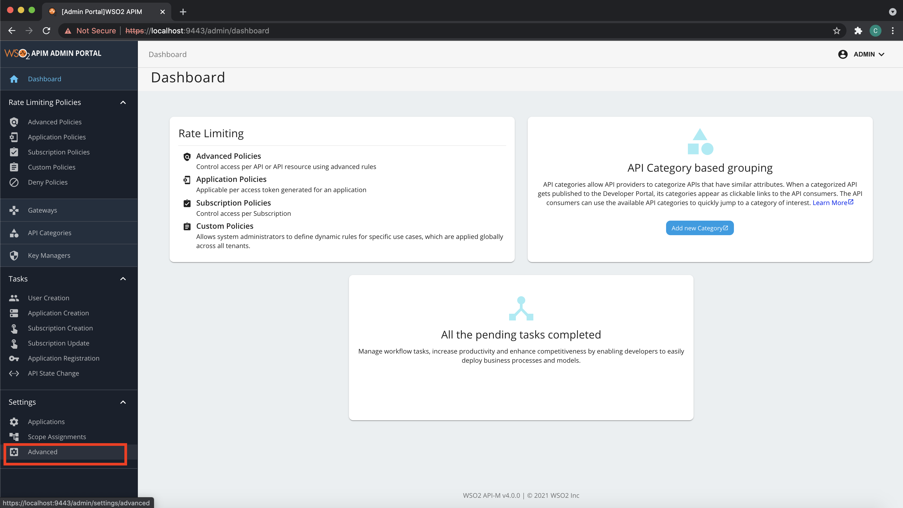
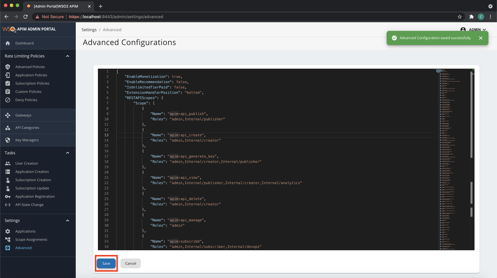

# **Advanced Configurations**

This section covers how to change and configure several features related to the advanced tenant configurations.

## Step 1 - Navigate to the Admin Portal Advanced Configuration Section

1. Sign in to the WSO2 Admin Portal via `https://<Server-Host>:9443/admin`.
2. Click **Settings** → **Advanced**.

## Step 2 - Change the Advanced Configurations per use case

1. Change the relevant configuration accordingly and click **Save**.

??? tip "Setting custom Linter rules"
    You can add your custom rules in JSON with the key **LinterCustomRules**.

2. You can revert unsaved changes by clicking **Cancel**.

!!! tip
    Before clicking **Save**, check and fix any schema validation errors visible in the editor due to the changes made.
