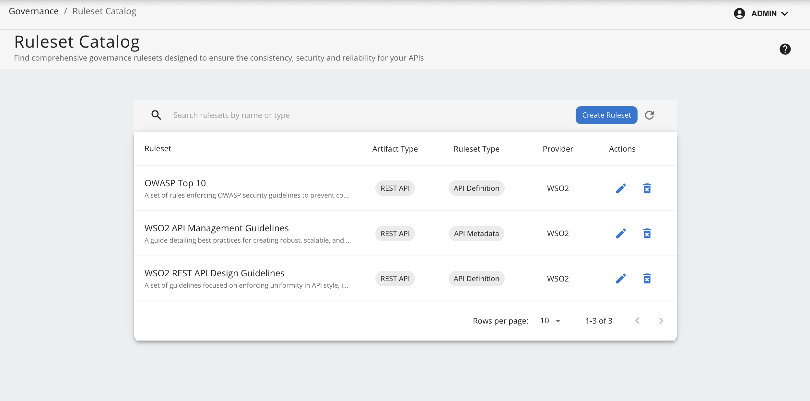
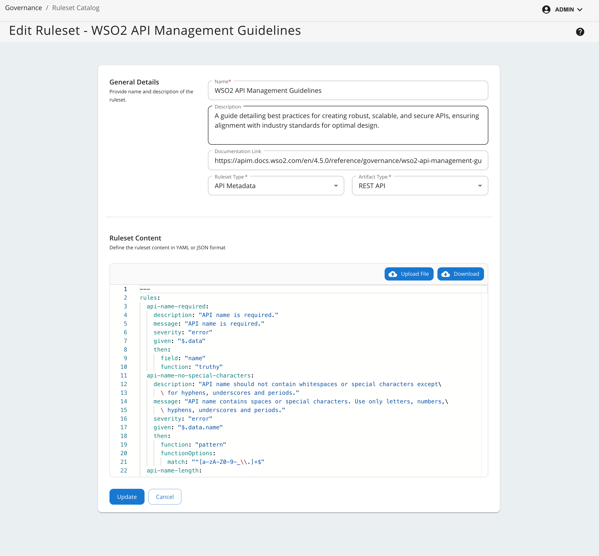
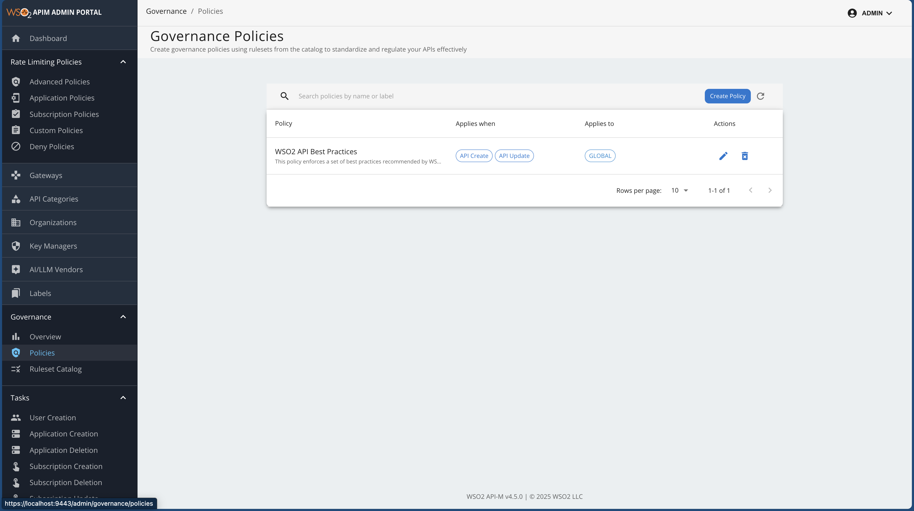
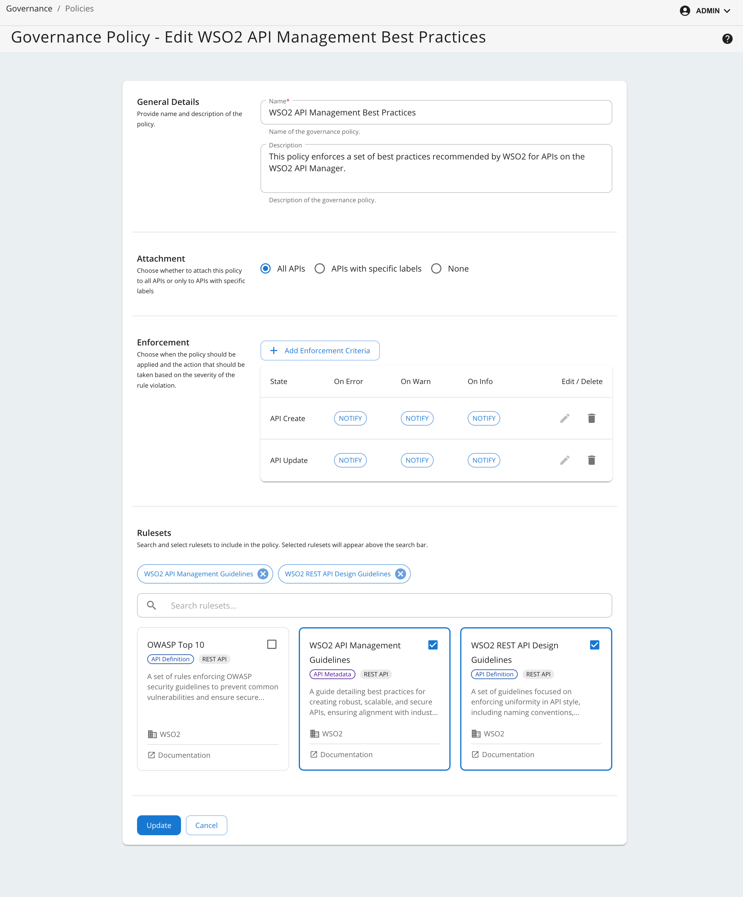
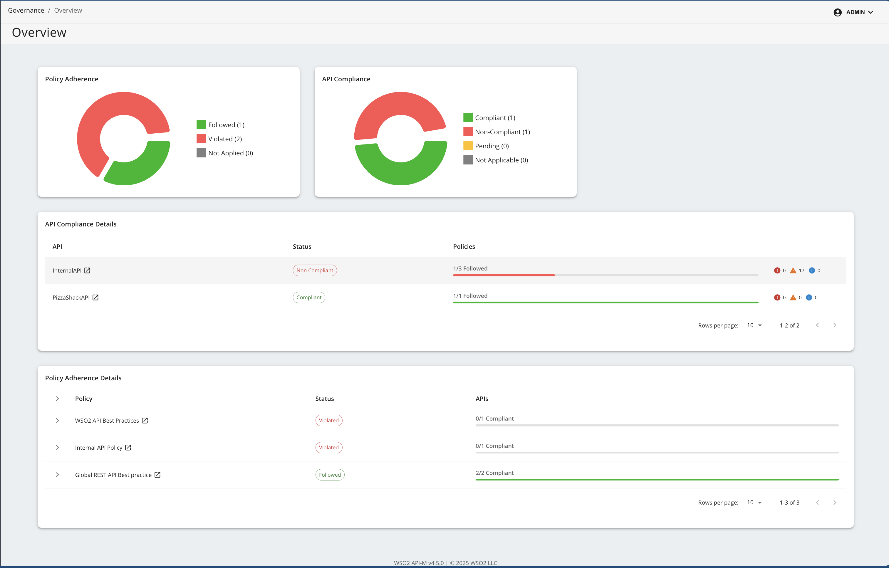

# Administrative Capabilities

WSO2 API Manager provides organization administrators the following administrative capabilities 
to manage rulesets and policies for API governance.

### Create and Manage Rulesets

The **Rulesets Catalog** provides a list of predefined governance rulesets that can be used to enforce security, compliance, and performance policies on APIs. Follow these steps to access the catalog and explore available rulesets.  

1. Log in to the **API Manager Admin Portal**.  
2. Go to the **Governance** section in the main menu.  
3. Click **Rulesets Catalog** to view all available rulesets.  

<a href="../../assets/img/governance/ruleset_view.png">
  
</a>

#### Create a New Ruleset

To create a new ruleset, click on the **Create Ruleset**. When creating a new ruleset, you need to provide the following information:

| Field Name | Description                                                                                                                                                                                                                       | Mandatory | Options/Values |
|------------|-----------------------------------------------------------------------------------------------------------------------------------------------------------------------------------------------------------------------------------|-----------|----------------|
| Name | The name of the ruleset.                                                                                                                                                                                                          | Yes | - |
| Description | A brief description of the ruleset.                                                                                                                                                                                               | No | - |
| Documentation Link | A link to the documentation of the ruleset.                                                                                                                                                                                       | No | - |
| Ruleset Type | The type of the ruleset.                                                                                                                                                                                                          | Yes | API Definition, API Metadata, Documentation |
| Artifact Type | The type of the API.                                                                                                                                                                                                              | Yes | REST API, Async API |
| Ruleset Content | Refer [Writing Your Own Ruleset](#writing-your-own-ruleset) section. Define the ruleset content using the **Spectral-like format**. You can either write the rules manually or upload a pre-written ruleset YAML or JSON file. | Yes | - |


After providing the required information, click on the **Create** button to create the ruleset.

<a href="../../assets/img/governance/ruleset_create.png">
  
</a>

#### Writing Your Own Ruleset

Please refer to the [WSO2 Rule Validator Documentation]({{base_path}}/governance/rule-validator/rule-validator) to understand the ruleset format and how to write your own ruleset.

- If Ruleset Type is selected as **API Definition**, the ruleset should only contain rules that can be validated against the API definition file (OpenAPI or AsyncAPI).
- If Ruleset Type is selected as **API Metadata**, the ruleset should only contain rules that can be validated against the [API's YAML Representation]({{base_path}}/reference/governance/api-yaml-representation/). This representation is common for REST and Async APIs.
- If Ruleset Type is selected as **Documentation**, the ruleset should only contain rules that can be validated against the [Documentation YAML Representation]({{base_path}}/reference/governance/api-doc-yaml-representation/). This representation is common for REST and Async APIs.

#### Default Rulesets

WSO2 API Manager comes with a set of default rulesets that cover common governance aspects such as security, compliance, and performance. These rulesets can be used as-is or customized to meet specific organizational requirements. These include,


1. **[WSO2 API Management Guidelines]({{base_path}}/reference/governance/wso2-api-management-guidelines)** - An API Metadata ruleset that applies to REST APIs and covers general API management guidelines.
2. **[WSO2 REST API Design Guidelines]({{base_path}}/reference/governance/wso2-rest-api-design-guidelines)** - An API Definition ruleset that applies to REST APIs and covers design best practices.
3. **[OWASP Top 10]({{base_path}}/reference/governance/owasp-top-10)** - An API Definition ruleset that applies to REST APIs and covers best practices for securing APIs against OWASP Top 10 vulnerabilities.

!!! tip "Deleting Default Rulesets"  
    Deleting default rulesets from the list of rulesets is not sufficient. You must also remove the corresponding default ruleset files located in the `<APIM_HOME>/repository/resources/governance/default-rulesets` directory.


!!! note "Updating an Existing Ruleset"
    **Updating an existing ruleset which is already attached to a policy will trigger a compliance check for all APIs associated with the policy**. The compliance check will be performed in the background, and the results will be displayed in the compliance dashboard.

### Create and Manage Policies

The **Policies** section in the **API Manager Admin Portal** provides a list of governance policies that can be enforced on APIs. Follow these steps to access the policies section and explore available policies. 

1. Navigate to the **Governance** section in the **API Manager Admin Portal**.  
2. Click **Policies** to view the list of available policies.  

<a href="../../assets/img/governance/policy_view.png">
  
</a>

#### Create a new Policy

To create a new policy, click the **Create Policy** button and provide the following details:  

| Field Name  | Description                                    | Mandatory | Options/Values                                                                                                                                                 |
|-------------|------------------------------------------------|-----------|----------------------------------------------------------------------------------------------------------------------------------------------------------------|
| Name        | The name of the policy.                        | Yes | -                                                                                                                                                              |
| Description | A brief description of the policy.             | No | -                                                                                                                                                              |
| Attachment  | The way the policy is attached to the APIs.    | Yes | All APIs (REST and ASYNC) <br/> APIs with specific labels<br/> None                                                                                            |
| Enforcement | The detail of the policy enforcement criteria. | Yes | **When to Enforce** <br/> API Create, API Update, API Deploy, API Publish <br/> **Actions to Take** (based on severity of rule violations) <br/> Notify, Block |
| Rulesets    | The list rulesets included in the policy.      | Yes | -                                                                                                                                                              |


After providing the required information, click on the **Create** button to create the policy.

<a href="../../assets/img/governance/policy_create.png">
  
</a>

#### Default Policies

WSO2 API Manager comes with a default governance policy named **WSO2 API Management Best Practices**. This policy is a high-level policy that includes the **WSO2 API Management Guidelines** ruleset. This policy can be used as-is or customized to meet specific organizational requirements. 

It includes, **[WSO2 API Management Guidelines]({{base_path}}/reference/governance/wso2-api-management-guidelines)** ruleset and **[WSO2 REST API Design Guidelines]({{base_path}}/reference/governance/wso2-rest-api-design-guidelines)** ruleset.

!!! tip "Deleting or Disabling Default Policies"
    - Deleting default policies from the policy list is not sufficient. You must also remove the corresponding default policy files located in the `<APIM_HOME>/repository/resources/governance/default-policies` directory.
    - Instead of deleting a policy, you can disable it by updating the policy settings so that it does not apply to any APIs through the publisher portal.
    - During migration, it is recommended to disable the default policy by updating the `labels` field in the default policy YAML files in the `<APIM_HOME>/repository/resources/governance/default-policies` directory to an empty list.
    - After migration is complete, you can update the policy through the admin portal to apply it to all APIs as needed.  


!!! note "Creating or Updating a Policy"
    **Creating a new policy or updating an existing policy will schedule a compliance check for all APIs associated with the policy**. The compliance check will be performed in the background, and the results will be displayed in the compliance dashboard.

### Compliance Monitoring

Compliance monitoring is a key aspect of API governance. It ensures that APIs adhere to the defined governance policies and rulesets. The **Compliance Dashboard** provides a comprehensive view of the compliance status of APIs. Follow these steps to access the dashboard:

1. Log in to the **API Manager Admin Portal**.
2. Go to the **Governance** section in the main menu.
3. Click **Compliance** to view the compliance status of APIs.

<a href="../../assets/img/governance/admin_compliance.png">
  
</a>

#### **Policy Adherence**

This widget gives a summary of the policies deployed in the system with a breakdown of the number of policies that are followed, violated and not applied to any APIs.


#### **API Compliance**

This widget provides a summary of the compliance status of APIs with a breakdown of the number of APIs that are compliant, non-compliant, pending compliant results, and not applied to any policies.

#### **API Compliance Details**

This widget provides a detailed overview of an API's compliance status, including compliance level of associated policies.  

#### **Policy Adherence Details**

This widget offers a detailed overview of each policy's compliance, including the overall policy status and the compliance status of each API governed by the policy.  

#### API-Specific Compliance View

By clicking on each API listed in [API Compliance Details](###api-compliance-details) widget, an API compliance page will be displayed. This page provides a detailed view of the API's compliance status, including a breakdown of the compliance status for each policy attached to the API.

## Configuration Options

The background compliance evaluation tasks are conducted by a scheduler which by default runs every 2 minutes and consists of a thread pool of 20 threads and a queue size of 20. These values can be updated by updating the following configuration in the `deployment.toml` file located in the `<APIM_HOME>/repository/conf` directory.
For more information refer the [configuration catalog]({{base_path}}/reference/config-catalog/#apim-governance-configurations).

```toml
[apim.governance.scheduler]
thread_pool_size = 20 # Number of threads in the thread pool, be cautious when changing this value as it can affect the performance
queue_size = 20 # Size of the queue, be cautious when changing this value as it can affect the performance
task_check_interval_minutes = 2 # Interval in minutes to check for compliance tasks
task_cleanup_interval_minutes = 30 # Interval in minutes to clean up any stale tasks
``` 


