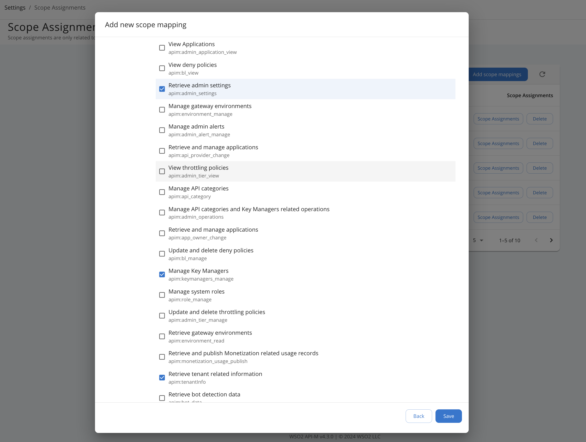
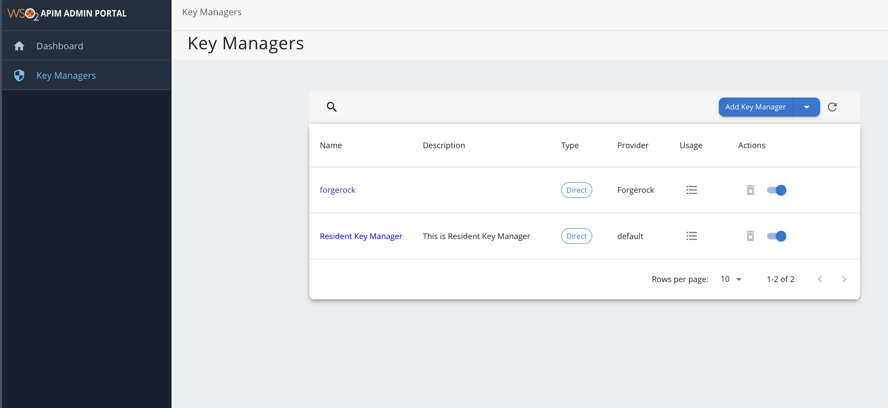

# **Role-based Access Control for Admin Portal**

Super admin can restrict each section in the admin portal based on scopes. Please follow the
scope chart below to define scopes.

## Step 1 - Create a new role

1. Sign in to the WSO2 Management Console (`https://<Server Host>:9443+<port offset>/carbon`)
2. Click **Add** under **Users and Roles**, then click **Add New Role**.
3. Give a name for the role and click **Next**.
4. On the permissions screen, assign the necessary permissions (e.g., `Login`).

## Step 2 - Create a new user

1. Click **Add** under **Users and Roles** and select **Add New User**.
2. Enter a username and password, then click **Next**.
3. On the **Users of Role** screen, assign the previously created role to this user.

## Step 3 - Assign scopes for the user

1. Sign in to the WSO2 Admin Portal (`https://<Server Host>:9443+<port offset>/admin`) as the super admin or tenant admin.
2. Click **Scope Assignments** in the left sidebar and select **Add scope mappings**.
3. Enter the role name created in Step 1 and click **Next**.
4. Under **Select Permissions**, choose **Custom scope assignments** and select the scopes to assign.  
   For example, to allow access to Key Managers settings, assign:  
   - `apim:keymanagers_manage`  
   - `apim:tenantInfo`  
   - `apim:admin_settings`

   

5. Log in to the Admin Portal using the newly created user account.  
   The user will only see the allowed pages (e.g., **Key Managers**).

   

---

## Scope Reference Table

| **Admin Portal Menu**  | **Scopes**                                                                                                                                               |
|------------------------|-----------------------------------------------------------------------------------------------------------------------------------------------------------|
| Rate Limiting Policies | apim:admin_tier_view, apim:admin_tier_manage, apim:tenantInfo, apim:bl_view, apim:bl_manage, apim:admin_settings                                          |
| Gateways               | apim:environment_manage, apim:admin_settings, apim:environment_read                                                                                       |
| API Categories         | apim:api_category, apim:tenantInfo, apim:admin_settings                                                                                                   |
| Key Managers           | apim:keymanagers_manage, apim:tenantInfo, apim:admin_settings                                                                                             |
| Tasks                  | apim:api_workflow_view, apim:api_workflow_approve, apim:tenantInfo, apim:admin_setting                                                                    |
| Settings               | apim:app_owner_change, apim:api_provider_change, apim:admin_application_view, apim:scope_manage, apim:admin_settings, apim:tenantInfo                     |
